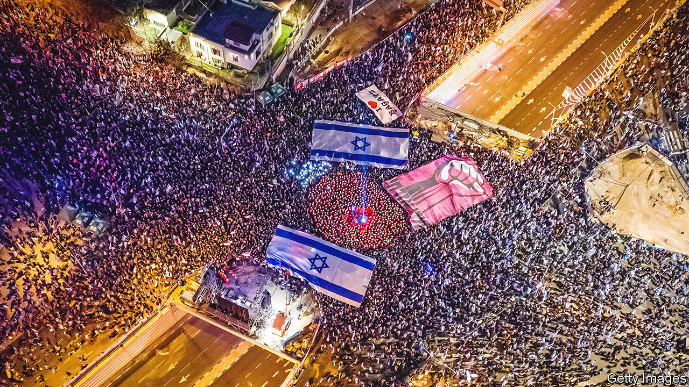
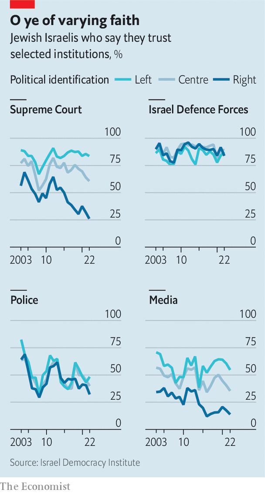
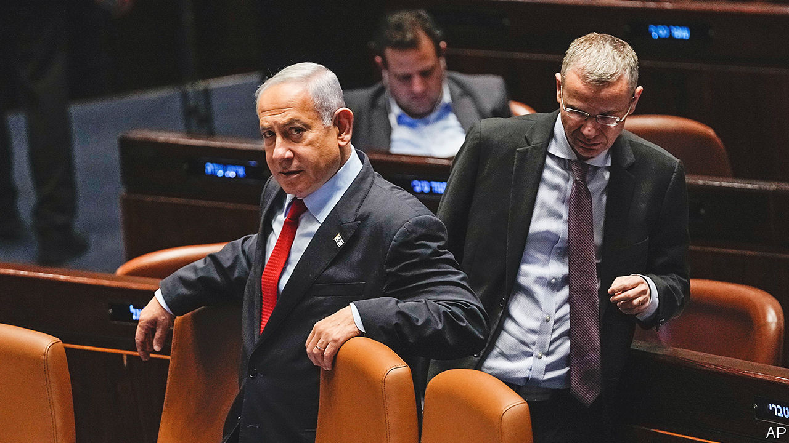

###### A house divided against itself

# Binyamin Netanyahu is exploiting Israel’s divisions 

##### The tensions are not new but they are at a crisis point 

 

> Mar 16th 2023 

Beersheva, a sleepy town in the Negev desert, is 100km south but a world away from Tel Aviv. Last year two-thirds of the town voted for parties of the far-right and religious coalition led by Binyamin (“Bibi”) Netanyahu, now the prime minister. Yet on March 11th some 10,000 Beershevans felt angry enough to protest against the government’s plans to weaken Israel’s Supreme Court. “This is a Bibi-ist town,” says Zipi Stolero, a retired civil servant who has lived there for 65 years. “But people are marching because they feel…freedom is at risk.” That the demonstrations have spread to Beersheva shows how widespread discontent with the government has become. 

Protests have buffeted the country for the past ten weeks. Recently around half a million Israelis turned out in demonstrations across the country, clashing with police and bringing parts of Jerusalem and Tel Aviv to a standstill. A third of all of Israel’s secular Jews have demonstrated or signed petitions against the government’s plans, according to the Israel Democracy Institute, a think-tank (almost no ultra-Orthodox Israelis have followed suit). 

They are protesting against a plan of radical “legal reform”, which ditches checks and balances in Israel’s democracy. Under the reform, the Supreme Court’s powers to overturn laws passed by the Knesset, Israel’s parliament, will be all but eliminated. New judges will be appointed by a commission stacked with people loyal to the coalition. The government insists this is necessary, arguing that the fiercely independent and activist court has seized powers on the basis of ill-defined laws, in what amounts to a “judicial dictatorship”. Israelis taking to the streets are convinced that the legislation is intended to let the government pursue a nationalistic agenda that will pander to the religious parties. They worry that an enfeebled Supreme Court will leave Israel with no effective legal restraints on the government.

Israel in its early decades as an independent country fought what it felt to be existential wars against its Arab neighbours and terrorist organisations. Today it no longer faces such dangers. The risk is from the battle between Israelis. “I’ve been warning for years that our biggest threat is an internal one,” says a former prime minister, Naftali Bennett, who led an unwieldy coalition of right-wingers, centrists, leftists and Islamists for 18 months until last November. “There are those who are trying very hard to divide us into two nations, Israelis and Jews,” says Mr Bennett. 

Yet Israel has been riven by deep divisions since its founding in 1948. First, between the Jewish majority and a minority of Arab-Palestinians who remained within its borders. Second, within its Jewish population, between the predominantly secular majority, mostly of Ashkenazi (European) heritage, and a more religious minority. Over the decades neither gained an advantage. But the divisions have deepened. The current crisis is ostensibly over the democratic character of Israel’s institutions. It is also a clash between two Israels: the poorer, more religious one, represented by Mr Netanyahu’s coalition; and the largely secular, more middle-class one, which sees the Supreme Court as the guarantor of the country’s liberal values. 

 


Israel has held together since its birth thanks to a covenant between these two tribes. The secular majority would serve in the army, build the economy and pay the taxes that help fund the way of life of the ultra-Orthodox, who would largely be exempted from national service and for the most part would study at religious seminaries rather than work. The majority would get to preserve Israel’s character as secular and fairly liberal. Now that covenant—Israel’s social contract—is breaking.

This is partly explained by the growth in both numbers and power of the Haredi, or ultra-Orthodox community. They currently represent 13% of Israel’s population. Since their birth rate is nearly three times higher than secular Israelis’, that percentage could double by 2050. Their representation in the Knesset has been rising fast. Their parties have formed alliances with Mr Netanyahu’s Likud, a once-secular nationalist party, in the belief that the right has greater respect for Judaism. Both the ultra-Orthodox, who keep away from secular Israelis, and the right-wingers, who are part of mainstream society, chafe at what they claim is the control by a leftist minority of the courts, academia and the media. This has in turn fostered a sense that they have never really been in power, although since 1977 most governments have been formed by Likud in coalition with religious parties. Among the Haredim this belief has sown a growing resentment and distrust of the Supreme Court.

Keep to the paths of righteousness

 “Our community has long been on a collision course with the Supreme Court, which doesn’t reflect our values and rules on matters pertaining to our lives,” says Eli Paley, the chair of the Haredi Institute for Public Affairs. “We’re not the ones trying to shape Israeli society according to our values; the court is.” Tension has been brewing for decades. In 1999 over quarter of a million Haredim demonstrated against a ruling by the Supreme Court that forced powerful local religious councils to integrate representatives of modern Reform Judaism. The Haredim growl against many of the court’s rulings, including one that forbids the public funding of any event where women are separated from men, as is the wont of the ultra-Orthodox. 

The last election gave the ultrareligious parties unprecedented sway in government. They demanded that Mr Netanyahu agree to pass a law letting the Knesset override court rulings as a condition for joining his coalition. This new power has stoked secular Israelis’ fear that they are being overwhelmed by the ultra-Orthodox and strengthened their determination to fight for the Supreme Court’s independence before it is too late. 

This has surprisingly prompted two parts of Israel’s middle class to join the protests: the tech sector and the army. “Communities who have never been involved in politics have mobilised,” says Rachel Azaria, a veteran campaigner who leads one of the main protest organisations, adding that tech investors are also financing the demonstrations. 

Tech is one of Israel’s main success stories and accounts for half the country’s exports of goods and services. But its involvement is deepening divisions within the country. Tech firms, which employ one-tenth of the workforce, pay well because they compete for talent globally. But beyond their glittering towers is a less wealthy society. More than a fifth of Israelis live below the national poverty line (2,849 Israeli shekels a month, or $780), as do one-third of Arab Israelis and almost a half of Haredim.

“For thirty years we’ve fought to keep companies and intellectual property in Israel, despite the pressure to move to the Silicon Valley,” says Yigal Erlich, one of the pioneers of Israel’s thriving venture-capital industry. “But as strong as the tech sector has become, it needs stability—and the government is now risking that with its crazy legislation.” Government supporters accuse tech investors of being privileged bullies and bad losers. If the tech industry has guaranteed Israel’s prosperity, the army has maintained its security. Thousands of officers and military pilots have signed petitions, declaring they would not “serve a dictatorship”, shocking even those who agree with them.

Both groups present themselves as the country’s serving elites, the backbone of its security establishment and a main source of tax revenue. They contrast this with the ultra-Orthodox community supporting Mr Netanyahu, where few young men and women undertake national service.

The protesters, while zealous in demanding that democracy within Israel be protected, are notably silent when it comes to denying basic freedoms to Palestinians on the West Bank, which Israeli forces have occupied since 1967. This points to another division within Israel: between the largely defunct “peace camp”, which wants the Palestinians to establish their own state, and the Jewish settler movement, which believes that the entirety of the land between the Jordan river and the Mediterranean Sea should belong to Israel. 

Yet another division separates the Jewish majority of Israelis from the Palestinian ones, who make up more than 20% of Israel’s population, but have been strikingly absent from the protests. “You won’t find one Arab in favour of the government’s plans,” says Aida Touma-Suleiman, a Knesset member who belongs to Hadash, a communist party. “It’s clear that we will be the first to be harmed by any erosion of civil rights. But most of us can’t identify with the protests, which are full of nationalistic and militaristic messages. It still keeps Arab citizens on the margins.”

The far-right elements of the government are determined to perpetuate the dominance of Israeli settlers over the Palestinians in the West Bank. This has created a dilemma for the pro-democracy movement as to whether it should highlight a connection between the two issues. 

Protesters have mostly played down the occupation, preferring a more centrist and “patriotic” campaign message. Left-wingers who turned up to the earlier protests with Palestinian flags in solidarity were discouraged. Instead, the protest movement set up its own flag factory, flooding the streets with them. “Israel’s flag is ours again,” said Yair Lapid, an opposition leader and former prime minister. But the mood has changed since members of the ruling coalition came out in support of the settlers who rampaged through Huwara, a Palestinian town in the West Bank, after two settlers had been killed nearby. Protesters have started chanting at the police: “Where were you in Huwara?”

How the government and its opponents go about solving the crisis will determine how dangerous those splits become. On March 15th President Isaac Herzog, a former leader of the Labour Party, proposed a compromise. His plan would give the government more say in appointing new judges but not overall control. It limits the court’s powers but maintains judicial oversight over most governmental actions and allows the court to disqualify legislation with a two-thirds majority. Mr Netanyahu’s coalition has already rejected the proposal.

 


 Those desperate to find a compromise feel they are racing against time to avert a catastrophe. They believe that the Supreme Court will have little choice but to strike down the new laws if they are passed in their present form. The government would almost certainly refuse to accept such a ruling, sparking a constitutional crisis. Gali Baharav-Miara, the attorney-general, also has the power to decide that Mr Netanyahu, who is on trial for strenuously denied corruption charges, is unfit to carry out his duties due to this conflict of interests. Should this happen, the civil service and security forces would have to decide whether to continue taking orders from Mr Netanyahu and his cabinet. 

The constitutional crisis has already hit parts of the government. Israel’s police commissioner bowed to pressure from the hardline national-security minister, Itamar Ben-Gvir, and removed Tel Aviv’s chief of police, who had been blamed for “going soft” on protesters. The attorney-general ruled that the removal was unauthorised, leading to his reinstatement. 

“These are uncharted waters,” says Efraim Halevy, a former chief of the Mossad intelligence agency. “The security chiefs cannot take orders from a prime minister acting in contravention of the legal authorities. But then who will they take orders from?” The chief of staff of the army, Lieutenant-General Herzi Halevi, made it clear where his ultimate loyalties lie. In a speech to reserve unit commanders he said that the army will obey orders “while keeping to the laws of the state and human dignity, and respecting the values of the state of Israel as a Jewish and democratic state.”

The prime minister is trapped, says one of his former aides. “He realises by now the damage being done to Israeli society and the economy. But his fundamentalist coalition won’t let him go back.” 

As the coalition rushes through its legislation and the protests gain momentum, chaos beckons. Economists in Israel and abroad are warning of long-term damage to investor confidence. Meanwhile Palestinian violence has been growing, both in the West Bank and on the streets of Jerusalem and Tel Aviv. Yet if the army is called upon to restore security, thousands of reservists may refuse to turn up for duty.

Both Mr Netanyahu and Mr Bennett, the former prime minister, are steeped in the history of the destruction of the second temple in Jerusalem two thousand years ago, arguing that it was caused not by external foes but by fighting among the Judeans. Yet they have drawn different conclusions. Mr Bennett sees parallels with current events, fearing that the coalition is stoking divisions that threaten Israel’s very existence. Mr Netanyahu thinks that only by staying in power—at any cost—can he prevent calamity befalling the country. With stakes this high, compromise for the moment seems elusive. ■

