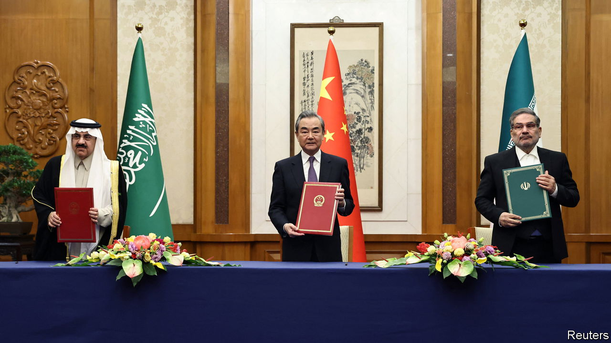

###### Deal or no big deal?

# China brokers an Iran-Saudi rapprochement 

##### But the deal will not end the countries’ proxy war, nor cement China as the region’s new powerhouse 

 

> Mar 10th 2023 

GO BACK, for a moment, to the halcyon days of late 2015, the last time Saudi Arabia and Iran had diplomatic relations. They were at odds in Syria, where they backed opposing sides in the civil war against Bashar al-Assad, and in Yemen, much of which had fallen to the Houthis, a Shia rebel group. Iran was furious over reports that Saudi police had sexually assaulted young Iranian pilgrims at Jeddah’s airport. Four years earlier, America had accused Iran of plotting to assassinate the kingdom’s ambassador in Washington. 

Then, one day after the calendar flipped to 2016, Saudi Arabia executed Nimr al-Nimr, a dissident Shia cleric. Rioters in Iran ransacked the Saudi diplomatic missions in Tehran, the capital, and the shrine city of Mashhad. The kingdom quickly severed ties with the Islamic Republic.

On March 10th the two old foes abruptly agreed to end their seven-year rupture. The deal became the subject of excited headlines in the Middle East and America. For the former, it seemed to signal an end to a long-running and ruinous proxy war. The latter was less interested in the substance than the venue: it was signed not in a regional capital but in China, a country that had hitherto played no significant role in the Middle East’s messy diplomacy.

Both reactions were a bit too exuberant. The agreement was transactional, not transformational. The two will remain at daggers drawn, as they were before 2016. China’s participation is more interesting, but still overstated: the deal dropped into its lap. Iran and Saudi Arabia have good reason to praise its role. But it is unlikely to become a new regional peacemaker.

Saudi Arabia and Iran have spent years talking about reconciliation. Such talks have gained new urgency in recent months, largely because both countries are exhausted. The Saudis have failed in their major foreign-policy gambits over the past decade, whether trying to overthrow Mr Assad or dethrone the Houthis. Iran’s victory, if it was one, was Pyrrhic: it is successful abroad but seething at home, as young people rage against a crashing economy and a corrupt dictatorship.

Saudi Arabia’s priority is to extract itself from its war in Yemen, launched in March 2015. Eight years and hundreds of thousands of deaths later, the Houthis still control much of the country and the war has only pushed them closer to Iran. The mullahs now supply the Houthis with weapons, money and training.

The Saudis are eager to strike a deal with the Houthis that would leave the group in power in exchange for an end to cross-border missile and drone attacks. For months they have wanted Iran to press the Houthis to accept. So the Saudi-Iranian agreement may presage a separate agreement in Yemen. That will not end the conflict, which was a civil war before the Saudi-led coalition intervened. But it would offer the kingdom a face-saving exit.

The agreement could also have implications for Iran International, a satellite-television channel established in London in 2017 that airs relentless criticism of the Iranian regime. Its bosses deny any direct links to the Saudi government. Nonetheless, the Iranian government has demanded that Saudi Arabia rein in the channel.

Those demands grew when street protests swept Iran in September. Iran’s regime also started threatening journalists working for Iran International. Last month the channel said it would move its broadcasting to Washington.

None of this heralds an era of friendship between Saudi Arabia and Iran. Their ideological disputes date back to Iran’s Islamic revolution in 1979. The Saudis will still worry about Iran’s nuclear and ballistic-missile programmes and its network of proxies in Arab states. Iran, for its part, will continue to see a Saudi hand in its (self-inflicted) domestic unrest.

Still, the treaty may lower the chances of a cold war turning hot. The United Arab Emirates (UAE) has reached a similar conclusion. Last year it restored full relations with Iran, having downgraded them after the attack on Saudi missions in 2016. The UAE was unnerved by drone attacks last year on Abu Dhabi, its capital, and worries that it could face retaliation for a possible Israeli strike on Iran’s nuclear facilities.

In Americathese points seem secondary. The focus was on the country that brokered the deal, not the signatories. “Seeing the Chinese role here will not warm any hearts in Washington,” tweeted Michael Singh of the Washington Institute for Near East Peace Policy, a think-tank.

This is an undeniable shift in China’s role. In 2021 Wang Yi, then the foreign minister, proposed a “five-point plan” for Middle East peace, full of banal slogans such as “advocating mutual respect” and “upholding equality and justice”. These empty words were the extent of Chinese diplomacy in the region. Now China has taken a far more public role.

Still, caveats are in order. Much of the diplomacy took place not in China but in Iraq and Oman, with America’s encouragement. China merely helped nudge the deal over the finish line. And it is hard to see how China can repeat the trick. It has gingerly dipped a toe into the swamp of Israeli-Palestinian peace, but no one expects it to wade in much farther.

Both Iran and Saudi Arabia have reason to play up Chinese involvement. In 2021 the Iranians signed a 25-year “strategic partnership” with China. Ebrahim Raisi, the president, wants his countrymen to think economic ties with the Middle Kingdom are a substitute for relations with the West. As for the Saudis, they hosted Xi Jinping at a big summit in December. China is their largest trading partner and the world’s biggest buyer of oil exports. After two chilly years with Mr Biden, it does not hurt to remind the Americans that the kingdom has other powerful friends.

Everyone stands to benefit—at least a bit. Saudi Arabia can ease tensions with a ruthless neighbour. Iran’s arch-conservative regime can look open to diplomacy. China can claim a diplomatic victory. But the underlying issues remain. This deal is more about perception than reality. ■

