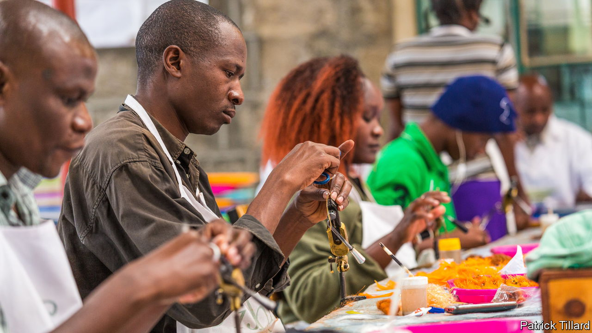

###### No flies on Kenya

# How an east African country became an odd sort of global powerhouse 

##### A cottage industry that adorns fishing rods on rivers across the world 

 

> Mar 16th 2023 

Red-eyed damsels, pole dancers, two-bit hookers, hot-legs foxy gotcha, woolly buggers, drunk and disorderly, Mrs Simpson and orange boobies are not what you might think. They are just a few of the colourful, dexterously tied flies that fishing folk cast from their rods to lure trout and salmon in the rivers of Scotland, South Carolina, Russia’s Kola peninsula and beyond. What these wacky names have in common is that they are among several thousand fluffy but lethal creations that have made Kenya a global hub of fly-tying.

Johnny Onslow, a 67-year-old retired head teacher whose fly-tying firm near the Kenyan town of Rongai is called Gone Fishing, reckons that at least 60% of the world’s supply of artificial flies tied to little fish-hooks is made in Kenya. No one really knows, because there are thousands of freelance tyers who do not register with Kenya’s tax authorities. 

This unusual cottage industry was started in the 1930s by a young Briton in what was then the colony of Kenya after he had broken his back in England playing rugby. Sent to recuperate in the clement African climate, he found that tying flies was a good way for an immobilised fishing fan to keep up his spirits. As his health improved, the hobby gradually became a business. 

Nowadays there are scores of workshops dotted across the country, where entrepreneurial Kenyans of all ethnicities, from freelance tyers in sheds to employers of more than a hundred at long tables, meet orders from as far afield as Chile, Estonia and New Zealand. By far the biggest markets, however, are in north America and western Europe. 

As the reputation of Kenya’s fly-tyers has spread farther afield, rival firms have sprung up in the Philippines, Sri Lanka, Thailand and Vietnam. Kenyans reckon their ingenuity (those names), speedy delivery, reliability and modest wages should keep them ahead. No one yet has discovered a mechanised method to replace the fiddly business of wrapping silk and cotton around delicate creations of feather, tinsel and fur to simulate a buzzing insect so convincingly that it whets the appetite of greedy trout. 

Most of the workers are paid piecemeal for the number of flies they tie. The official minimum monthly wage for such jobs in small towns is only around 19,000 Kenya shillings (about $146), and even less in the countryside. Some firms pay more than twice this rate when nimbler tyers exceed their targets, but even that is still cheap by global standards. Mr Onslow makes a point of hiring a number of disabled workers. 

This offers a lesson to other African countries fishing for exports. By dominating a niche, Kenya’s fly-tyers have hooked their customers, lined up a growing market and left competitors sinking.■

