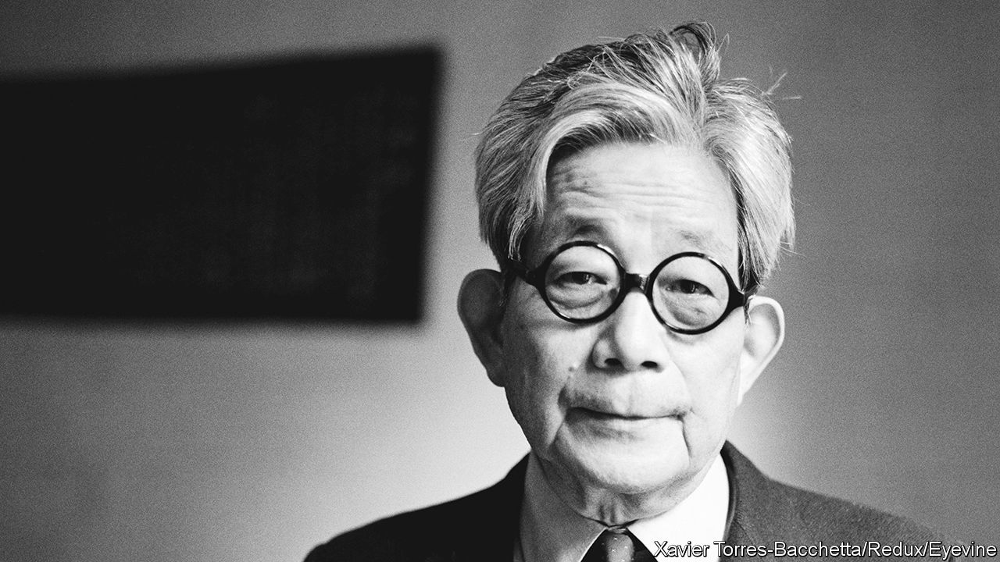

###### Father and son

# Oe Kenzaburo was made a writer by a family crisis 

##### The Nobel-winning novelist and activist died on March 3rd, aged 88 

 

> Mar 16th 2023 

The house where Oe Kenzaburo lived in Tokyo was a modest, tranquil place. Red maples and roses filled the garden, and paintings by his wife Yukari hung on the walls. The living room, crammed with books, was where he worked, sitting in an armchair to write in longhand on a board across his knees. But he was not alone. Also there was a man three decades younger, who sat sorting and re-sorting his collection of cds and listening to music. He had a misshaped skull, a squint and a shy, sweet smile. His father kept an eye on him even as he wrote, ready to help at once, watchful for seizures. This was Hikari, his eldest son. 

The birth of Hikari, in 1963, had been the greatest crisis in his life. He and Yukari were horrified at the sight of him, a baby with a cranial hernia so huge that he seemed to have two heads. Without an operation, the child would die. With one, he would still be profoundly handicapped. The dilemma was so acute that Kenzaburo could only run away, towards “some other horizon”. 

Oddly, perhaps, that horizon was Hiroshima, and a conference opposing nuclear weapons. There he met survivors of the atomic blast with dilemmas much like his own. Should they risk having children, if those children might be born deformed? Should they kill themselves, or try to live in hope? He spoke especially to doctors who did not know how, even whether, to treat people—but who had concluded that wherever there was pain, they should give care. There was his answer: he should take Hikari home.

That decision also shook up his writing. Fresh out of Tokyo University he had become a star—an unlikely one with his accent from a forest village far to the south-west, his jug ears and his owlish grin—by winning a national award for his novella “The Catch”, the story of a friendship between a Japanese boy and a black American POW, “a splendid guest from the sky”. But he had struggled since. In Hiroshima, he made two decisions: to write and campaign for the voiceless, and to speak uncomfortable things. 

He faced his own dilemma by writing it down, as his method was, in three stories that branched out differently from the same point, a damaged child. In “A Personal Matter” and “The Silent Cry” the parents first abandoned the baby, then reclaimed it. In “Aghwee the Sky Monster”, however, the father killed the baby by feeding it sugar-water rather than milk, and was haunted by the infant in its white hospital gown. Hikari featured in the novels under various names, and his own. This was not exploitation, his father insisted, but a recognition of what his voiceless child meant to him.

Too many voices were going unheard in Japan. Those from Hiroshima he recorded in “Hiroshima Notes”, a scathing description of the effects of nuclear war. He made the point that these people were victims not just of the Americans, but of Japan’s own aggressions in Asia. In essays and articles he spoke for the Korean minority, for forced labourers and “comfort women”, and for proper reparation. He lamented, too, Japan’s decline into consumerist conformity, a “happy wasteland” without controversialists. The 1950s had brought hopes of a new, pacifist role in the world, when Japan could have stood up with the weak. Yet it still saw itself as the forceful centre of Asia rather than, like him, making the most of a place on the periphery.

The revival of nationalism troubled him most. As a small schoolboy in the war he had pledged to obey the emperor unreservedly: if so ordered, “I would die, sir. I would cut open my belly and die.” He was astonished to discover, when Japan surrendered, that the emperor was not some sort of mystical white bird; his voice was human. That quickly disabused him, but emperor-worship still persisted. Democracy needed defending, and he did so fulsomely in 1994 by declining the Order of Culture because the emperor bestowed it, and he rejected his authority. 

Meanwhile the principle of eternal peace, the moral prop of Japan’s post-war constitution, was threatened by the idea of collective self-defence. In 2004 he co-founded the Article 9 Association to resist all attempts to water down the peace clause and allow the use of force. By then he had been protesting against war for 40 years, marching abroad as well as in Japan. He was known for his gadfly activism as much as for his books, and relished that. He saw his job as that of a clown who spoke seriously, about sorrow.

His books, though, were also attacked by the right. These were tough, unflinching novels, heavily coloured by his reading of Rabelais, Yeats, Dante, Auden and Orwell. They writhed with seaminess, explicitness and grotesques, including a portrait of Japan as sexually humiliated by the United States. Their world was rough. In “The Silent Cry”, the half-blind hero used his lost eye as a sentry “forever trained on the darkness within my skull, a darkness full of blood”. Unsparingly, he described his alcoholic wife, “her upper lip greasy with sweat”, the reek of a dog’s slobbering mouth, a decomposing corpse with “the dam of the skin sentenced to burst”. Yet the book also followed the hero’s ascent from a cesspit of despair to a moment of brotherly reconciliation and, at the end, to “Expectation”. It was themes of hope like this, passing from the personal to the universal, that led Mr Oe in 1994 to the Nobel prize. 

Not the least of his acts of defiance was to bring Hikari up publicly. Brain-damaged children in Japan were usually shut away. But the bond between him and his son grew ever-closer. In his childhood in the forest, his mind full of the adventures of Huckleberry Finn and Nils Holgersson, the boy who flew with wild geese, he slept out among the trees and dreamed of knowing the language of the birds. When Hikari too was in the woods, aged six, he spoke his first sentence, identifying a water-rail. From that point the “monster-baby” came to know birds by their songs, to take in the music of Mozart and Bach, and to compose his own. He fulfilled his father’s dreams; and he proved that music healed “the voice of a crying and dark soul”, as his father hoped that words could. 

In the living room in Tokyo they worked in the same space, separate but ever mindful of each other, looking, as he put it, “in the same direction”. Hikari’s name meant “light”. ■

