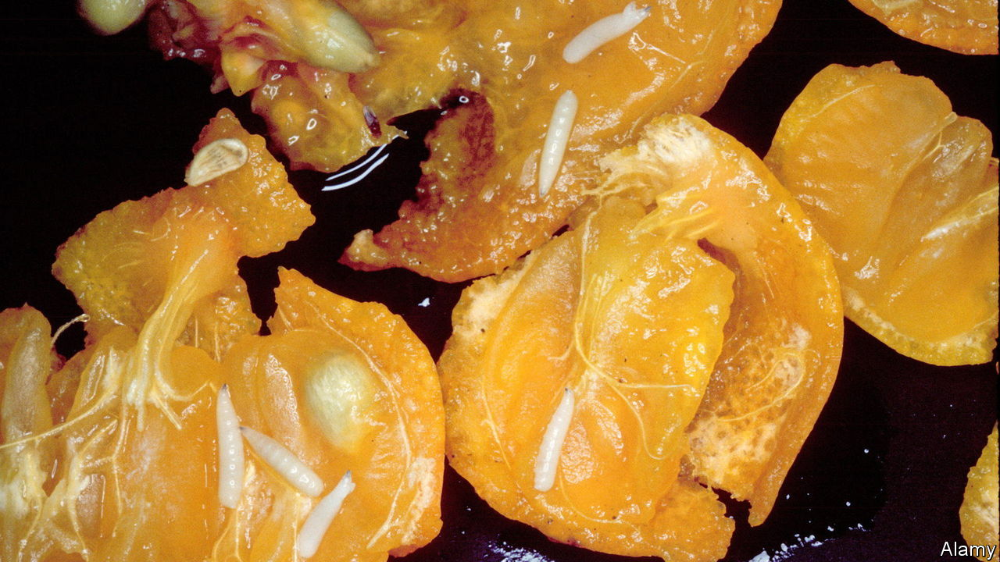

###### Mind maps

# A big advance in mapping the structure of the brain 

##### After larval fruit-flies’, more complex brains are next 

 

> Mar 10th 2023 

The cognitive abilities of a fruit-fly larva may not seem particularly noteworthy. This creature—the fly’s early, wormlike phase—is just about capable of sensing its environment, searching for food and avoiding predators. Its brain does not yet know how to walk, fly, or even properly see. And yet its limited capacity is still, in miniature, a useful model for what larger and more complex brains can do.

Researchers have now published the first complete map of the brain of such a larva. This “connectome”—the equivalent of a three-dimensional circuit diagram—charts the locations of a brain’s neurons as well as the synapses, the junctions where the brain cells pass information between each other. The structures of these circuits influence the kinds of computations a brain can do. Knowing how neurons are interconnected can give scientists a more mechanistic understanding of how the brain functions.

Until now, the production of connectomes has been limited to those of simpler organisms such as the nematode worm, whose brains have hundreds of neurons and in which complex behaviour has not yet been observed. Small portions of larger brains—including the fruit fly itself—have also been mapped. Never before, though, has the whole brain of such a complex organism—spanning some 548,000 connections between 3,016 neurons in the case of the fruit-fly larva—been mapped. 

The latest work, published in , marks the culmination of over a decade’s worth of effort, started at the Janelia Research Campus in Virginia, as part of its Flyem project. The first step involved slicing the tiny larval brain into thousands of layers for scanning with an electron microscope (the EM of the name). Researchers then painstakingly labelled and analysed the images, mapping out areas associated with functions such as vision, for example, or olfaction.

The connectome of the fruit-fly larva has already provided insights. For example, regions of the creature’s brain associated with learning had more loops in their circuitry, with downstream neurons connecting back to those close behind them, than other regions of the brain. This suggested some repeat processing of signals. One proposed explanation is that such loops encode predictions, and that the creatures learn by comparing these with real experiences in their environment. 

Information about the taste of a leaf, for example, might enter a neuron at the same time as a prediction based on previous meals. If the taste differs from prediction, the neuron may secrete dopamine, a chemical capable of rewiring the circuitry to create a new memory.

Biologists have much to learn from connectomes. Marta Zlatic, a neuroscientist at the University of Cambridge and an author of the latest research, envisages a connectome study programme with three steps. First, a connectome is mapped. Second, the activity patterns in a living brain are imaged while an animal carries out a set of tasks. And third, these two sets of information are combined to pinpoint variations in brain structure worth manipulating or breeding in the lab. That would help to test hypotheses between individuals with different brain structures. 

In order to understand the origins of intentionality, for example, or how a fly decides to perform an activity such as moving forward, an individual’s brain would be scanned while it moved. Then, the regions that showed activity would be analysed in the connectome. Other flies could have those specific brain circuits silenced and, by comparing the behaviours of the different individuals, scientists would be able to pinpoint the role played by specific brain regions in how a fly carries out an activity. “The future”, says Dr Zlatic, “is comparative connectomics.”

This now seems achievable. Even in the decade since this larva was imaged, technology has advanced dramatically. The nanoscale salami-slicing involved in EM can now be done in weeks, rather than years. Analysis could also be sped up: now that the painstaking work of labelling the larval connectome has already been done by hand, a machine could be taught to do it again on a different individual’s brain.

Dozens of groups are forging ahead. Another branch of the FlyEM team is tackling the adult fruit-fly connectome, which has ten times more neurons and a vastly larger visual cortex. Other groups are facing down the zebrafish, a relatively tractable vertebrate. The biggest game in the crosshairs at the moment, though, is the mouse. With a brain volume a thousand times bigger than the fruit fly’s, researchers are currently advancing one cubic millimetre at a time. Still, says Moritz Helmstaedter at the Max Planck Institute for Brain Research in Frankfurt, who leads one such project, a full mouse connectome is eminently achievable, even if it is also several hundred million dollars away.

Of course, the ultimate prize is the human brain, a thousand times bigger still and vastly more complex. But when, if ever, that can be given the full connectome treatment remains to be seen. ■


