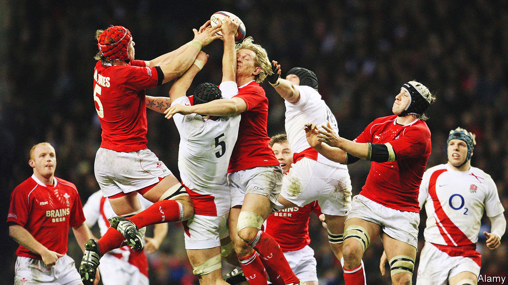
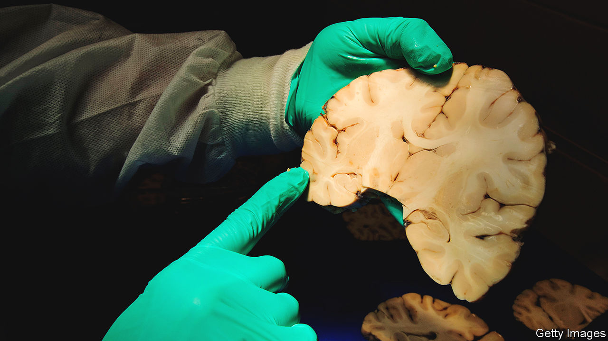

###### Brainslammed

# Evidence is growing that playing contact sports can lead to long-term brain injuries 

##### Rugby players are taking their sport’s governing bodies to court, alleging harm 

 

> Mar 15th 2023 

Meeting Nelson Mandela should be a high point in anyone’s life. But Alix Popham, a Welsh former rugby player who once met the legendary president of South Africa before a match, has no memory of the encounter. Later that day during the game, he was struck so hard on the head that he suffered a severe concussion, an injury in which his brain was thrown around inside his skull.

Concussions can cause someone to see stars or slur their speech. They might also be knocked unconscious, as in Mr Popham’s case, and robbed of what may have become cherished memories. But Mr Popham (pictured, in red and crashing into an opponent’s arm) believes that the thousands of repeated knocks to his head over the course of his rugby career have robbed him of far more. He now gets lost easily, hates background noise and, in a fit of rage, once ripped off a banister upstairs in his home. He is 43 and has been diagnosed with early-onset dementia.

Mr Popham is not alone. Last year Rylands Garth, a British law firm, began court proceedings against World Rugby, rugby union’s world governing body, and also the sport’s national governing bodies in England and Wales, on behalf of 225 former professional players with neurological impairments. It is just one claim among several in Europe. Otherwise-healthy sportsmen in their 30s and 40s are suffering from a host of conditions that include motor-neurone disease, early-onset dementia, Parkinson’s disease and chronic traumatic encephalopathy (CTE). There are concerns that these injuries were acquired through a professional career playing contact sports, and that sporting authorities did not take the right actions to prevent them.

The outcome of these legal claims, and also any changes to how contact sports may be played in future, rely on the emerging scientific evidence that aims to link historic blows to the head with the various neurological conditions currently afflicting the players. In America the National Football League (NFL) and the National Hockey League settled similar legal cases in 2013 and 2018 respectively. 

The dam breaks open many years too soon

An early focus of concern was evidence that concussions were leading, in some players, to CTE. This degenerative brain disease causes memory loss, confusion and problems with impulse control, among a range of other symptoms. Worry about concussion, which is a mild form of traumatic brain injury (TBI), has since spread to sports including ice hockey, boxing and football. 

TBIs are accepted as increasing the risk of developing dementia—in 2020,  commission on dementia, convened by academics to recommend ways to tackle the rise in neurodegenerative conditions, added TBIs to their list of causative factors. Moreover, there is compelling experimental work in mice that shows that blows to the head, even when they do not result in the classic signs of concussion, can nevertheless lead to brain injuries and the first steps towards CTE. In 2019 an ongoing study of almost 8,000 former professional footballers in Scotland reported that their rate of death from neurodegenerative diseases was three-and-a-half times higher than expected. In 2021 the same study found that the footballers’ overall risk of developing brain problems was related to position on the field (defenders were most vulnerable) and to the length of their career. Those involved in the study say that these findings, along with post-mortem work, show that head injuries are an important risk factor for neurodegenerative disease in footballers. 

A new study published this month in  finds the age of first exposure to American football, and years played, both had an association with less white matter in the brain and with impulsive behaviour. White matter is the neurological wiring that connects the neurons within the brain. This all points to a “dose-response” relationship. In other words, more blows to the head seem to increase the risks of long-term damage.

 


In 2022 a different study in looked at the brains of 44 active elite rugby players (including three women) and compared these with control groups comprising people playing non-collision sports, and those outside sport entirely. In addition, brain scans of some of the players were taken a year apart. The researchers found that, whether or not players had had a recent head injury, ten of them had abnormalities in their white matter that indicated disrupted nerve fibres. There were also small tears in blood vessels that had caused bleeds in three of the rugby players. In those players who had had brain scans, half were found to have reductions in brain volume over the year. 

Crucially, the problems were also seen in players who did not exhibit any of the classic symptoms of concussions. However, while the study’s findings were alarming, a short-term study such as this is not able to prove that these players will have a higher risk of neurological difficulties later in life. For that, longer term imaging studies would be needed.

Dark forebodings

How TBIs might contribute to longer-term neurological conditions such as dementia is less clear. One theory, says Neil Graham, a neurologist at Imperial College London, is that a TBI may trigger a neurodegenerative process that propagates over time. That idea is supported by work in animals that show injuries to axons—the long threadlike parts of neurons that connect different cells and transmit electrical signals—can generate abnormal forms of brain proteins such as tau and amyloid. These may clump together and spread through the brain. Clumps of abnormal proteins such as these are one of the proposed causes for Alzheimer’s disease.

Dr Graham also says that better technology is needed to understand what is happening to players during games. Simply observing how someone behaves on the pitch after a blow to the head can be misleading. “We need to shift towards using biomarkers such as ultrasensitive blood tests so we can get objective data,” he says. Research into blood and saliva tests shows that these could give clues to what is going on inside the brain by looking for molecular biomarkers—including tau, glial fibrillary acidic protein and ubiquitin C-terminal hydrolase L1—that spike in the blood within hours of an injury. The recent approval, in America, of a blood test for mild TBI shows it will soon be possible to identify and measure such an injury objectively, perhaps even at the pitch-side. Sports governing bodies have typically not made use of such technologies in the past, but that could be changing. World Rugby is testing mouthguards containing accelerometers, which can measure the forces players are being subjected to during games.

Although the science is becoming clearer, it will remain difficult for individual players with dementia or related problems to prove causation. They need to show that, on the balance of probabilities, what happened decades ago caused the problems they suffer from now, explains Jack Anderson, a professor of sports law at the University of Melbourne. This will be difficult, not least because relevant medical records may not have survived. Much of the players’ case will rely on the advances in medical imaging, alongside epidemiological evidence that aims to link brain injuries and their probable cause.

You shout but no one seems to hear

In 2021, after the lawsuit against it was announced, World Rugby published a six-point plan committing it to improving player welfare. The organisation is also conducting its own research into head impacts, reviewing existing laws and, it maintains, devising its policy assuming that there is a link between repeated head impacts and CTE. But progress has been slow. There are routine examples of sportsmen and women who receive brutal blows to the head on the pitch, yet continue to play. World Rugby says such incidents are reviewed and team doctors who are found to have erred in their judgment can be sent for further training or even disciplinary action. Official recommendations state that, during training, players should have only 15 minutes of contact time per week, ie where they can collide at full speed as they might in a game. But that guidance does little to restrain clubs and players hungry for a competitive edge.

James Drake, chairman of the Drake Foundation, a non-profit that funds research into the long-term health effects of a career in sports, also points to evidence that the game was probably safer in rugby’s amateur era. As it has become more professional, players have become bigger. In the past, players had to be quick and agile; now it is a collision sport. In football, where English players have launched their own rugby-style negligence claim, the Professional Footballers’ Association has created a “brain-health department” to help lobby for stronger concussion protocols and to care for former players with dementia. They are also trying to raise awareness among current and future players of the potential dangers of heading the ball.

To widen the evidence base, former athletes from a range of sports are donating their brains for medical research. The “brain bank” at Boston University contains more than 700 brains with CTE, mostly belonging to former athletes (see image). As of February, 345 of the 376 brains of NFL players studied at the brain bank had been diagnosed with CTE. The figures contrast sharply with the very low rates of CTE found in the brains of non-athletes, although the brain-bank samples are subject to selection biases.

Playing different tunes

The rugby lawsuits, as with the NFL cases a decade ago, will probably end in a settlement. A recent ruling in Los Angeles showed how difficult it can be to prove these cases—a jury there rejected a $55m lawsuit by the widow of a former American football player, who alleged that the 6,000 hits her husband endured during his career caused him permanent brain damage and resulted in his death at the age of 49.

For the claimants, their case is about far more than compensation. Mr Popham says that, if an offer to settle came, he would only do so if new rules were put into place to make rugby safer to play. “I watch rugby through different eyes now with what I know,” he says. The evidence as yet may not be definitive. But one way or another, Mr Popham and his peers are determined to make rugby a very different game. ■


