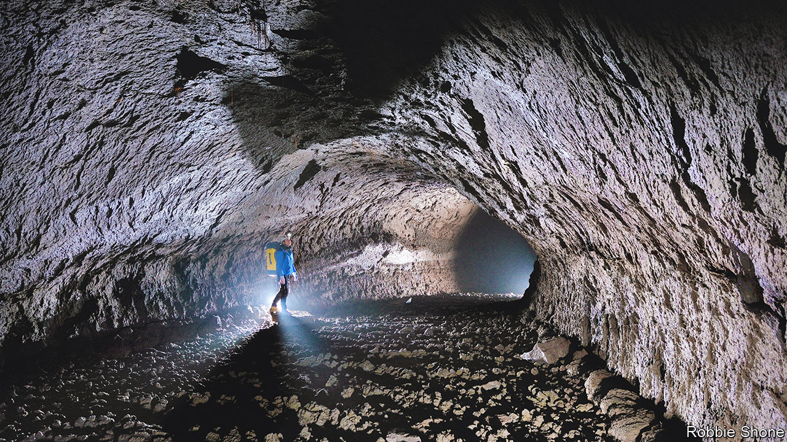

###### Lunar living

# Pressurised natural caves could offer a home from home on the Moon 

##### It would make building bases a lot cheaper and easier 

 

> Mar 15th 2023 

Imagine a habitable colony on Mars or the Moon and the kinds of structures that come to mind are probably gleaming domes or shiny metallic tubes snaking over the surface. But with no Earth-like atmosphere or magnetic field to repel solar radiation and micrometeorites, space colonists would probably need to pile metres-thick rocks and geological rubble onto the roofs of such off-world settlements. More like a hobbit hole than .

There could be another solution, however, that would offer future colonists safer and far more expansive living space than any cramped base built on the surface. Writing in , Raymond Martin, an engineer at Blue Origin, a rocket company, and Haym Benaroya, an aerospace engineer at Rutgers University, explore the benefits of setting up a Moon base inside giant geological tunnels that lie just below the lunar surface.

First discovered during the Apollo programme, these lunar lava tubes are a legacy of when Earth’s nearest celestial neighbour was geologically hyperactive, with streams of boiling basaltic magma bursting from the interior to flow across the Moon’s surface as lava. Found on Earth (see picture), and identified on Mars, lava tubes form when the sluggish top layer of a lava stream slows and cools, forming a thick and rocky lid that is left behind when the rest of the lava underneath eventually drains away.

Lava tubes on Earth are usually up to 15 metres wide and can run for several kilometres. But the reduced gravity on the Moon makes them hundreds of times bigger, creating colossal cave systems that are up to a kilometre across and hundreds of kilometres long.

Space scientists have long identified these lava caves as a likely site for human habitation on the Moon, because the thick walls and ceiling offer protection from the harsh radiation striking the Moon’s surface. But Mr Martin and Dr Benaroya went a step further. Rather than simply situating a Moon base inside a lava tube—domes and shiny buildings and all—they suggested that a section of such a tube could be pressurised with breathable air. Residents could live, work and sleep inside the pressurised tubes with no need for space suits and with plenty of spare real estate for some low-gravity recreation. And although the costs and details need more planning, it could end up cheaper than having to send from Earth everything needed to survive on the lunar surface.

In their latest study, the two scientists crunched some numbers on what might be possible. “One of the first big hurdles there is proving that they [the lava tubes] are structurally sound,” says Mr Martin. To find out, he and Dr Benaroya built a computer model to simulate the integrity of a relatively small lava tube in the Moon’s Oceanus Procellarum (Ocean of Storms), which was photographed by the Indian  lunar probe 15 years ago.

After checking several combinations of internal pressure and roof thickness, and whether the resulting structure was stable, the study suggested a lava tube with a roof thickness of ten metres could be safely pressurised to almost the same conditions found at sea level on Earth. The scientists also showed that the overall pressure (and so the risk of roof failure) could be reduced by increasing the proportion of oxygen in the artificial air used to fill the caverns. And given the awkwardness of moving around in a space suit, the study looked at how astronauts could get themselves and their equipment safely in and out of the tubes. The best option, it concluded, would be to build the entrance where a wall of the lava tube had naturally collapsed open.

Knowing that the roof will not fall in should give engineers the confidence to work on other aspects of the idea, such as how to use inflatable structures to cap the ends of a pressurised section of the tube. Such membranes are already used for flood prevention in tunnels on Earth, where they can be quickly deployed to block incoming floodwater. Another issue is whether the lava tube’s ceiling would be fully airtight, and if not, how to seal it to prevent leaks. And, of course, how to prepare humanity for a return to life in caves. ■


