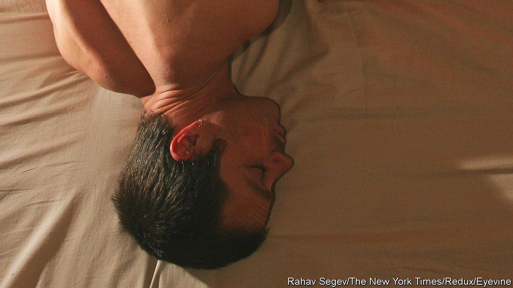

###### Give it a rest

# To ensure vaccines work properly, men should get a good night’s sleep 

##### The case for women is less clear 

 

> Mar 15th 2023 

Vaccines get all the glory, but it is really the immune system that does the heavy lifting. Indeed, those with weak immune systems often benefit little from . Aware of this, researchers have long thought that people  also ought to benefit less from vaccines, as sleeping less is thought to reduce immune function. A new analysis reveals that this is clearly the case—though only in men.

The immune system is metabolically expensive for the body to operate. When resources run low, it cannot function as well as it might when well supported. This is why people who are profoundly cold for long periods of time tend to fall ill—their bodies are burning calories to stay warm that might otherwise have been used to fuel their defence. 

The immune system is similarly hamstrung by a lack of sleep since a number of its key components, such as the white blood cells that produce antibodies, are predominantly made by the body when a person is slumbering. Yet it has remained unclear whether poor sleep at a time of vaccination leads to reduced immune benefits.

Vaccines work by presenting the immune system with the foreign material of a pathogen. The system reacts by making antibodies, though these do not last for ever—they circulate in great numbers shortly after a real or vaccine-induced invasion but their population wanes over time. Eventually, another shot of vaccine is needed to boost the antibody count.

For their study, Karine Spiegel at the French National Institute of Health and Medical Research and Eve Van Cauter at the University of Chicago speculated that insufficient sleep might damage the ability of the immune system to react to vaccines and thus result in fewer circulating antibodies. They pooled the results of seven studies in which a total of 603 participants between the ages of 18 and 60 had had their antibody response to vaccines monitored and who had also been asked how many hours of sleep they were getting each night. 

Dr Spiegel found that men showed a strong relationship between insufficient sleep (defined as fewer than six hours of kip a day) and antibody response. The magnitude of the effect, when sleep duration was recorded objectively by a lab rather than self-reported by a patient, was similar to the amount of antibody waning seen in an average person two months after being given the Pfizer-BioNTech covid-19 jab. The vaccines given to sleep-deprived men, therefore, still provided protection but the effect was less potent from the start and lasted for less time, on average. 

The results were published this week in Dr Spiegel says that encouraging patients to get plenty of sleep before and after a vaccination appointment is an ideal way for a medical system to maximise its vaccine stock and ensure that the benefits granted are as large as possible.

As for why the results in women were not significant, Dr Spiegel and her colleagues theorise that sleep affects female response to vaccines too but that hormone interference, driven by varying stages of the menstrual cycle, contraception and hormone-replacement therapies, is probably altering immune response in profound and unknown ways that throw off the results. It is a subject area that urgently needs more attention, argue the researchers. 

Vaccines are an important tool in the world’s armoury against disease and there is no getting around the fact that developing and adminstering them is a difficult and expensive process. But patients could at least be encouraged to give their immune system a rest before getting jabbed. It costs nothing, and could pay considerable dividends.■


