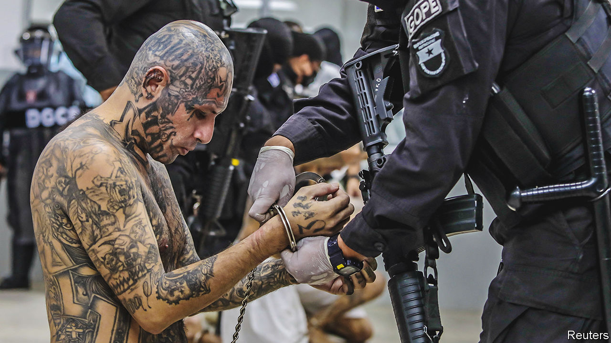
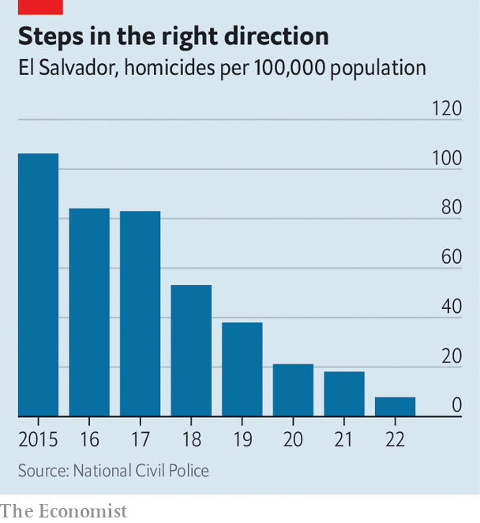

###### Borrowing from Bukele

# El Salvador’s authoritarian president is becoming a regional role model 

##### That is dangerous for democracy and human rights 

 

> Mar 16th 2023 

In january Nayib Bukele, El Salvador’s president, carried out the latest of the eye-catching acts that have characterised his time in office. He inaugurated the “terrorist-confinement prison” on the plains near the San Vicente volcano in the centre of the country. Mr Bukele says it will hold 40,000 detainees, which will make it the largest prison in the world (and the most crowded in the Americas). 

The president has a talent for getting his country of 6.3m people into global headlines. In 2020  to bully it into supporting his security budget. In 2021 El Salvador became the first country to make . Mr Bukele’s theatrics and his policies have paid political dividends. His approval rating has not dropped below 75% since he took office in 2019. In February it reached 90%, the highest in Latin America. 

 


The biggest reason for this is a sharp drop in violence during Mr Bukele’s presidency. In 2015 El Salvador had the highest murder rate in the world, 106 per 100,000 people (see chart). Last year, according to the government’s figures, this had dropped to 7.8. That rate puts El Salvador on a par with the United States. In next-door Honduras it is 36. The “unprecedented reduction in crime” has contributed to “robust [economic] activity”, the IMF noted recently. Tourism has recovered from the slump brought on by the pandemic: 2.5m tourists visited El Salvador in 2022, nearly the same number as in 2019. Lonely Planet, a guidebook publisher, lists the country as one of its top destinations for this year. 

Politicians in nearby countries are studying Mr Bukele’s tactics. Zury Ríos, the front-runner in Guatemala’s presidential election, scheduled for June, has called his security policy “a model”. Costa Rica’s security minister has said the country should adopt it. Leaders outside El Salvador are experimenting with Mr Bukele’s methods rather than adopting them in full. But there is popular pressure to go further. That could imperil democracy and human rights in Central America and beyond. 

Mr Bukele, who comes across as Hollywood’s idea of the hijacker of the president’s plane rather than the president himself, seems keen to export his style of government. In January El Salvador announced that it would open an office in Haiti to advise its government how to deal with the gangs that control much of the country. Mr Bukele’s associates have set up a political party in Guatemala with the same name and logo as his New Ideas party and have made an attempt, so far unsuccessful, to do the same in Costa Rica. If El Salvador’s murder rate stays down, his influence will grow. “If this proves sustainable, a lot of people all over Latin America will be looking to Bukele as a model to follow,” says Kevin Casas-Zamora, a former vice-president of Costa Rica who now leads IDEA, a think-tank based in Stockholm.

Mr Bukele’s growing soft power abroad is based on a ruthless exercise of hard power at home. Two gangs, Barrio 18 and MS-13, have terrorised Salvadoreans for years. Their main business is extortion. When the violence they caused was at its height, GDP was  by one estimate. In March last year, after a weekend during which the gangs killed 87 people, Mr Bukele introduced a “state of exception” that allows police to arrest anyone without showing cause. Since then, he boasts, police have locked up 62,000 people, 2% of the adult population. This is the “largest dragnet” ever in Central America, a region given to harsh crackdowns on crime, according to the International Crisis Group, a think-tank based in Brussels.

The results have been dramatic. In Las Cañas, a neighbourhood of Ilopango, a town east of San Salvador, rival gangs used to clash near the football pitch that marked the border between their territories. Anyone passing could be hurt, says Álex Meléndez, a 37-year-old resident. He used to leave his job refurbishing houses at 4pm to get home before dusk. Since the round-ups carried out under Mr Bukele’s state of exception, Mr Meléndez has been able to stay out. His mother-in-law has opened a sweet shop. Youngsters play football late into the evening on the formerly contested pitch.

Salvadoreans are paying a high price for relative peace. , a digital newspaper, put it this way in a headline: “No gangs but no more democracy”. Yessenia, who works with young people in a Catholic church in Delgado, close to the capital, says youths are no longer scared of gangs and have new opportunities. But now they are frightened of the army and police who patrol the community. “They are always harassed by the authorities,” she says. Claudia Ortiz, an opposition lawmaker, says “there is a lot of collateral damage” from Mr Bukele’s offensive against crime. “And there is no plan for exiting the emergency.” 

His crackdown on crime is enabled by one on lawful institutions that might get in his way. After intimidating the legislature he won control of it in elections in 2021. Soon after he sacked the attorney-general and judges on the Supreme Court, replacing them with loyalists who renew monthly his state of exception. He has threatened to sue independent media (including ). He uses trolls to insult critics on social media and to try to get their accounts shut down. In a ranking of democracies by the Economist Intelligence Unit, our sister company, El Salvador fell further last year than all but three countries (Burkina Faso, Haiti and Russia). It classifies El Salvador’s government as a “hybrid regime”. 

Among the services rendered by the new Supreme Court is permission for Mr Bukele to run for re-election next year, despite a constitutional term limit. He need not commit fraud to win it and to secure again a parliamentary majority. Voters still blame the two main opposition parties, which alternated in power from the end of the civil war in 1992, for misgoverning the country until Mr Bukele came along. 

His governing project poses two dangers. The first is that it fails. Many Latin American governments, including past ones in El Salvador, have tried versions of Mr Bukele’s  (iron fist) policies. All have failed, says Ivan Briscoe of Crisis Group. Guatemala’s Plan Escoba in 2004 used extrajudicial killings of gang members. The murder rate rose to record highs.

Mr Bukele, like his predecessors, started out by trying to strike deals with gangs. He refused to extradite 14 bosses to the United States and quietly let some out of prison. The crackdown came after relations deteriorated and killings jumped. For now his policy of removing people from the streets, and raising security forces’ pay so they don’t team up with the criminals, is working, though the violence began dropping before Mr Bukele became president. The government’s homicide numbers exclude some victims, such as gangsters who die in shoot-outs with police.

 


The dip in violence is unlikely to last. People who are wrongly locked up may be forced to join existing gangs in the terrorist-confinement jail to protect themselves. And new criminal networks may form, as has happened in other Latin American prisons. Despite the recovery of tourism and the reduction in violence, El Salvador’s economy is not yet growing fast enough to significantly reduce unemployment and poverty, which push young people towards gangs in the first place. “Education, the desire for status and so on has not changed,” says Mr Briscoe. 

The second danger is that Mr Bukele succeeds, and that he becomes a role model in Central America and beyond. Central America’s only full-fledged dictator is Nicaragua’s Daniel Ortega, a 77-year-old leftist who overthrew a right-wing regime more than 40 years ago, then lost and regained power. Mr Bukele, a younger, cooler , is likely to have more appeal in a region that is disappointed with democracy. 

In the Northern Triangle (El Salvador, Guatemala and Honduras) the democracies that formed in the 1990s after civil wars were mechanisms for sharing spoils between the political parties founded by the combatants. Poverty, violence and corruption have thwarted economic development and fostered crime. Since 2014 more than 2m people have emigrated from the area. Costa Rica, a more prosperous and stable democracy, suffers from political paralysis caused by the fragmentation of power among parties and the president’s frequent use of his veto power. 

Latin Americans are increasingly willing to sacrifice democracy for security and prosperity. AmericasBarometer, a survey, reports that more than half would give up the right to vote if that would get them decent incomes and basic services. In 2021 half of Salvadoreans, the highest level in Latin America, said that in difficult times the president should be able to shut down the parliament. That is a rise of 33 percentage points from 2018. In neighbouring Guatemala 38% would accept that deal. In Guatemala and Honduras small groups have recently held demonstrations to demand Bukele-style rule. 

Leaders in the region are trying some of his tactics, but wary of becoming his clones. In an effort to reduce extortion, in December Honduras’s left-leaning president, Xiomara Castro, declared a state of emergency that, like Mr Bukele’s, allows the police to jail suspects without charge. But her government has jailed fewer people and exempted some municipalities. Rodrigo Chaves, Costa Rica’s president, is under investigation by a parliamentary committee for allegations that he used trolls to harass journalists in the run-up to his election in 2022. Like Mr Bukele he fulminates against the opposition and the press, and rubbishes rather than seeking to reform institutions that he claims hold up progress. Yet Mr Chaves has ruled out adopting Mr Bukele’s security model. He pointedly declares that he loves democracy and supports the separation of powers.

The answer to democracy’s failings is to “to make democracy work better”, says Mr Casas-Zamora. At the moment, to many Salvadoreans and citizens of nearby countries, Mr Bukele’s authoritarianism seems more alluring. ■

