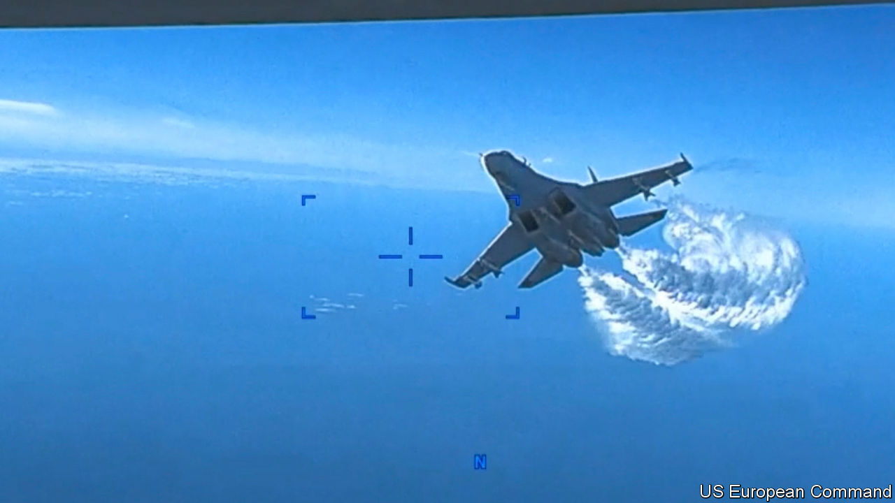

###### The Economist explains

# What to make of a clash between a Russian jet and an American drone 

##### Aerial interceptions are common. Collisions are vanishingly rare 

 

> Mar 15th 2023 

THE SUN had barely risen over the Black Sea on March 14th when two Russian Su-27 “Flanker” jets began following the American MQ-9 , more commonly known as the Reaper, 50 nautical miles south-west of Crimea, a Ukrainian peninsula occupied by Russia since 2014. The Reaper had made that trip hundreds of times over many years. So too had the Russian jets. But the encounter culminated in a collision, according to American officials, with one of the Su-27s clipping the Reaper’s propeller and causing it to ditch in the sea. How do such intercepts normally work, and how dangerous are they?

 


America and its allies routinely fly drones and crewed aircraft over eastern Europe and the Black Sea to collect intelligence on Russian military forces in Crimea and other parts of Ukraine. The planes flew over Ukraine until the war began; now they skirt its borders. Publicly available tracks of NATO surveillance flights between September and November, an illustrative period, show intense activity from the Baltic Sea in the north to the Black Sea in the south (see map). They typically hoover up electronic intelligence, such as communications and other signals from Russian units, and often share it with Ukraine. Some flights are intended to activate Russian air-defence radar, allowing NATO countries to locate batteries and identify their different radio-frequency emissions. 

Russia often sends jets to monitor these flights, just as NATO sends warplanes to monitor Russian bombers approaching European airspace. Most such “intercepts” are uneventful. Research by the RAND Corporation, a think-tank, shows that between 2014 and 2018 well under 5% of American reconnaissance flights encountered “assertive” Russian behaviour. That spans a range of things: dipping wings to reveal weapons; using afterburners to create turbulence; in more extreme cases, locking onto the target with weapons radar.


The aims are to intimidate the plane or drone operator, forcing the aircraft to change course, and to deter future flights. Similar encounters occur in the Pacific. In June last year Australia accused a Chinese jet of releasing flares in front of an Australian plane over the South China Sea. In December America accused a Chinese jet of flying within a few metres of an RC-135 spy plane.

There are no public data on whether Russian approaches have become more aggressive since the country’s invasion of Ukraine began in February 2022. RAND suggests that Russian activity tends to be responsive, rather than proactive: “the data show that as the number of US [intelligence] and bomber flights in Europe increases, so do the expected number of assertive Russian incidents in the air.” In October another Russian Su-27 released a missile near a British RC-135 plane over the Black Sea. British officials began sending fighter escorts up with their planes. But they judged that mishap to be an accident, rather than a deliberate show of force.

In the latest encounter, American officials say that the Su-27s conducted 19 close passes and sprayed jet fuel on the Reaper, possibly to obscure its sensors. On the last pass, one jet struck the Reaper’s rear propeller forcing its controllers to glide it into the water. Russia denies this account, insisting that the plane fell into the sea after “sharp manoeuvring”. A video from the Reaper, released by US European Command on March 16th (pictured above), corroborates the American claims. It shows the Su-27 swooplng up wildly next to the drone, and a damaged propeller in the aftermath. American officials have described the intercept as “unsafe”, “unprofessional” and “juvenile”—but Lloyd Austin, America’s defence secretary, said that it was not clear whether the collision itself was intentional. Russian pilots are likely to have taken greater risks with a drone than they would have done had a human pilot been on board. In 2016 China seized an American naval drone in the South China Sea—something it would not have dreamed of doing with a crewed vessel.

In large part, this game of aerial cat and mouse is neither new nor uniquely dangerous. There were tens of thousands of intercepts after 1945, notes Robert Hopkins, a former RC-135 pilot and historian, but only two collisions—one between a Soviet Su-27 and a Norwegian P-3 sub-hunter in 1987, and between a Chinese jet and American EP-3 plane near Hainan island in 2001. Only the Chinese jet was lost, though the incident triggered a Sino-American crisis. That suggests that brinkmanship, though intended to raise risks and dissuade adversaries from snooping, can typically be kept under control.

Aerial tensions are not confined to adversaries. Mr Hopkins has noted that Israeli pilots were often the most aggressive in seeking to dissuade American intelligence-gathering. And the most serious incidents were not accidents at all but deliberate decisions to attack. “Nowadays, it seems, the opponent pesters the recon plane,” writes Larry Tart, a former American reconnaissance pilot. “In the cold war, in too many cases, the approved method was to kill it.” The Soviet Union, China and North Korea shot down multiple American planes during interceptions, resulting in more than 100 airmen killed or missing. In 1989 American jets shot down a pair of Libyan planes sent to intercept an exercise. “The only differences” with past interceptions, says Mr Hopkins, are that America “is publicly discussing them” and “more people are aware of them due to social media.”■

