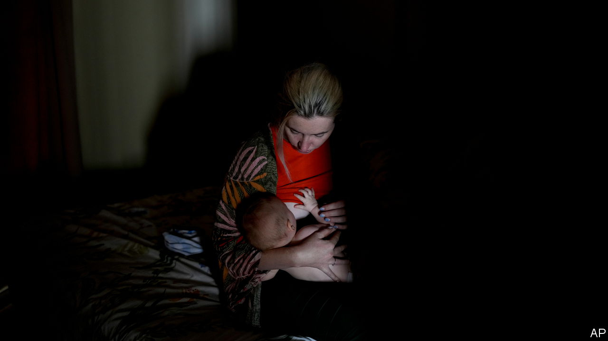

###### The Economist explains

# Why Russian women are flying to Argentina to give birth 

##### The country offers visa-free entry and birthright citizenship 

 

> Mar 14th 2023 

ARGENTINA HAS always been a country of immigrants. In the 19th century millions of Italians and Spaniards came to plough the country’s fields. More recently hundreds of thousands of Bolivians, Paraguayans and Venezuelans have arrived. But the latest wave is different. According to Florencia Carignano, the head of Argentina’s immigration authority, some 22,000  entered Argentina last year—and an unusually high number were pregnant women, many close to term. Restaurants in Palermo, a posh area in Buenos Aires, have issued menus in Russian. The city’s  is suddenly bustling. Why are women travelling halfway around the world to give birth? 

 Argentina’s permissive immigration laws, introduced in the 19th century to encourage , remain loose today. Many foreigners, including Russians, may enter as tourists without a visa and stay for 90 days. Health care is free, and, as in America, children born on Argentine soil to foreign parents automatically receive citizenship. Having an Argentine child can halve the time it would usually take parents to obtain a passport to just two years. 

That is a big draw. An Argentine passport allows visa-free travel to some 170 countries, 53 more than a Russian passport does, according to the Henley passport index. Indeed, it seems plausible that acquiring Argentine citizenship for babies is the main reason that pregnant Russians are coming to the country. More than half of the Russians who entered Argentina last year, including 6,400 women, have already left. Ms Carignano has said that around 2,500 have applied for residency. 

The phenomenon of Russian pregnancy tourism is not new. In the late 2010s hundreds of affluent Russian women travelled to Miami, where there was already a small Russian community nicknamed “Little Moscow”, to give birth. But since 2021 almost all Russians wishing to travel to America have had to apply for visas in other countries. 

That has made several Latin American countries more attractive. A trickle of pregnant Russians seem to be heading to Brazil, which also offers birthright citizenship. But Argentina’s food, architecture and culture all feel more “European” to Russian visitors. A small industry of firms has sprung up offering pregnant Russians travel packages, including accommodation, translating services and medical visits, for thousands of dollars. (They tend to exaggerate the ease with which Russian parents of babies born in Argentina will be able to get citizenship themselves.)

The influx of pregnant Russian women has caused concern in Argentina and abroad. The fear is that Russian criminals or spies may be able to obtain Argentine passports by posing as the husbands of pregnant women, or by making use of the industry that has sprung up to fast-track citizenship applications. In January two alleged Russian spies with fake Argentine passports were arrested in Slovenia. 

Argentina’s government argues that Russian women who travel to the country to give birth should not be allowed to enter as tourists, and instead must apply for residency—though this is not a clearly established point of law. In February immigration authorities detained six Russian women who are believed to have entered the country in order to give birth there, and could not prove they were visiting for tourism. They have since been released. The judiciary is also investigating several of the agencies that assist Russian mothers. On February 11th Argentina started suspending the residence permits of Russians who entered the country to give birth but did not remain. 

For now, Argentina seems wedded to its loose immigration regime. But the authorities know that the risks are serious. In a televised interview, Ms Carignano said: “What is at stake is the security of our passport.” ■

