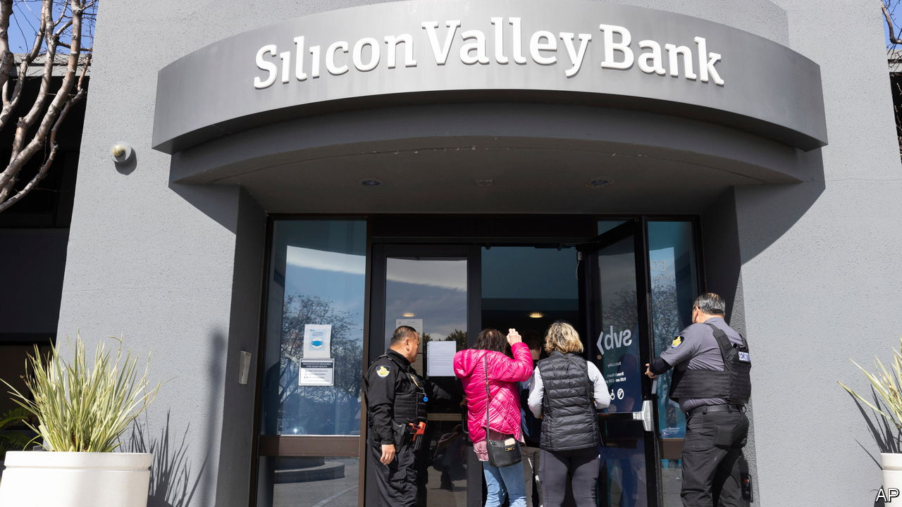
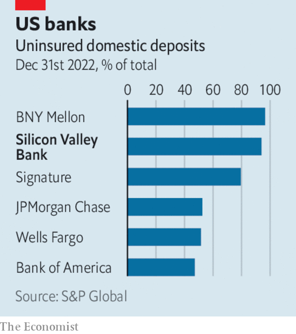

###### The world this week

# Business 

#####  

 

> Mar 16th 2023 

 


The failure of , a mid-sized American lender, sent shock waves through the financial system. SVB specialised in offering banking services to tech startups. It got into trouble as interest rates rose, the value of its bond holdings plunged and nervy depositors took out their money. An attempt to raise capital to plug a shortfall in its finances failed, leading to a run on its deposits and the collapse of its share price. On March 13th HSBC purchased SVB’s British assets for £1, but America’s regulators have struggled to find a buyer for the rest of the bank. 

Two days after  imploded regulators took control of Signature Bank, which is based in New York. The speed and the size of the failures rattled , wiping billions off banking stocks. In a co-ordinated action, the Treasury, the Federal Reserve and the Federal Deposit Insurance Corporation stepped in to protect depositors at both banks and set up a facility that allows banks to tap emergency funds. 

The failure of SVB complicates the Fed’s path for further monetary tightening. It will now have to weigh up stability in the banking system as well as . The data for February showed annual inflation dropping to 6%, but the core annual rate, which strips out energy and food prices and which economists fret about now, was almost unchanged at 5.5%, and actually rose over January’s figure. The is also running hot. Employers created 311,000 jobs in February, well above expectations. 

Despite the turmoil in banking markets the  pushed ahead with a half-percentage point rise to interest rates, taking its deposit facility to 3%. 

In the febrile atmosphere,  saw its share price plunge by a quarter when its largest investor, Saudi National Bank, said it would not increase its stake in the business. The troubled Swiss bank had to turn to Switzerland’s central bank for support in the market meltdown, and will borrow up to SFr50bn ($54bn) to bolster its liquidity and buy back some of its debt. 

Not many countries face inflationary pressures quite like . The official annual inflation rate soared to 102.5% in February, the highest it has been since 1991 and despite price controls on more than 1,700 goods. 

The British government banned  from all devices used by ministers and civil servants on security grounds, following similar moves by America and the European Union. It is the latest blow for the app. In America TikTok faces a potential complete ban over claims that it hands user data to the Chinese government. 

 reported an annual net profit of $161bn. Like others in the oil industry, the company benefited from a buoyant market as demand recovered after the pandemic and prices spiked after Russia invaded Ukraine. It thinks that oil demand will grow again this year, as China reopens and the airline industry recovers. 

Underlining  rebound, retail sales grew by 3.5% in the first two months of 2023, year on year, reversing a series of declines towards the end of last year. The statistics bureau warned, however, that the country’s economic recovery is “not yet solid”.

No jobs in the metaverse

 is shedding another 10,000 jobs, which come on top of the 11,000 lay-offs it announced last year. The parent company of Facebook, Instagram and WhatsApp hired too many people during the pandemic and its boss, Mark Zuckerberg, has called 2023 a “year of efficiency”. Markets approve. Meta’s share price has rebounded from its nadir in November. 

OpenAI, the firm behind ChatGPT, released GPT-4, the latest upgrade to the  that underlies the chatbot. GPT-4 can accept images as well as text as inputs to generate descriptions and answers. 

 increased the amount of money it is investing in building electric vehicles and batteries over the next five years, to €180bn ($190bn). The investment will also go towards developing software that links smartphones to the cars’ functions. The German carmaker has chosen Canada as the home for a new plant that will supply batteries to another new factory, in South Carolina. 

 announced its acquisition of , a biotech company that specialises in cancer medicines. At $43bn, it is the biggest takeover in the drugs industry since 2020. 

The global battle for dominance in  intensified, with the news that Samsung Electronics is to spend 300trn won ($230bn) on building five factories near Seoul for advanced semiconductors. The investment forms part of the South Korean government’s plan to support 550trn won of private investment in high-tech sectors. 

By contrast to South Korea

Britain’s economy is doing better than expected and will shrink by just 0.2% this year, according to the government’s ; that is an improvement on the contraction of 1.4% previously forecast. Among a series of measures, the budget unveiled a new but temporary regime for capital allowances and more generous child-care support. It also reduced alcohol taxes for pubs. “British ale is warm but the duty on the pint is frozen,” said Jeremy Hunt, the chancellor. 

