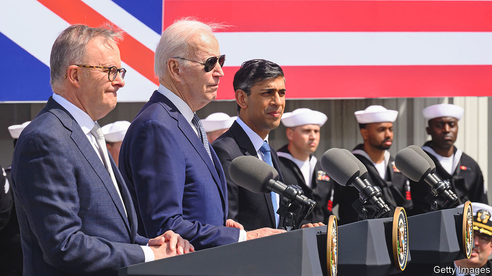
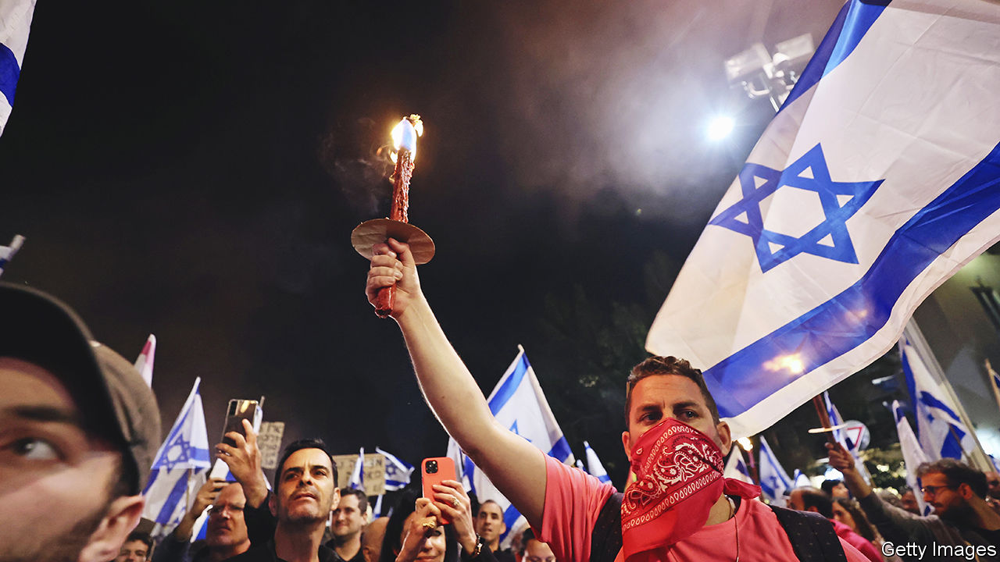

###### The world this week

# Politics 

#####  

 

> Mar 16th 2023 

Anthony Albanese, the prime minister of Australia, and Rishi Sunak, the prime minister of Britain, met Joe Biden, the American president, in San Diego to announce the next stage of the three countries’ . In a landmark agreement, Britain is to help design and build a new type of submarine for Australia, and America will sell nuclear-powered submarines to Australia in the 2030s. The deal expands the involvement of Britain and Australia in policing the Indo-Pacific. China said the AUKUS countries were travelling down “a dangerous road”. 

Mr Albanese then went to Fiji to assure it and other  that the AUKUS deal does not mean Australia is abandoning its commitment to nuclear non-proliferation. His visit comes as China renews its push for a security pact with nations in the region. 

Very cordial

It was also a busy week for Mr Sunak, who met , the French president, in Paris. One purpose of their summit was to discuss the surge of illegal migrants crossing to Britain in small boats—Britain pledged money to help build a new detention centre in France. Both said their meeting was a success; Mr Macron described it as “entente renewed”. Mr Macron has bristled at the AUKUS pact, though if France ever joins it could become FRAUKUS. 

Yoon Suk-yeol visited , the first trip to the country by a  president for 12 years. His visit follows a recent agreement to compensate victims of Japanese forced labour during the second world war, which had been a sticking point in the two countries’ relations. Mr Yoon and Kishida Fumio, the Japanese prime minister, discussed the threat from North Korea, which fired a ballistic missile shortly before the talks. 

Police in  tried unsuccessfully to arrest Imran Khan, the country’s popular former prime minister, on corruption charges. Mr Khan, a former cricket star who is campaigning for an election due in October, is holed up at his house in Lahore, surrounded by a phalanx of supporters, who forcefully resisted the police’s efforts. As Pakistan’s economic crisis deepens, many fear a rise in political violence.

 parliament confirmed Li Qiang as the country’s new prime minister. The former Communist Party chief in Shanghai is a protégé of Xi Jinping. He may be more in tune with business than his boss is, but he is expected to be unflinchingly loyal.

An American was struck by a Russian fighter jet over international waters in the Black Sea, causing the Americans to down their unmanned aerial vehicle. It was the first military tussle between America and Russia since the start of the Ukraine war. America said the Russians’ conduct had been “unsafe and unprofessional”. 

Russia agreed to extend a deal that allows for the safe passage of  from Black Sea ports, but only for 60 days. Ukraine thinks the extension should be for 120 days. 

 ruling party, the right-wing populist Fidesz, is to delay a session of parliament that will vote on  and joining  even though a Hungarian parliamentary delegation to Sweden said it would back that country’s application. Hungary and Turkey are the last remaining NATO countries to ratify the Nordic pair’s membership. Negotiations with Turkey over the Nordic pair’s membership restarted recently. 

 president, Cyril Ramaphosa, was cleared by the Public Protector, an anti-corruption watchdog, of attempting to cover up the theft of $580,000 in cash hidden in his sofa. The report will bolster Mr Ramaphosa’s political position.

More than 200 people have been killed by flooding and landslides after Cyclone Freddy struck  and . The damage appears to be worse than that caused early last year when another tropical storm destroyed crops and damaged hydroelectric power stations. 

Frenemies, again

 and  restored  after a seven-year break. The two countries agreed, in a deal brokered by China, to reopen their respective embassies and re-establish formal relations within the next two months. That is unlikely to transform the relationship between the Saudis and the Iranians but it does mark a more public role for Chinese diplomacy in the Middle East.

 


Hundreds of thousands of people took to the streets of  to demonstrate against legal reforms put forward by Binyamin Netanyahu, the prime minister. Critics say the reforms would undermine the independence of the judiciary and weaken Israeli democracy. The protests may have been the biggest in Israel’s history. Isaac Herzog, the president, tried to reach a compromise by suggesting alternative reforms, but Mr Netanyahu rejected them. Mr Herzog warned of the risk of civil war. 

The  lira plunged to 100,000 against the dollar. The currency is officially pegged at 15,000 to the dollar but it hit a new low on the black market. It has now lost 99% of its value since the country’s economic crisis began in 2019. 

The lower house of  Congress rejected a tax reform proposed by Gabriel Boric, the country’s left-leaning president. He had hoped that it would raise revenues to help pay for improvements to health care and pensions. 

A former cabinet minister in  who had been convicted of corruption escaped from Argentina’s embassy in Quito (where she had taken refuge since 2020), causing an almighty row between the two countries. She later turned up at Argentina’s embassy in Venezuela. 

The president of , Xiomara Castro, said her country would establish diplomatic relations with China, which means it will no longer recognise . That reduces to 13 the number of countries that recognise Taiwan, a self-governing democracy that China claims as its territory. Seven are in the Americas.

Reported in America rose by 12% in 2021. Almost 65% of such crimes were related to the race or ethnicity of the victims, 16% to sexual orientation and 14% to religion. 

, a putative Republican presidential contender, said that supporting Ukraine was not in America’s vital interests. He had previously favoured arming Ukraine, but has now moved closer to the foreign-policy stance of Donald Trump. His comments were condemned by the Republican establishment, which will do him no harm among Republican primary voters. 

“Everything Everywhere All at Once” dominated the , winning best picture. Its star, Michelle Yeoh, won best actress, the first woman from Asia to capture the award (Ms Yeoh was born in Malaysia). 

