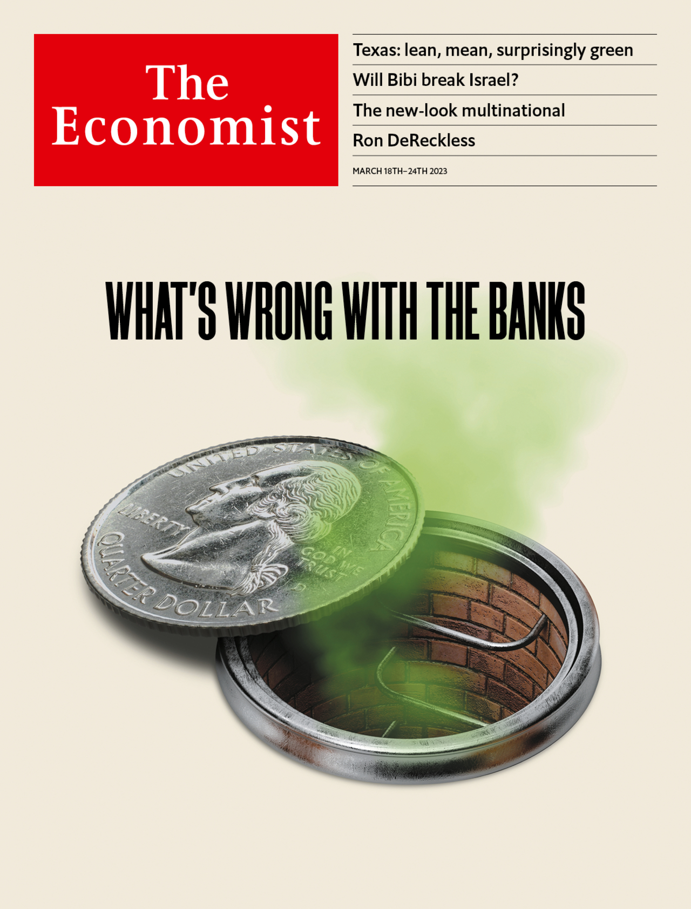

###### The Economist

# This week’s covers 

##### How we saw the world 

> Mar 16th 2023 

After a week that saw the collapse of three American lenders, the cover in most of the world considers the health of the banking system at a time of high interest rates.

 


: 

: 

: 

: 


In the Middle East and Africa, however, we focus on Israel, a country in turmoil. Binyamin Netanyahu, the prime minister, is exposing—and exploiting—long-standing divisions.

 


: 

: 


