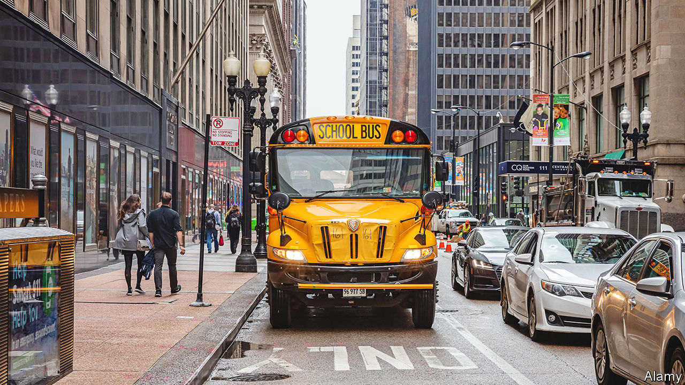

###### Class half empty

# Chicago’s public schools are emptying. Politics makes it hard to fix 

##### Segregation intensifies a problem schools face all over America 

 

> Mar 16th 2023 

From the outside, Hirsch Metropolitan High School, in Greater Grand Crossing, a neighbourhood on the South Side of Chicago, looks as grand as ever. Its handsome building, constructed in the mid-1920s in red brick with turrets in cream terracotta, occupies most of a city block. The problem is on the inside. The school, which was built for 1,100 pupils, has just 113 on its books. That is far too few to provide a broad education. “They don’t even have enough funding, barely, to have full classes,” says Maria Owens, a lawyer who volunteers on the school’s council. Though the school has been able to start a theatre programme, other extra-curricular activities are lacking. The swimming pool and music room are out of use.

Hirsch is one of dozens of schools across Chicago, mostly on the west and south sides, that are struggling with enrolment that has collapsed. Though schools across America are losing pupils, in Chicago, the problem is particularly acute, partly due to the city’s policies, and partly due to its deeply ingrained racial segregation. Chicago’s mayoral election—the run-off of which is on April 4th—has focused so far almost exclusively on the problem of crime. Yet both candidates have backgrounds in education. Paul Vallas is a former chief executive of Chicago Public Schools; Brandon Johnson is a former public school teacher who is backed by the teachers’ union. And education has a history of tripping up Chicago’s politicians.

The basic problem is an “overproduction of schools”, says Stephanie Farmer, an academic at Roosevelt University. In 2006, Hirsch still educated almost 900 pupils. But since then, dozens of new charter schools have opened, even as the number of school-age children has fallen, particularly in majority-black neighbourhoods like Greater Grand Crossing. The result is that there are too few pupils to go around. And since 2017, money has been distributed to schools on a per-pupil basis. That means that schools that shrink invariably have to make cutbacks. Teachers are laid off; discretionary classes and activities are cancelled; sometimes classes of different year groups are even combined. In 2019, Ms Farmer calculated that most of the underfunded schools in the city are in majority-black neighbourhoods.

Yet money is only part of the problem. Though, on paper, funding follows individual students, “equity” grants from the school district mean that smaller schools do in fact still get more. These have surged since the pandemic, thanks to higher property-tax revenues and federal pandemic relief cash. For example, according to state figures, in 2022, Hirsch spent $42,000 directly per pupil, against a figure of $17,000 across the Chicago school district in general. Extra spending “is basically what’s holding the schools together right now”, says Andrea Zayas, who teaches at a charter elementary school. 

But it is not enough to stop schools from losing pupils. A school with just 100 pupils needs almost as many janitors, security guards and librarians as one with 1,000, which means even very large per-pupil budgets do not always go far. Nor can cash solve the problem that there are not enough children for a sports team. According to data collated by ChalkBeat, a website, from 2018 to 2022 high schools with fewer than 250 pupils lost a third of their enrolment. Larger schools grew slightly.

The obvious solution is to consolidate schools—reallocating some buildings and closing others. Yet that is politically difficult. Starting in 2013, Rahm Emanuel, Chicago’s former mayor, closed 50 struggling schools, largely to save money. But there were unintended consequences. Pupils who moved sometimes found they were persecuted by gangs at the schools they arrived at. Research by the University of Chicago found that those moved also saw their test scores plummet, at least initially. All that convinced many black voters that the closures were simply a way to remove money from their already struggling neighbourhoods, says Daniel Anello of Kids First Chicago, an education ngo.

So far, neither candidate for mayor has outlined what they would do. Mr Johnson’s education plan argues that more social services should be located in underused school buildings, to help share the burden of maintaining and staffing them. That could be helpful, but is unlikely to be enough. Mr Vallas has said that he is committed to school choice, but he has not explained what should happen to the schools parents decline to choose. They may both be hoping to dodge the problem: in 2025, control of schools will be handed to a 21-member school board, which by 2027 will be fully elected, with no mayoral input. 

Yet the problem is more urgent than that. A new teachers’ contract is due to be negotiated next year, and teachers are likely to push for pay increases (though over a third already make more than $100,000). A black hole in Chicago’s municipal pensions plan (which covers non-teaching staff at schools) may have to be filled from the schools budget. And kids are already struggling to catch up from pandemic school closures. Just a fifth of Chicago’s high school students are able to read and do maths at their appropriate grade level, a far lower rate than in 2019. Whoever wins the election may find that, after months of talking about crime, education is in fact what defines their first term. ■


