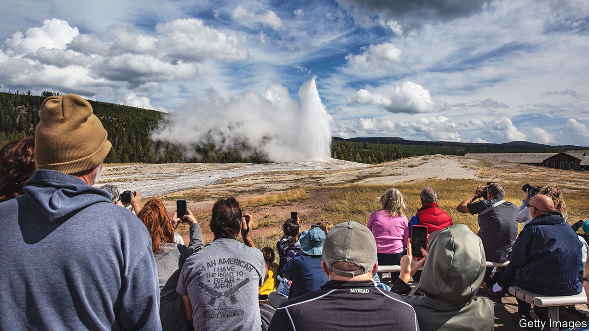
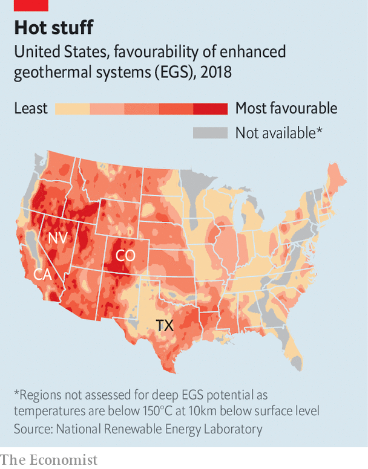

###### Some like it hot

# In America climate hawks and Big Oil alike cheer geothermal energy 

##### Even that may not be enough to get the industry cooking 

 

> Mar 14th 2023 

EXIT THE lift on the top floor of the Houston Museum of Natural Science, and the mechanical beeps and whirrs of a model offshore oil rig welcome you to an exhibit entirely devoted to energy. Explore the riveting history of drill bits or , all conspicuously sponsored by , Chevron or another oil major. Amid all the cheerleading for oil and gas, only a small section is dedicated to renewable energy. But in a few years, perhaps a whole wall will be devoted to a different type of drilling—for heat instead of . 

The Inflation Reduction Act, passed by Congress last year, offers lots of federal subsidies for established low-carbon technologies, such as solar and wind, but it also attempts to give nascent ones a boost. Geothermal-energy enthusiasts point out that hot rocks can provide baseload power when there is no sun or wind. The technology is cleaner than gas and requires less land than wind or solar farms. This, then, is a test case for whether public investment can jolt a new industry into being.

America has used geothermal energy since the 1800s, by harnessing heat from hot springs and geysers. Geothermal is plentiful in places where the movement of tectonic plates has pushed magma closer to the Earth’s surface, such as along the Ring of Fire, which encircles the Pacific Ocean. Underground reservoirs of steam or hot water are most common, and closest to the surface, in the western states. The vast majority of geothermal-power production happens in Nevada and California. In these plants, which have been operating for decades, hot water is pumped from the reservoirs to create steam, which rotates a turbine. Yet even though America is the world leader in geothermal generation, it accounts for less than 1% of the country’s power production.

 


To use geothermal energy anywhere, not just in places with natural reservoirs near the surface, companies need to drill deep and fracture hot rocks through which they can then pump water or chemicals. It is, in essence, fracking for heat. Unsurprisingly, the hottest rocks, at a depth of 3 to 10km, are also found in the West (see map). No such “enhanced geothermal system” (EGS) commercial power plant yet exists in America. But the potential is immense. The Department of Energy (DoE) hopes that by expanding EGS, geothermal can provide 8.5% of America’s electricity generation by 2050. Researchers and startups are also experimenting with using EGS to power carbon-capture systems, and to store excess energy underground, like a giant battery.

There are two main obstacles. One is cost. Exploring and drilling wells miles into the Earth is capital-intensive. And venture-capital firms tend to be squeamish about the technology risk. Cindy Taff, a former Shell executive who runs Sage Geosystems, a geothermal startup, says combination can kill firms. “I guess we’re in the valley of death,” she adds. 

The Inflation Reduction Act should help. Sarah Jewett, director of strategy at Fervo Energy, another startup, says the fact that the investment and production tax credits it offers will be in place for a decade provides some certainty. The $1.2trn infrastructure bill, passed in 2021, is also helping fund startups’ pilot projects. One of the DoE’s “earthshots”, or missions to accelerate climate tech, is to reduce the cost of enhanced geothermal power by 90%, to $45 per megawatt-hour, by 2035.

 could get in the way. Some 90% of natural geothermal resources are on lands owned by the federal government. An analysis by the National Renewable Energy Laboratory, near Denver, suggests that a geothermal project could trigger up to six separate environmental assessments. Under such a regime, it could take seven to ten years to go from exploration to construction of a geothermal power plant. The Burning Man Project, the non-profit behind a pyromaniacal festival in Nevada, is suing the Bureau of Land Management (BLM) over its approval of geothermal exploration in a town close to the annual bacchanal. Lauren Boyd, acting director of the Geothermal Technologies Office, within the DoE, says the oil-and-gas industry enjoys a more straightforward permitting process than geothermal. 

But where developers see despair, Texas spies opportunity. The state has fewer natural geothermal resources, but only 2% of its lands are owned by the feds. “If you drill here, you gotta go deeper,” says Matt Welch, of the Texas Geothermal Energy Alliance. But, he argues, that may be easier than “if you’re in Nevada, and you’re in your tenth year…and now you have Burning Man coming after you.” Because Texas is bursting with oil-and-gas companies, and fracking is central to EGS, Houston has become a capital for geothermal startups. 

The technology and skills needed to drill for heat, such as horizontal drilling, have been honed during the shale boom. Some startups are even experimenting with converting existing or abandoned oil and gas wells into geothermal ones. The Congressional Research Service suggests that the skills of three-quarters of the oil-and-gas workforce are relevant to geothermal. But President Joe Biden’s focus on creating new clean-energy jobs does not quite match the reality on the ground. Jared Polis, Colorado’s Democratic governor, who is bullish on geothermal, says he is more concerned with his state’s labour shortage than a potential jobs shortfall.

Many startup executives say they fled oil and gas for geothermal because they were queasy about hawking planet-warming fossil fuels. Ms Jewett refers to her years in the Wyoming oilfields as her time on “the dark side”. But geothermal’s similarities to oil and gas could also become a problem. The oil majors may wonder whether geothermal has the potential to cannibalise their business. Environmentalists may fret that scaling up geothermal also secures a future for fracking, which can increase the risk of earthquakes. 

Meanwhile, investors are eagerly awaiting results from startups’ pilot projects. It could become clear as soon as this year whether enhanced geothermal is ready for prime time, or whether the DoE’s earthshot is really a moonshot. ■


