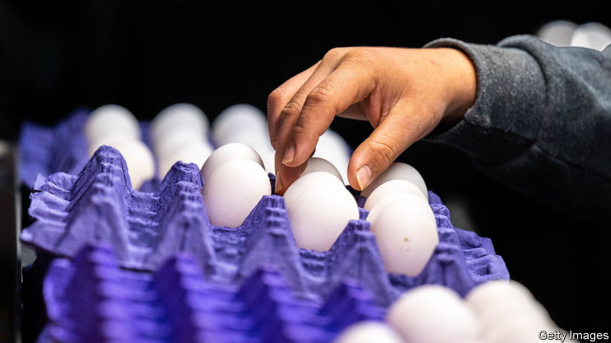
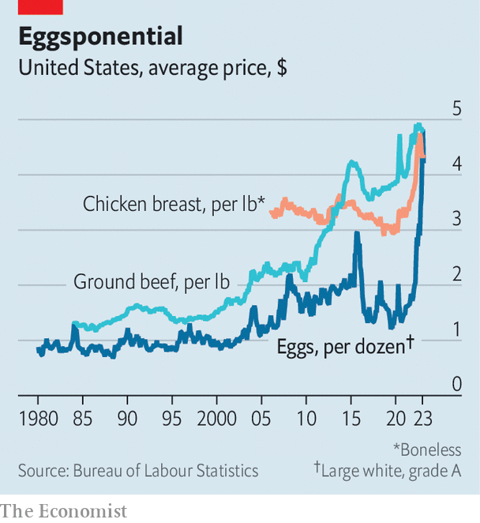

###### Eggstortion

# The price of eggs in America cannot be explained by inflation alone 

##### You can’t make an omelette without breaking antitrust laws 

 

> Mar 16th 2023 

When the holiday-induced baking frenzy passed and demand for snickerdoodles slowed, many thought egg prices would fall. The cost of a dozen had surged by more than that of any other supermarket item, from $1.79 to $4.25 in the year to December 2022. Could they get any pricier? Indeed they could. When January came to a close, Joe Biden told America that food inflation was cooling. But egg prices had risen by another 13.5%. 

The Department of Agriculture blamed last year’s price spike on an avian-flu outbreak that killed 43m of America’s egg-laying birds. Industry lobbyists say that the rising costs of feed, fuel and labour further pushed up prices. 

 


Such problems tend to beget shortages, but Cal-Maine Foods, which has 20% of the market and is the country’s biggest egg producer, sold more eggs in 2022 than in 2021 (the company sells about 12bn eggs a year). Though flocks in the industry overall were a tad smaller, the Stakhanovite hens laid more. Ultimately inflation and flu brought a boon to Big Egg. While the S&amp;P 500 fell by 9% last year, Cal-Maine’s shares rose by 17%. The firm generated $800m in sales in the final quarter of 2022, a 110% increase on the same period the previous year; gross profits increased seven-fold.

Farm Action, an advocacy group which supports small farmers (and hates genetically modified crops), has accused Cal-Maine and two other big egg companies of price gouging, arguing that the virus, supply-chain disruptions and inflation together do not justify the price rises. The firms, Farm Aid argued in a letter to the Federal Trade Commission, cite these trends to hide unjustified price hikes. Together the three account for close to 40% of eggs sold in America, an impressive (or worrying) amount of market power.

Cal-Maine rejects the accusations levelled at it by Farm Action. “Regardless of market conditions, Cal-Maine sells its eggs based on the pricing negotiated with each customer and has done so consistently throughout our history, whether at a profit or a loss,” the firm says.

If the soaring profits were just a reflection of normal market power, other food companies ought to have seen them too. But there was no such bonanza in the meatpacking industry, which, run by a handful of powerful firms, is often accused by farmers of acting like an oligopoly. Pre-tax profits on beef, pork and prepared foods at Tyson Foods, one of the biggest meatpackers in America, were down in the fourth quarter. Fast-food firms did not do too well, either. Net income at PepsiCo, which sells snacks as well as sugary drinks, was less than half what it was during the same period the previous year.

To the relief of the nation’s bakers, scramblers and lovers of pisco sours, the price of eggs came down in February. The cost of a dozen fell by 12.7%, to $4.21. But that is still more than double last year’s price. If the price of eggs does not continue to fall in the coming months, then Big Egg may find federal agencies in charge of things other than interest rates and agriculture crack down on price rises. And when the feds get involved, it is no yolk. ■


