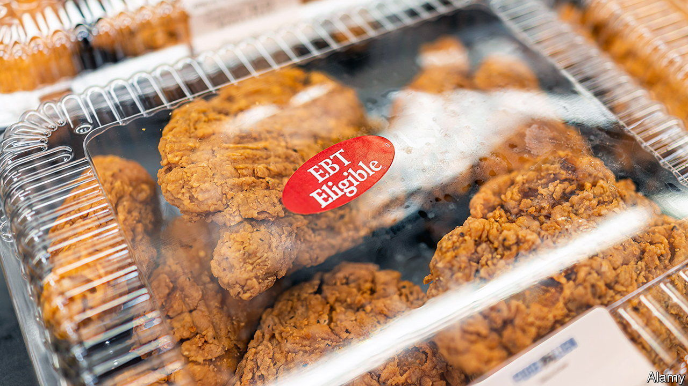

###### SNAP, crackle, pop

# Theft from America’s anti-poverty programmes seems troublingly easy 

##### State and federal governments are struggling to prevent it 

 

> Mar 16th 2023 

Dee and her husband thought they had left the tough times behind them. Having spent the previous six months living in a homeless shelter in Baltimore with their small child, they were finally living in an apartment on their own. With some government-supported cash and food assistance, they would be able to make ends meet. That was until their cash was stolen by fraudsters earlier this month. Now Dee wonders if they made a mistake leaving the shelter so soon.

The covid-19 pandemic forced governments all over the world to temporarily increase social-welfare programmes. In America the Supplemental Nutrition Assistance Programme (SNAP), federal aid that provides food for the needy more commonly known as food stamps, increased by at least $95 per eligible family per month. Some states also used the Temporary Assistance for Needy Families (TANF) programme, a federal cash-assistance scheme, to further help vulnerable families. Other states provided additional help: California gave tax refunds this year to some residents to offset high inflation.

Some of that money was stolen too. “Anytime there’s that much money being punched out with antiquated processes and systems, you are going to have fraud,” says Haywood Talcove of LexisNexis Risk Solutions, a firm that sells fraud-prevention services. Criminals can obtain personal details through phishing (sending emails or other messages to encourage people to reveal their account numbers, private identification numbers and other important data) or skimming (illegally placing gadgets over card readers and other devices to steal account information). This information is also sold on the dark web.

Mr Talcove estimates that about $20bn could be stolen over the next six months from SNAP, an assumed fraud rate of 15%. The United States Department of Agriculture (USDA), the agency that administers the programme, reckons that the sum will be much lower: it forecasts a fraud rate of only 0.01-0.02%. States have their own estimates. Maryland recently announced that $2.5m was stolen from its food assistance programme between October and February; California says it reimbursed $7.4m in food aid and $39.7m in cash assistance due to electronic theft between July 2021 and November 2022.

Vastly more money may have vanished through unforced errors rather than outright crime. The Government Accountability Office estimates that $281bn was lost by the federal government during the 2021 fiscal year due to overpayment to eligible individuals or paying the wrong person.

How can this waste be prevented? Typically the government does not have much of an incentive to prevent fraud, says Linda Miller, the former Deputy Executive Director for the Pandemic Response Accountability Committee, a government agency that was created to oversee pandemic spending. These agencies are usually more focused on getting relief to those who need it, she says. And what would seem like obvious penalties, such as reducing the budget at the USDA for failing to curb fraud, would come at a cost to needy families who rely on those funds to eat.

Having been fleeced, some states are trying to adopt the sort of anti-fraud measures that are common in the banking system. California is planning to upgrade security for debit cards used to transfer benefits. State senator Katie Fry Hester of Maryland introduced a bill in her state which requires Maryland’s Department of Human Services to reimburse victims of fraud. It would also encourage the state to hire vendors that meet certain criteria, such as holding a form of insurance that can be used to reimburse a beneficiary for fraud and identity theft. But as to the wasteful government spending that all this fraud represents, it seems that is just viewed as a cost of doing business.■


