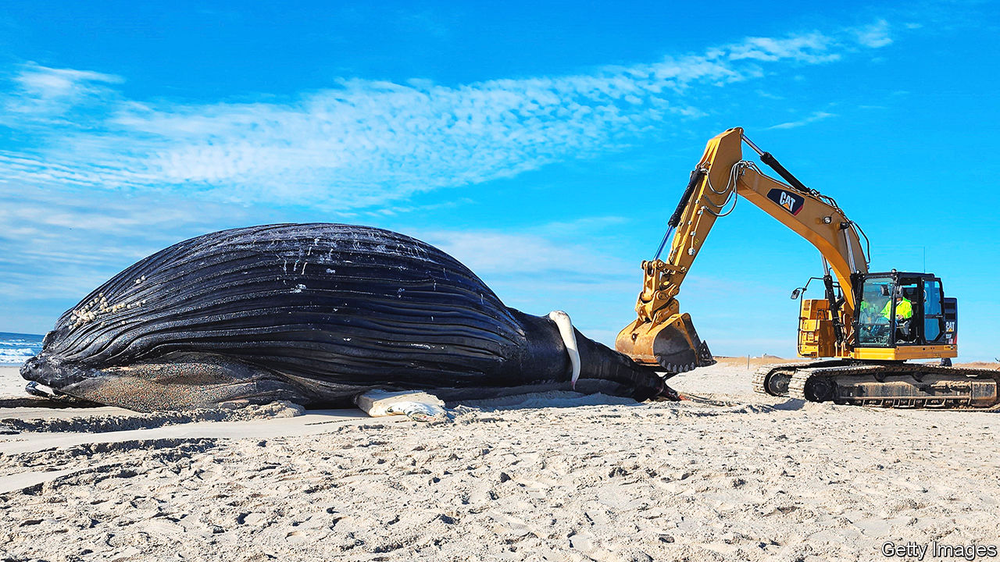

###### Ahab in Brooklyn

# Why are so many whales washing up dead on east-coast beaches? 

##### The magnificent creatures are essentially jaywalking 

 

> Mar 16th 2023 

Luna was last seen alive in September off the coast of Nova Scotia. Scientists had been tracking the 40-year-old whale for decades. Like all humpback whales his tail, called a fluke, had distinctive pigmentation patterns. These are used by scientists as a sort of fingerprint. Luna’s fluke had a moon shape, hence his name. Those tracking him knew every scar and took note of new ones whenever they saw him. The next time he was seen was when his carcass washed ashore in January on Lido Beach on Long Island, about 40 miles (65km) from Manhattan and 600 miles from Nova Scotia. 

Whales have been dying in elevated numbers along America’s east coast since 2016. So much so that the National Oceanic and Atmospheric Administration, the federal agency that monitors fisheries and oceans, declared the existence of an “Unusual Mortality Event” back in 2017. Prior to 2007, Rob DiGiovanni, the chief scientist at the Atlantic Marine Conservation Society, which surveys wildlife and conducts necropsies, said he saw stranded whales just once every two years. Then it became one to three a year; now it is every few weeks. Since the start of December, 29 dead whales, including right whales, whose numbers are already precarious, have washed ashore along America’s east coast. Luna was the tenth of 13 whales to be found dead on New York and New Jersey beaches. Scientists are trying to figure out why.

A whale necropsy is a huge undertaking. The equipment may entail cranes to lift the whale, as well as sharp knives to fillet it. In 40% of the necropsies, there was evidence of blunt force trauma or propeller wounds, which indicates the whales were hit by a vessel, or evidence of entanglement in fishing gear. Some die of natural causes; others from ingesting debris. Paul Sieswerda of Gotham Whale, a research organisation, said that vessel strikes are the equivalent of “the butler standing there with a smoking gun.” Preliminary findings from Luna’s necropsy indicate a vessel was the probable cause of death. 

Whale sightings, particularly of humpbacks, have increased in the New York Bight, which stretches from the tip of Long Island to the far end of the Jersey Shore. Like their human neighbours, the whales are drawn to the Big Apple’s cuisine. Menhaden, a kind of fish many whales feed on, have increased off the shores of New York and New Jersey, possibly because of warming waters.

No longer must people trek to Maine or Nantucket to see whales. New Yorkers can observe them near city beaches. Several whale-watching companies, including in Brooklyn, have sprung up. Unfortunately, the whales are essentially playing in traffic. New York Harbour is America’s busiest port, which puts the whales in the path of all sorts of vessels, including enormous container ships and cruise liners. Some of the carcasses on the beach are the result.■


