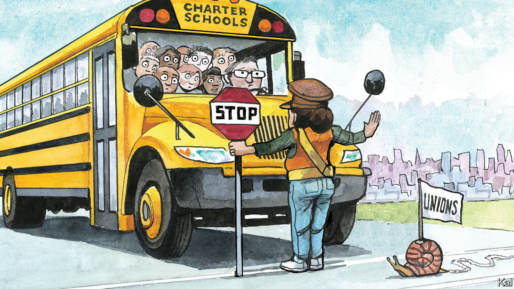

###### Lexington

# Why did America’s leaders stop caring about schools? 

##### A political fight in New York suggests some may be facing up to the problem again 

 

> Mar 16th 2023 

A political struggle is under way in New York that seems like a throwback to another era: Governor Kathy Hochul, a Democrat, is fighting an uphill battle to permit more so-called charter schools, which use public funds but are run independently and compete for students with conventional public schools. 

This is the kind of thing, earlier in this century, that Democrats used to fight about a lot, less with Republicans than among themselves. Under Presidents George W. Bush and Barack Obama, debates raged across the country over how to close academic-achievement gaps between poor minority children and rich white ones. That ferment subsided over the past decade as polarisation and the politics of identity and culture changed the priorities of both parties, leaving them ill-equipped to respond to the toll covid-19 took on America’s future, as politicians like to call children.

Waving the banner of “school reform”, mayors and superintendents in the Bush and Obama years pushed not just for more spending but for more competition, data and accountability. They wanted to link teacher evaluations and pay to student outcomes, measured by new tests. These reformers advocated shutting down bad schools and creating charter schools, generally unconstrained by union contracts, to invent new ways of engaging students. 

Nowhere were the changes more radical than in New York’s system, America’s biggest with nearly 1.1m students. As mayor, Michael Bloomberg graded schools and replaced those rated as failing with hundreds of smaller schools and charters. Some charters also failed, or came under fire for excessive discipline or cherry-picking applicants. But many exploited their greater flexibility to pay teachers more, lengthen the school year and enrich the curriculum. New York City’s charter students consistently outperform those in district schools on the state’s standardised tests.

Bureaucratic inertia and political resistance were always strong, and the backlash after Mr Bloomberg’s tenure was severe. To the ascendant progressives, in New York and nationally, reformers’ emphasis on choice and competition stank of capitalism and their emphasis on testing of racism; charters reeked of both. 

Mr Bloomberg’s successor, Bill de Blasio, veered away from charters and testing and focused on creating a universal pre-kindergarten programme. He shifted attention from improving the worst schools to opening up access to the best: he fought unsuccessfully to eliminate the admissions test for New York’s eight top public high schools, where Asian and white students are overrepresented relative to their numbers in the system.

Then covid hit. The disruption in education appears to have wiped out 20 years of gains nationally in reading and maths among nine-year-olds. You might expect America to be obsessed with that, but it is not. Joe Biden has not made public education a priority. Republicans are opting for hysteria, fanning fears of indoctrination. Some are so indoctrinated themselves that Senator Tommy Tuberville, a Republican from Alabama, did not have to explain any terms when, at a recent conservative conference, he compressed the party line into a perfect if accidental haiku: “All this woke, uh/Transgender athletes, uh/ CRT, 1619.” The Republican panacea is vouchers, which would fragment public education by letting parents use taxpayer dollars for private schools.

Ms Hochul may be lighting a path back to a more constructive debate. Because of the resistance to charter schools, their numbers have been capped in New York City at 275. In her proposal for the state budget Ms Hochul has, in effect, urged raising that cap by 85, while also allowing operators to apply to run about two dozen other “zombie” charters that have closed. 

The Democrat-dominated legislature, under pressure from the teachers’ union, is opposed. As the two sides negotiate over the budget, old arguments against charters are resurfacing. The state education commissioner, who is not appointed by the governor, wondered at one hearing why, if charters were so great, they tended to appear in mostly black and brown neighbourhoods, rather than white ones. “The argument is like saying if insulin is such a great drug, why isn’t everyone taking it?” fumes Miriam Raccah, who leads an outfit called the Black, Latinx, Asian Charter Collaborative, a group of 21 schools. “Rich white kids have options.”

Right to choose

As on crime and policing, some progressives seem out of step on education with the communities they care about. Charters are now rooted in New York’s neighbourhoods. There are 275 of them, educating 15% of the students—around 140,000—often in poorer neighbourhoods such as Harlem. 

Brian Cunningham, a New York state assemblyman representing parts of Brooklyn, says more than 30% of the schools in his district are charters, and parents are happy to have options. “There are so many choices we stand up for as Democrats and say are human rights,” he says, predicting the legislature will come around. “Our whole job here is to create options and access for people.” 

The school reformers came up with no magic solution. But under Mr Bloomberg, the entire system got stronger. Studies showed that poor black and Latino students in charter schools made significantly more progress, but test scores improved district-wide. Dropout rates plummeted and graduation rates rose by 40%, to historic highs. The quality of teachers, as measured by their own test scores, also improved. 

Mr Bush and Mr Obama both called education “the civil-rights issue of our time”. (So did Donald Trump, before making civil rights the civil-rights issue of our time.) Their evangelising, combined with the dynamism in cities like New York, brought new, ambitious people in as teachers and principals: better human capital began building better human capital. America’s future needs such leadership again. Ms Hochul should stand her ground—and President Biden should speak up. ■


