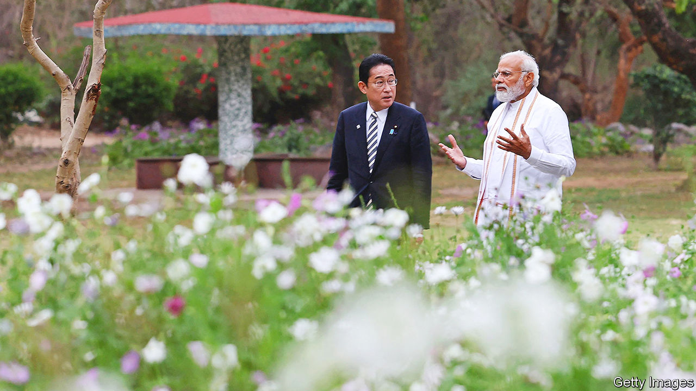
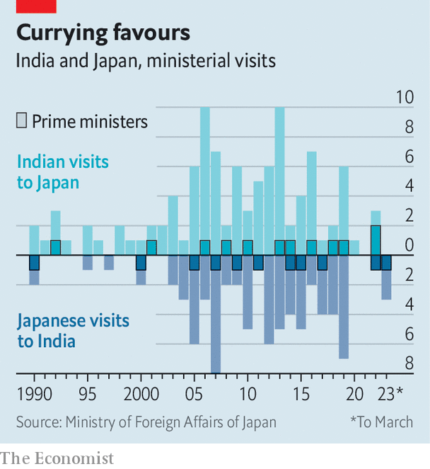

###### Asian geopolitics

# Fear of China is pushing India and Japan into each other’s arms 

##### Asia’s biggest and richest democracies are close. They could be much closer 

 

> Mar 19th 2023 

THE MUGHAL PRINCE Dara Shikoh was beheaded in 1659 after publishing a scandalous book, “The Confluence of the Two Seas”, in which he identified a spiritual affinity between Hinduism and Islam. In 2007 Abe Shinzo, then Japan’s prime minister, borrowed the book’s title for a stirring speech to India’s parliament in which he called for the Indian and Pacific oceans to be seen as , and for Japan and India to recognise their shared interests. Those ideas, the basis for taking an expansive Indo-Pacific view of Asian security, are now widely accepted among Western strategists. “Without the Japan-India relationship, there is no Indo-Pacific,” says Kenneth Juster, America’s ambassador to India from 2017 to 2021. “That relationship is vital to why we have this concept, and to the future of the region.”

Kishida Fumio, Japan’s prime minister, endorsed that on March 20th during a two-day visit to Delhi. “India is the place where the Free and Open Indo-Pacific came into being,” he declared. Asia’s biggest democracy and its richest one were on opposite sides in the cold war. But over the past decade and a half they have dramatically improved their diplomatic, economic and security ties. Their aim is to forge a democratic counterweight to China. And their progress, as Mr Kishida and Narendra Modi also stressed in Delhi, will be conspicuous in international diplomacy this year, with Japan chairing the G7 and India the G20.  The Japanese and Indian leaders spoke of trying to improve co-ordination between the two groupings.

 


The countries’ leaders attend annual bilateral summits; this was Mr Kishida’s second visit to Delhi in two years (see chart). Japan is a big investor in India’s accelerating . Last year Mr Kishida promised an additional 5trn yen ($42bn) in Japanese investment over the next five years. India and Japan are, with America and Australia, members of the , a once stop-start grouping that was revived in 2017. The Indian and Japanese armed forces exercise together increasingly often; they conducted their first joint fighter-jet drills earlier this year.

This closening relationship is based more on shared fears than common values. Both countries have longstanding territorial disputes with an increasingly aggressive China—India along its , and Japan over the uninhabited Senkaku/Diaoyu islands in the East China Sea. Both are wary of growing Chinese influence in their wider region, and what it will mean for the maritime lines of communication each relies on. Each sees the other as central to confronting the security challenge that China poses. 

For Japan, which initiated the bilateral detente in the early 2000s, that conclusion was sharpened by an early sense of India’s potential. “We believed that India would be a future big power,” says Ishii Masafumi, a former Japanese diplomat. “And it’s safe to say that China is the largest challenge for India, like it is for Japan.”

The partnership has some useful underpinnings. Officials in both countries point to their shared tradition of Buddhism. In 1948 Radhabinod Pal, an Indian judge, became a hero for Japanese nationalists when he cast the lone dissenting vote at the Tokyo trials, in which Japanese imperial leaders were convicted of war crimes. (Abe visited Mr Pal’s descendants in 2007 after making his Two Seas speech.) There are some personal ties between the countries’ elites: India’s influential foreign minister, Subrahmanyam Jaishankar, is married to a Japanese woman, Kyoko.

More important, decades of Japanese investment and aid, mostly low-cost loans, have given Indians a sunny view of Japan. According to a poll by the Pew Research Centre, Indians regard Japan positively by two to one—a brighter view than they have of any big country other than America. And where America can be polarising in Indian politics, Japan is not, says Christopher Johnstone of the Centre for Strategic and International Studies in Washington: “Japan is viewed differently and has an advantage that we, America, don’t have.”

As Mr Kishida was driven around Delhi this week, he will have seen streets teeming with Japanese influence. Indian officials tend to favour large Toyota vans and SUVs. By far the commonest cars on the capital’s roads are nifty Maruti Suzukis, weaving through traffic at optimistic speeds. Suzuki, a Japanese firm that entered the Indian market in the 1980s through a joint venture with the country’s government, still accounts for over 40% of cars sold in India.

The Japanese imprint extends underground: Delhi’s metro was built with Japanese help. Japanese firms are also helping plan a high-speed rail link between Mumbai and Ahmedabad in Mr Modi’s home state of Gujarat, a project close to the heart of the Indian prime minister. And they have helped build infrastructure in India’s long-neglected north-east—in part to counter growing Chinese involvement in the region, says Horimoto Takenori, a Japanese scholar of India.

Yet for all the countries’ overlapping interests, in some ways their relationship is struggling to fulfil its potential. India-Japan trade and investment fall far short of what was once envisaged—despite the seeming complementarity of young, developing, labour-rich India with ageing, technologically advanced, capital-rich Japan. In 2006 Abe mused that Japan’s trade with India might surpass that with America and China within a decade. 

But in 2022 China accounted for 24% of Japan’s imports and 22% of its exports; India represented just 0.8% of Japan’s imports and 1.7% of its exports. In 2014, during Abe’s second term, he and Mr Modi vowed to double the number of Japanese companies in India within five years. But by 2019 the number had grown from 1,156 to only 1,454. (Over 13,000 Japanese companies were present in China that year.)

Abe also failed to persuade India to join the Regional Comprehensive Economic Partnership, a big Asian trade pact that China takes part in. Even now, as investors look to diversify from China, it is striking how rarely Japanese ones are involved in key Indian sectors such as ports, airports and energy, reckons Dhruva Jaishankar of the Observer Research Foundation America, the American offshoot of a Delhi-based think-tank. (Mr Jaishankar is the son of India’s foreign minister.)

Much less than Abe wanted

On defence and security, too, ties amount to less than meets the eye. Japan and India have signed several defence-equipment transfer agreements in the past decade. But there has been little actual co-operation between their defence sectors. A Japanese bid to attract interest in a new amphibious aircraft fizzled because India thought it too expensive. An initiative by India to acquire Japanese submarines failed because Japan hesitated to transfer the technology. Though the two armies are exercising more together, their rudimentary drills are more getting-to-know-you exercises than a serious preparation for either country to come to the other’s military aid. 

In part this reflects divergent military priorities. While India and Japan are equally worried about China, “the nature of the concern is different”, says Kurita Masahiro of the National Institute for Defence Studies in Tokyo. China presents mostly maritime challenges for Japan. India, which shares 3,440km (2,100 miles) of border with China, much of it disputed, is more focused on possible land warfare.

The bilateral underperformance is especially frustrating to Japan. It is “getting a little worn down by the slow pace of Indian strategic change”, says Michael Green of the United States Studies Centre at the University of Sydney. “India has been replaced in the Japanese dance card by Australia.” Last year Japan and Australia signed a pact to improve defence co-operation. America, too, has been putting less stress on the Quad and more on , an ambitious new alliance between America, Australia and Britain to establish a fleet of nuclear submarines capable of countering China in the Pacific.

Even optimists in Tokyo reckon that engaging India is a long-term investment with uncertain returns. “We know they will be a very difficult superpower—like a big France,” says Kanehara Nobukatsu, a former deputy national-security adviser to Abe. India’s stance on the war in Ukraine illustrates this. Japan stands with America and other Western allies against Russia’s aggression, a stance Mr Kishida reiterated this week. From Delhi, he travelled to Kyiv to meet Ukraine’s president. India, which maintains close ties to Russia, the source of much of its energy and most of its arms imports, has stayed neutral. In September 2022 it took part, alongside China, in Russia’s Vostok naval exercise, which skirted a group of Russian-controlled islands, north-east of Hokkaido, that Japan claims as its own.

India, for its part, has long been frustrated with Japan’s restrictive immigration policy. “The lack of people-to-people exchanges is a massive gap,” says Ajai Shukla, a security analyst in Delhi. In 2021 the two countries agreed to co-operate on a new Japanese foreign-worker programme. Yet visas are restricted to 14 professions and mostly limit stays to five years without family. The resulting lack of a sizeable Indian diaspora in Japan makes it harder to form the deep ties India has with America, Britain and some Gulf countries, which Indians have been emigrating to for decades.

The relationship also lost an important personal element when its main architect, Abe, was assassinated last summer. “Modi doesn’t have many friends abroad, but Abe was an exception,” laments Dr Horimoto. In Delhi this week Mr Kishida tried to press further along the bilateral pathway his predecessor laid by inviting Mr Modi to attend the G7 summit in Hiroshima in May. Japan wants to use its turn running the G7 to boost outreach to the developing world, and sees India as a key conduit. “Without India, we can’t engage the Global South,” Mr Kanehara says.

That is testament to just how far the relationship has progressed, despite its various areas of shortfall. Asia’s democracies stand increasingly united across the region’s two great seas. India and Japan sit at their south-western and north-eastern extremes—and fear of Chinese assertiveness lies at the confluence.■

