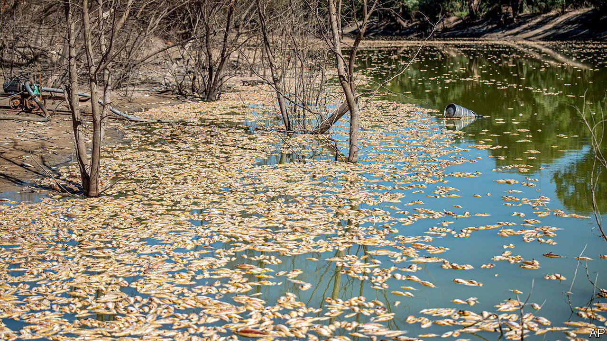

###### Oh Darling

# Millions of dead fish are washing up in Australia 

##### Climate change and poor management are imperilling its biggest river system 

 

> Mar 23rd 2023 

YABBIES, FRESHWATER lobsters native to Australia, thrive in the outback for a reason. They can tolerate high temperatures and drought, and need hardly any oxygen in their water. Yet even for them the Darling river, which snakes through western New South Wales, is proving uninhabitable. Swarms of yabbies were recently seen scrambling out of its murky water. On March 17th the river was blanketed by millions of dead freshwater fish, herring, perch and cod, near the town of Menindee. Graeme McCrabb, a local, estimates the “line of dead fish” stretches over 100km. “It has an odour that’s pretty unique,” he says.

The mass fish death is the latest illustration of how climate change is combining with mismanagement to blight Australia’s fragile environment. The Darling forms one arm of the Murray-Darling basin, a vast river system that covers much of Queensland and South Australia. It could hardly be more important—the system supports 40% of Australia’s agricultural production and breathes life into the vast, arid outback. But it is in desperate state.

Climate change is bringing more extreme heat and drought, which caused the previous “mass mortality” in the Darling river system in 2018 and 2019. Drought brought the river to a standstill, depleting its oxygen. But the warming climate is also bringing more extreme precipitation and flooding, which is behind the latest die-off.

Eastern Australia has had three years of heavy rainfall. This summer the Darling burst its banks, submerging towns and washing tonnes of chemicals and organic matter into the water. That has caused bacteria to flourish, sapping oxygen from it, says Richard Kingsford, an ecologist at the University of New South Wales. A heatwave may have exacerbated this “blackwater event”, since warm water holds less oxygen. The many dams and weirs that line the Darling then made it hard or impossible for stricken fish to escape to healthier water. So millions died; and their decomposition in turn drew more oxygen from the river, worsening the cycle.

Over-exploitation of the Murray-Darling’s waters has made the system especially vulnerable to such shocks. Four states fight over them. A water-sharing initiative launched in 2012 was supposed to help conservation, yet there is little evidence that it has improved the basin’s health. For Robert McBride, who owns a vast sheep station near Menindee, the Darling is paying “the supreme sacrifice for total mismanagement of the river system”. After the recent deluge, water quotas were lifted so high that farmers could in theory drain some tributaries. That would prevent them flushing out “the putrid snot” that Mr McBride’s animals are now drinking.■

