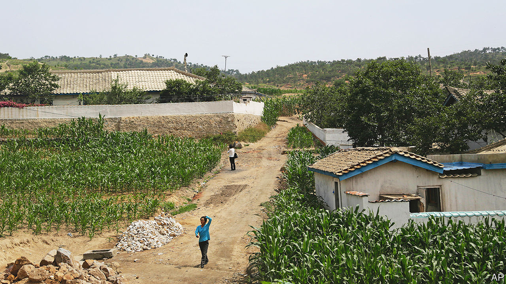

###### The hungry people’s republic

# North Koreans are at growing risk of starvation 

##### Reports of terrible hunger are emerging from the closed-off state 

 

> Mar 21st 2023 

Hunger makes people desperate. On February 10th a starving man in his 70s took a stand outside the communist party office in Hyesan, a city in the northern part of North Korea. As party members arrived for work, he called out, “I’ll die of starvation if things continue like this, please give me food.” Other famished people quickly joined him. When security guards tried to dispel the crowd, a skirmish ensued. In a country where causing a disturbance can get you sent to the gulag, or worse, dissent of this kind appears to be vanishingly rare.

Such incidents, reported by , a secret group of journalists operating inside North Korea, offer a glimpse of the closed-off state’s growing food crisis. The UN reckons that between 2019 and 2021, 42% of North Koreans were malnourished. And as a result of poor weather conditions and a shortage of fertiliser—in part due to the country’s self-imposed three-year quarantine—it had an especially poor harvest last year. Total food production was only 4.5m tonnes, down by 3.8% compared with the year before, according to South Korea’s rural development agency. That is more than 1.2m tonnes less than the UN’s World Food Programme estimated in 2019 was needed to feed the country. 

Its statist agricultural system has long failed to produce enough food for North Korea’s 26m people. A famine in the 1990s cost at least 200,000 lives—and by some estimates as many as 3m. The current hunger is less serious. “‘We’re certainly not there yet,” says Lucas Rengifo-Keller of the Peterson Institute for International Economics, a think-tank in Washington. But, he adds, “it won’t take much to reach that level.” South Korea’s government is sounding the alarm. It believes some North Koreans are already starving. Horrifying reports, including one of a seven-year-old found starved to death with two family members, are seeping across the border.

Trade is the likeliest source of relief, says Choi Eun-ju of the Sejong Institute, a think-tank near Seoul. But though official cross-border trade has been increasing, it is well below pre-covid-19 levels; Chinese trade data suggest that in 2022 North Korea imported more than 56,000 tonnes of flour and 53 tonnes of cereals. In the past, moreover, much of North Korea’s food was imported off-the-books. And a decision by the regime of Kim Jong Un to close its borders in January 2020, ostensibly as a pandemic defence, has limited such food imports, as well as those of fertiliser. Newly built border fences guarded by soldiers with shoot-to-kill orders have apparently reduced food smuggling to close to zero. 

The prices of rice and maize, which make up 98% of the country’s cereal production, hint at the seriousness of the situation. Both are at five-year highs for March, according to, a Seoul-based outlet with contacts inside North Korea The cost of maize is rising fastest, suggesting that North Koreans are being forced to opt for that less calorific crop.  reports that ordinary people have also been called on to contribute “patriotic rice” to the country’s armed forces.

The situation may be about to deteriorate further; the lean season before the first rice and maize harvest, known as the “barley hump”, is imminent. And the weather promises no relief. Winter snow, which provides meltwater for irrigation, has been below average. North Korean media, which are admittedly less than reliable, warn of a possible drought. 

The regime of Kim Jong Un is sufficiently worried to have acknowledged the crisis on several occasions. At a communist party meeting earlier this month, Mr Kim called on his cadres to usher in a “new era” of rural development. This intervention is additionally worrying. The famine of the 1990s was ultimately ended by small-scale private farming and trade, which sprang up amid the ruins of the country’s Stalinist agriculture and distribution systems, notes Benjamin Katzeff Silberstein of the Stimson Centre, a think-tank in Washington. He and other North Korea-watchers believe these markets should be sufficient to prevent another severe famine. Yet the Kim regime appears to be intent on tightening its grip on them.

reports that the state has banned the sale of food in markets in some cities to give state-run food shops, which are selling grain at below-market prices, a monopoly. Other elements of Mr Kim’s “new era”, such as new irrigation systems and farming equipment, are longstanding but unfulfilled regime promises. North Koreans who spoke to  said they wished the government would focus on distributing food and fertiliser. “People on the verge of starvation aren’t likely to do a great job” of farming, said one.

WFP has tripled its budget for North Korea for the first half of 2023. But the UN agency’s staff are barred from entering the country and there is currently no sign that that will change. In February North Korea’s regime newspaper derided foreign aid as “poison candy” and an insult to the country’s “honour and dignity”. 

South Korea has also offered aid, with the proviso that the North must resume negotiating a possible end to its nuclear-weapons programme. But Mr Kim sees nuclear arms as the guarantor of his regime’s continued existence. In March alone North Korea has launched five missiles, including an intercontinental ballistic missile and what state media claimed was the country’s first submarine-launched cruise missile. For the Kim regime, guns will always beat butter.■

