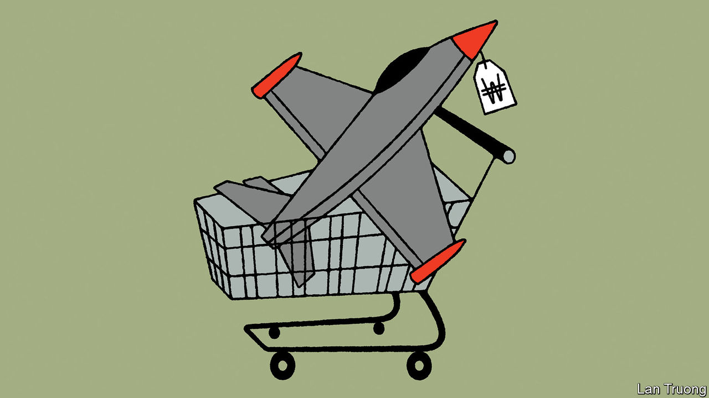

###### Banyan

# Russian arms have fewer takers in South-East Asia 

##### South Korea looks set to become the region’s new weapons-maker of choice 

 

> Mar 23rd 2023 

HARD-WIRED INTO the psyches of those running South-East Asia is that they live in a dangerous world. Their region sees great-power competition between America, China and India. China has overlapping claims in the South China Sea with five South-East Asian states and asserts them aggressively. The professions of amity and consensus that dominate discussions in the regional club, the ten-country Association of South-East Asian Nations, are intended partly to paper over a history of mutual suspicion and conflict. In South-East Asia, strong defence is the starting-point for a strong state. Tiny Singapore spends almost 3% of its gdp on defence, more than any European country apart from Greece, Russia and Ukraine. In Myanmar, the generals turn weapons on their fellow citizens.

Where South-East Asian countries buy their arms is therefore a big issue—and Russia’s faraway invasion of Ukraine has upended things. In the two decades up to the war, Russia was easily the region’s biggest supplier, selling $11bn-worth of arms, with America, France, Germany and others trailing. Russia offered high-tech weapons at affordable prices, notes Ian Storey at the ISEAS-Yusof Ishak Institute, a research outfit in Singapore. It also accepted bartered commodities as payment. It did not give a hoot about human rights. And corruption helped grease deals.

Yet even before the war Russian arms sales were slowing. Vietnam, easily the region’s biggest buyer from Russia, put a military modernisation on hold following concerns about corruption. Others worried about being punished by America after it passed sanctions legislation against Iran, North Korea and Russia in 2017. Indonesia abandoned a deal to buy Su-35 fighter jets; the Philippines shelved plans for Russian helicopters.

Since the war, Russia’s sales to South-East Asia have collapsed and are unlikely to revive. Some states worry about the reputational risk of buying from Russia. All have seen how poorly some Russian weaponry has performed in the war. And even if Asian countries wanted to carry on buying Russian arms, it would be hard. Siemon Wezeman of the Stockholm International Peace Research Institute (SIPRI) says that tightened sanctions on Russia (including, in Asia, by Japan, Singapore, South Korea and Taiwan) will complicate Russian firms’ access to the advanced technologies that are crucial not just for making arms systems, but also for upgrading them over their expected lifetime. Vietnam’s armed forces, in particular, now look horribly exposed by their reliance on Russia.

Who will fill Russia’s shoes? China wants to, but it does not look well-placed. Chinese arms sales in South-East Asia fell by two-fifths in the five years to 2021 compared with five years earlier. Singapore much prefers defence relationships with the West. Those in dispute with China in the South China Sea, including Vietnam, are hardly going to buy weapons from their potential adversary there.

There are also concerns about the quality of some Chinese kit. The former generals running Thailand struck a deal with China in 2017 to buy three submarines, worth about $1bn. Yet the project has run onto the rocks for lack of a viable Chinese engine. If Thailand curtails or cancels the contract, as Mr Storey argues is likely, it would be a huge embarrassment for China. Even Myanmar’s brutal junta, ostracised by most of the world but not Russia or China, is disgruntled about the quality of a fleet of fighter jets made by a joint Chinese-Pakistani venture; it would send them back if only they were safe to fly. Partly in response, the junta has redoubled ties with Russia as it wages war on the opposition. Myanmar thus joins a long list of countries destabilised by Russian arms.

Indian arms-makers also hope to step into the breach—a deal looks imminent to supply Indonesia with BrahMos cruise missiles. But the big winner from Russian arms-dealers’ exit is South Korea, an export powerhouse in other sectors which, SIPRI calculates, is now the region’s biggest arms supplier. 

Its weapons win on price, quality, offers of credit and prompt delivery. And South Korean suppliers are happy to transfer technology to their clients, starting with Indonesia, which is building naval vessels with South Korean help (the region has no indigenous defence industry to speak of). Also attractively, South Korea has little skin in the great geopolitical game that is playing out in South-East Asia. In the eyes of many in the region, that counts for a lot. 


