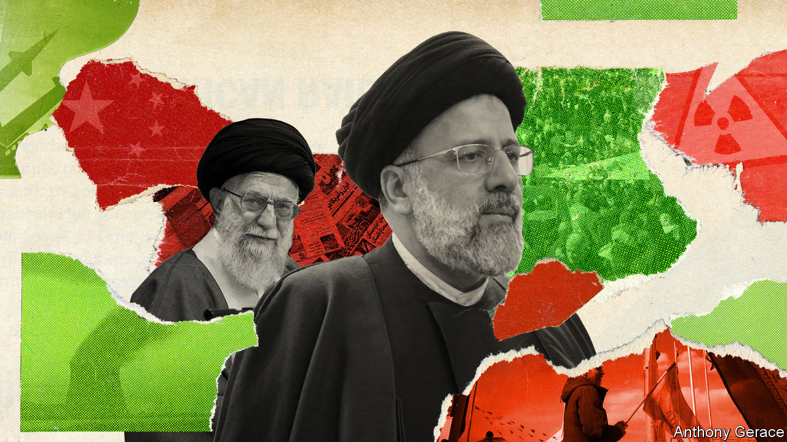
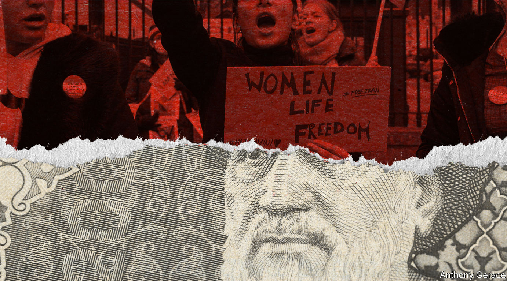

###### Intransigence mixed with emollience

# Iran wants a detente with its neighbours but not with America 

##### A swooning economy and popular unrest notwithstanding, it is sticking to its nuclear programme 

 

> Mar 23rd 2023 

Those who see Iran’s clerical regime as a fount of danger and discord have had no shortage of evidence in recent months. It has supplied Russia with hundreds of kamikaze drones to bomb civilian targets in Ukraine, and is thought to be building a factory in Russia to provide yet more. In early March the International Atomic Energy Agency (IAEA) revealed that it had found traces of uranium at an Iranian facility that were too pure for any civilian use and almost refined enough to be made into a nuclear bomb. The government’s violent repression of widespread public protests is now in its sixth month. And this week it conducted naval exercises with China and Russia off its southern coast. 

Yet recent weeks have also seen the biggest easing of tensions in years between Iran and its geopolitical rivals in the Middle East. On March 10th the government signed a deal, brokered by China, to restore diplomatic relations with Saudi Arabia after a seven-year lapse. The Saudi government has invited Ebrahim Raisi, Iran’s president, to visit the kingdom—something only one previous Iranian president has done. And Iran’s closest ally in the region, Syria, is also patching up relations with its neighbours. Bashar al-Assad, Syria’s president, visited the United Arab Emirates (UAE) this week.

This peculiar mix of emollience and belligerence raises several questions. Is Iran turning over a new leaf? What accounts for its apparent inconsistency? And how will Iran’s confusing conduct affect the region and the world?

Just over two years ago, when Joe Biden became America’s president, he had high hopes of easing America’s long-running feud with Iran. His predecessor, Donald Trump, had withdrawn from a deal struck in 2015 that put limits on Iran’s nuclear programme. Instead, Mr Trump reimposed sanctions. Mr Biden calculated that Iran, its economy reeling, would jump at the chance to escape some of the sanctions by restoring the nuclear pact.

Mr Biden’s hopes have come to nothing. Round upon round of painstaking talks in Vienna have yielded no breakthroughs. Ali Khamenei, Iran’s supreme leader, appears to have lost patience. The IAEA’s discovery, meanwhile, suggests that Iran is accelerating its nuclear work. 

But Iran’s detente with Saudi Arabia suggests that it is open to at least some overtures from its adversaries. Its relations with the kingdom in recent years had been worse, if anything, than with the United States. Iran and Saudi Arabia took opposing sides in the long civil wars in Yemen and Syria, among other disputes. Iran inflicted a series of humiliating reversals on the Saudis via the Houthis, the faction Iran backs in the war in Yemen. Last year, for instance, the Houthis fired missiles and drones at an oil depot in Jeddah, Saudi Arabia’s second city, days before a Formula 1 race there. Saudi Arabia had been lobbying Mr Biden to make sure that any deal America struck with Iran was not too lenient.

Bridging the gulf

Now, all of a sudden, in addition to restoring diplomatic ties with Saudi Arabia, Iran has agreed to curtail shipments of arms to the Houthis, according to officials in both America and Saudi Arabia. On the Saudi side, Mohammed al-Jadaan, the finance minister, has held out the prospect of Saudi investment in Iran growing “very quickly” if the agreement holds.

 


That may be empty talk, but the thaw in relations does seem to have an economic logic on both sides. Saudi Arabia needs stability to attract the investment it is counting on to help diversify the economy away from oil and petrochemicals. Iran’s economy, meanwhile, is on its last legs. In February the rial dropped to an all-time low of around 580,000 to the dollar, leaving it 55% weaker than a year before and 94% down over a decade (see chart). Partly owing to the weakness of the rial, inflation has hovered at about 50% for the past year.


The miserable state of the economy, in turn, has exacerbated the protests that erupted in September after Mahsa Amini, a young Iranian woman, died in the custody of the “morality police” in Tehran, the capital. Though the crowds have ebbed, unrest still smoulders in places like the Kurdish north-west. Women across the country  the legal requirement to wear a  a focal point of popular anger (see Middle East &amp; Africa section).

After the deal with Saudi Arabia was signed, the rial appreciated by about 14% against the dollar (though it later lost some of those gains). “Any kind of deal that could bring any kind of stability to their domestic politics, and therefore to their domestic economics, is welcome,” says Mahdi Ghodsi, an Iranian economist at the Vienna Institute for International Economic Studies.

But the same logic does not seem to apply to the Joint Comprehensive Plan of Action (JCPOA), the nuclear pact that America wants to revive. The jcpoa barred Iran from amassing any more than 202kg of uranium of a maximum 3.67% purity. In return, the West and the UN eased sanctions on Iran’s economy. A similar offer has been back on the table since Mr Trump left office. But whereas the detente with Saudi Arabia involves marginal concessions for marginal benefits, scrapping the nuclear programme—in a deal with the hated Americans—is apparently too abject a surrender for Iran’s leaders to accept. 

Since the election of Mr Raisi in 2021 (after all moderate candidates had been barred from standing), hawks have controlled all branches of Iran’s government. Mr Khamenei, the ultimate arbiter, was always reluctant to negotiate with the West. Mr Trump’s repudiation of the jcpoa left him feeling vindicated. “He says, ‘I told you we should not trust the Americans,’” says Raz Zimmt of the Institute for National Security Studies, an Israeli think-tank. “‘We were ready to do that for the sake of sanctions relief, but at the end of the day the Americans violated the deal, so you have to convince me why I should make the same mistake again.’”

What is more, Iran’s leaders believe they have built a “resistance economy” capable of enduring prolonged sanctions. Never mind the swooning rial and sky-high inflation: the regime thinks China and Russia will keep it afloat. It signed a 25-year “strategic partnership” with China in 2021 and has boosted ties with Russia during war in Ukraine. “They want to signal to the West that ‘We have our partners, we don’t need you,’” says Mr Ghodsi.

But relations with China are lopsided: Iran sends lots of cut-price oil east, but China does not send much the other way. Giddy Iranian officials talked about how the partnership agreement might spur $400bn in Chinese investment. Last year, however, Chinese firms injected just $185m. Soon after Mr Trump renounced the jcpoa, Iran announced that China National Petroleum Corporation (CNPC) had stepped in to replace Total, a French energy giant, in a $5bn contract to develop the massive South Pars gasfield. But CNPC pulled out a year later. The project remains unfinished.

Russia has overtaken China as Iran’s largest investor. The two countries are also working together to bypass Western sanctions, using their own currencies in some bilateral trade, for example, and connecting their banking systems. Trade has grown to at least $2bn a year, up from about $1.5bn before the war in Ukraine (official statistics in both places can be unreliable). 

Gulf of expectations

Still, there are limits to how much two countries hobbled by sanctions can offer one another. Talk of boosting trade to $10bn a year, as Mr Raisi promised last year, is probably fanciful given their weak economies (and the fact that both countries tend to export similar products). Investment is unlikely to surge either. And they are becoming competitors in energy markets, where they both seek to offer discounted oil to Asian buyers.

At a recent talk, a pro-regime academic gave a sense of the government’s view of its economic straits. Iran, he said, was “selling every drop of oil it produced” and earning more in oil revenue—despite the discounts it must offer because of sanctions—than it did when the JCPOA was intact.

That is all true. But it omits some important context: Iran is selling every drop because production has fallen almost by half since 2017, from 4m barrels a day to 2.5m. It is only earning more revenue because the average price of oil in 2022 was 100% higher than five years earlier. In other words, sanctions have severely reduced Iran’s output and so cost the country tens of billions of dollars a year in revenue. Worse, some of Iran’s earnings come not as cash but rather through a barter scheme with China, which means the export revenue does not help to shore up the rial.

Whatever the economic cost, however, Iran’s “breakout” time (how long it needs to make a bomb’s-worth of uranium) is growing ever shorter. It has already amassed at least 70kg enriched to 60% purity. The particles the IAEA found had been enriched to 83.7%, just a fraction below the 90% required to make a bomb. Diplomats speculate that Iran has not yet accumulated much uranium of such purity. But it is hard to know anything for sure: Iran has restricted the IAEA’s monitoring of its nuclear facilities. Colin Kahl, an American official, thinks Iran could make enough fissile material for a weapon within 12 days.

It is unlikely to do so—for the moment. Although it has mastered enrichment, it lacks the expertise to turn the enriched uranium into a warhead and mount it on a missile. It is making steady progress on those fronts, too, however. Iran has an active programme making ballistic missiles and has unveiled weapons with ever greater ranges in recent years.

That leaves the world with a series of bad options. One is continued diplomacy. But if Iran wanted to return to the JCPOA, it could have done so by now. An alternative might be a lesser agreement, sometimes dubbed a “JCPOA-minus”, in which Iran would not accept broader limits on its nuclear programme but would agree not to refine uranium to weapons-grade, and permit strict IAEA monitoring, in return for limited relief from sanctions.

This idea is attractive to some European policymakers. But it would be unpopular in Israel and Saudi Arabia, because it leaves Iran so uncomfortably close to breakout. It would cause an uproar in Washington too: instead of the “longer and stronger” agreement Mr Biden has promised to negotiate, he would be settling for a shorter and weaker one. On top of all that, it is unclear whether Iran is interested.

A second option is a military strike on Iran’s nuclear facilities. Binyamin Netanyahu, Israel’s prime minister, has threatened one for more than a decade. Mr Biden has also made clear that America could attack if it felt Iran was too close to a bomb.

This would undeniably set back Iran’s nuclear work—although how much depends on who does it. Many analysts think the damage from an Israeli strike could be repaired in a matter of months. “It’s not the case of 1981 Iraq or the reactor in Syria,” says Mr Zimmt, referring to two incipient nuclear programmes that were brought to a halt by Israeli attacks.

An American strike would do more damage, but even that could be undone—and it would reinforce the rationale for having nuclear weapons in the first place. Iran has pursued a nuclear programme at tremendous cost in order to give the regime a guarantee of security. An attack by one (or both) of its greatest foes would only further convince policymakers that they need a nuclear deterrent.

Many Iranians who oppose the regime also fear an attack would prompt the country to rally behind its rulers. No one likes seeing bombs fall on their homeland, after all. But America’s assassination in 2020 of Qassem Suleimani, a senior Iranian general, does not seem to have hugely bolstered support for the regime (although it did bring big crowds onto the street). Nor did a long campaign of suspected Israeli sabotage and assassination, from the killing of Iran’s top nuclear scientist in 2020 to a strike on a drone-production facility in January. If anything, some Iranians argue, these incidents exposed the brittleness of a regime shot through with defectors and unable to protect itself.

Then there is the question of retaliation. Iran would probably lash out at either Israel, via its proxies in Lebanon and Syria, or the Gulf states. Some Saudis think their country should just grit its teeth and suffer through such an attack. That view is not widely shared in the kingdom, however, nor in the UAE, which fears an Iranian blitz would do lasting damage to its reputation as an oasis of stability. Some regional officials have sought to dissuade the Israelis from carrying out an attack.

That leaves a third option: the status quo. For all its advances, Iran is probably still a year or two away from being able to make and deliver a nuclear weapon. Even if it quickly produced lots of weapons-grade uranium, it could only turn it into a “dirty bomb”, a crude device that would not be much of a deterrent. A functional arsenal remains some way off.

What is more, Iran’s regime is odious but not suicidal. If it used a nuclear weapon it would find itself on the receiving end of a much stronger response from America, Israel or other powers. That is little comfort, of course, to Israel or Saudi Arabia. But it suggests another way forward: if Iran’s nuclear programme cannot be stopped through diplomacy or force of arms, it must be contained through the logic of deterrence. That does not preclude further efforts to press the regime, via sanctions, and to impede its nuclear work, through acts of sabotage.

None of these is a good option. They underline Mr Trump’s recklessness in renouncing even an imperfect arms-control agreement. The stand-off is a source of growing anxiety in the Gulf, which in turn, is one reason Saudi Arabia sought Chinese help in lowering tensions with Iran.

Engulfed by fear

The Saudis have not felt secure in their relationship with America for at least a decade. They saw Barack Obama’s support for the Arab spring as misguided and opposed his efforts to negotiate with Iran. Mr Trump was much warmer, yet when Saudi oil facilities were attacked by Iranian-made drones in 2019, he did little. Then came Mr Biden, who promised on the campaign trail to make Saudi Arabia a “pariah”. Congress has sought for years to obstruct arms sales to Saudi Arabia.

If your strongest partner seems unreliable, and your greatest foe seems threatening, it is only natural to hedge. The Saudis will look for ways to placate rather than provoke Iran, not unlike a shopkeeper paying protection money to the local mob boss. They will also seek to draw China into playing a bigger diplomatic role. If Iran keeps pushing ahead with its nuclear programme, the Saudis hope that China can be persuaded to use its economic clout to help rein in the regime.

If that gambit fails, however—or if China is unwilling to try—Saudi policymakers do not think China will be a substitute for America: no one expects the People’s Liberation Army to ride to the rescue when Gulf security is threatened.

For all their frustrations, the Saudis are not eager to break up with America. An Asian diplomat likens the Gulf states to Singapore, a country that has strong economic ties with China but still looks to America for its security. On March 14th Saudi Arabia announced a $37bn deal with Boeing, an American aircraft manufacturer, to buy as many as 72 of its 787 Dreamliners for a new airline being established by the main Saudi sovereign-wealth fund. Officials say the deal is not purely commercial: by giving a boost to American industry, they hope to boost the kingdom’s standing in Washington as well.

 


Saudi Arabia will also leave open the door to an eventual normalisation of ties with Israel. In the short term, that is hard to imagine. Israel has been paralysed for months by massive protests against a far-right government, and the number of Palestinians killed by Israeli forces in the occupied West Bank is on the rise. Both Israeli and Saudi diplomats say the circumstances for normalisation are not right. But the deal with Iran does not mean the Saudis have abandoned their budding security relationship with Israel, any more than they have given up on America as the most influential external power in the region.

All this fits with a broader spirit of detente in a region exhausted by wars and civil unrest. Mr Assad, Syria’s bloodstained dictator, is patching up ties with his neighbours, who have largely given up hope that he might be overthrown. Turkey is trying to repair its relationships with Egypt and the Gulf states, which had been frosty for years because of their differing views on political Islam. Qatar, too, is fixing festering disputes with Egypt and Saudi Arabia.

The new mood suits America just fine. Mr Biden has been preoccupied with war in Europe and competition with China. “His advisers just want to keep the Middle East off the president’s desk,” says a congressional staffer. Any reduction in tensions is therefore a good thing.

Even China’s usurpation of America’s role as regional broker is not as alarming as it may at first seem. As an American official points out, “We couldn’t have negotiated this deal, because we don’t have diplomatic relations with the Iranians.”

What is more, as Prince Faisal bin Farhan, Saudi Arabia’s foreign minister, put it, the Saudi-Iranian agreement is not a “solution to all outstanding differences”. The Iranian nuclear programme still looms large. If Iran is to remain a nuclear-threshold state, countries like Saudi Arabia will continue to feel insecure. America may not have a ready solution, but China is not even looking for one. ■

