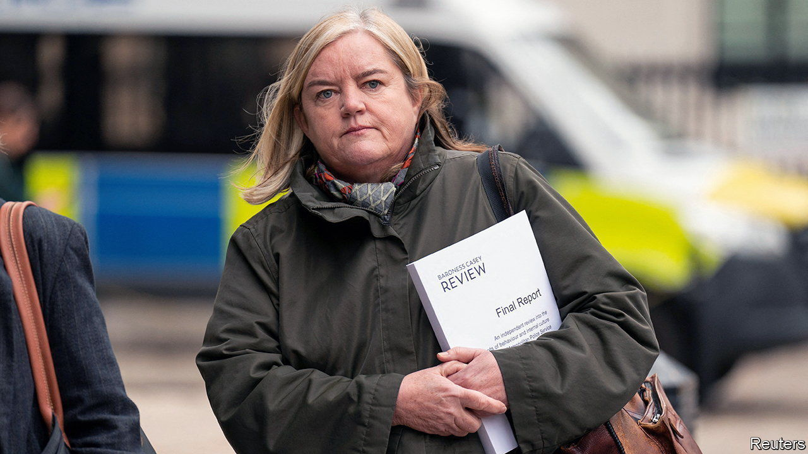

###### Ill met

# Louise Casey says the Met is institutionally misogynistic 

##### The social-problems fixer says radical reform to Britain’s biggest police force is needed 

 

> Mar 21st 2023 

Louise casey has spent her career telling it like it is. As head of the Rough Sleepers Unit established by Tony Blair, she observed that handing out soup and top-of-the-range sleeping bags made it too easy for people to remain on the streets. After running the Troubled Families Programme under David Cameron she chastised leftie “do-gooders” for thinking anti-social behaviour could be fixed with more youth clubs. Commissioned by Theresa May to produce a review on integration, she said she was “sick of some men’s version of Islam: telling women what to do”. 

Lady Casey has been true to form in her report on the “culture and standards” of the , which was published on March 21st. Prompted by the abduction, rape and murder of a young woman, , by a serving Met officer, Wayne Couzens, in 2021, it is the most damning assessment of Britain’s biggest police force since William Macpherson published another landmark report in 1999. Macpherson found then that the Met’s mishandling of the murder of Stephen Lawrence, a black teenager, betrayed “institutional racism”. Lady Casey says there is still plenty of evidence of that. But she concludes that the Met is also “institutionally homophobic” and “institutionally sexist and misogynistic”. 

Her report was not needed to reveal that Mr Couzens—and his employer’s failure to identify him as a dangerous predator—were indicative of a . That case was followed by a series of terrible revelations, including the fact that one of Britain’s most prolific rapists was  serving in the same Parliamentary and Diplomatic Protection Command (PaDP) as Mr Couzens. Yet Lady Casey’s investigation vividly illustrates the scale and horror of the Met’s dysfunction. It describes PaDP as “a dark corner of the Met” where poor morale and bigotry fester. (One black officer in the unit was referred to as “gate monkey”.)

The failings are widespread. Unlike London, the Met is still “largely white and largely male”. Female new recruits currently resign at four times the overall rate, the review found. Austerity has damaged front-line policing, with especially dire effects on the way sexual offences are dealt with. The review was told that a murder investigation gets “a whole team of experienced and specialist trained detectives, whereas a woman raped and left in a coma would likely be dealt with by one trainee detective constable”. The report is full of such gruesome details; testimonies from victims and officers are peppered with asterisks in place of swear words.

A former colleague once said of Lady Casey that no other civil servant would go down a crack alley to find out why someone is homeless. Her unusual route into the establishment may help explain that. She and her brother were the first members of their family to go to university. Her first job was on a reception desk at the Department of Health and Social Security (where Britons apply for benefits). The poverty she saw there prompted her to find a job working with the homeless; it was as deputy director of Shelter, a charity, that she was recruited by the Labour Party to be homelessness tsar. In 2020 she was made a cross-bench (ie, non-party-political) peer by the head of the civil service in order, he said, to allow her to speak “without fear or favour”.

That may not have been necessary. Lady Casey was particularly forthright at a press briefing for her review, railing furiously against some of the most shocking transgressions by Met officers who then remained in their jobs: they included an officer caught masturbating publicly on a train. In no other profession would that happen, she said. “It does your head in.”

Reports can be lauded and then quietly ignored, she said. But her recommendations for reforms—from new misconduct processes to changed governance structures—include checking some key measures after two and then five years. If the Met does not increase public trust, take more action on misconduct, increase charging rates and increase the diversity of its workforce it should consider radical restructuring. She would be watching carefully, she said. As ever, she means it. ■


