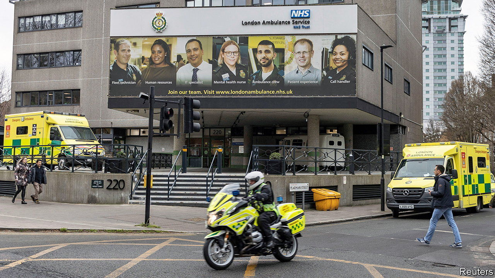
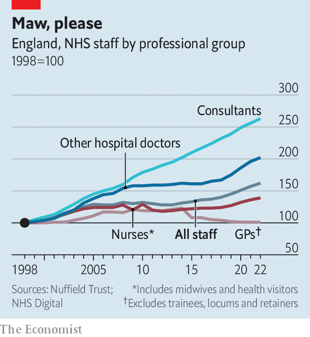

###### Trap for the NHS

# The British government attempts to take on the NHS’s workforce problems 

##### Pay, pensions and planning 

 

> Mar 23rd 2023 

OF every 17 Britons in work, one is on the payroll of the National Health Service (NHS). Despite the huge headcount, more workers are needed. One in every 11 NHS posts in England is vacant; shortages are reported across almost every health-care role. , who are not usually salaried NHS employees, are especially thin on the ground (see chart). This all adds to pressure on those employees that remain. In an annual staff survey completed by over 600,000 respondents, 17% said they would leave as soon as they can find another job. Long-standing grievances among front-line workers have culminated in a series of strikes.

 


The government has been sluggish in responding to the strikes and to the NHS’s underlying workforce problems. But the pace is picking up. In his on March 15th Jeremy Hunt, the chancellor of the exchequer, announced that to retain more senior doctors, he would abolish the cap on the lifetime amount that people can save for their pensions before paying additional tax. The next day, a government pay offer to NHS staff, excluding senior managers and doctors, was accepted by all but one of their unions. These actions, combined with the upcoming publication of a long-awaited workforce plan, mean that things are in a “more optimistic” place than they have been for a while, says Professor Helen Stokes-Lampard, chair of the Academy of Medical Royal Colleges. 

Still, big questions remain. Start with the pay offer. The proposal, a one-off payment for the current 2022-23 fiscal year and a 5% pay bump for 2023-24, will be put to a vote of union members in the coming weeks. But how it will be funded is an open question. A Treasury emergency fund may cover the lump-sum payment but next year’s pay rise may well be covered by what the government calls “efficiency savings”—in other words, raiding existing NHS budgets. This would be counterproductive: leaking roofs and bad IT are not good for productivity or morale. 

Junior doctors, meanwhile, who are asking for a pay rise of 35%, have not yet been offered a deal. Their 72-hour strike this month has already led to the cancellation of over 170,000 appointments and procedures, dealing a blow to the government’s pledge to slash waiting lists.

The pension reforms are a boon for senior doctors (not to mention other high-earners like bankers, say critics). Yet the government has not been able to say how many doctors will be retained as a result. Hospital consultants are pleased, but it is “not quite as effective as what we were pushing for and arguably more expensive”, says Dr Vishal Sharma, who chairs the consultants’ committee of the British Medical Association, the doctors’ union. They favoured a reform, which has already been introduced for judges, in which their pension schemes are non-registered for tax purposes, thereby exempting them from annual and lifetime allowances. Dr Sharma’s committee may still ballot members on a strike over pay next month.

A workforce plan, drawn up by NHS England in consultation with the government and others in the sector, is due this spring and is the most consequential change. A strategic approach to planning is undoubtedly needed: it takes at least ten years to train a doctor, double the length of a full parliamentary term. The plan should lay out how many  the system needs; they are currently capped in England at 7,500 per year. It should also consider how to balance the likely supply of migrant staff with the need for a home-grown workforce, given international competition for the services of doctors and nurses. The World Health Organisation projects a global shortfall of 10m health-care workers by 2030.

But workforce planning is not a hard science. Previous independent forecasts have been “outrageously large”, notes Ben Zaranko of the Institute for Fiscal Studies, a think-tank. “At some point we’ll all be working in the NHS, if you project these numbers into the long term,” he says. And adding more workers is not an answer to every problem the system faces. A paper co-written by Mr Zaranko shows that productivity has fallen in the NHS since the pandemic, despite a higher headcount. The NHS is being held back by staff shortages. But better management and a more efficient social-care system, among other things, also have a big part to play. ■

