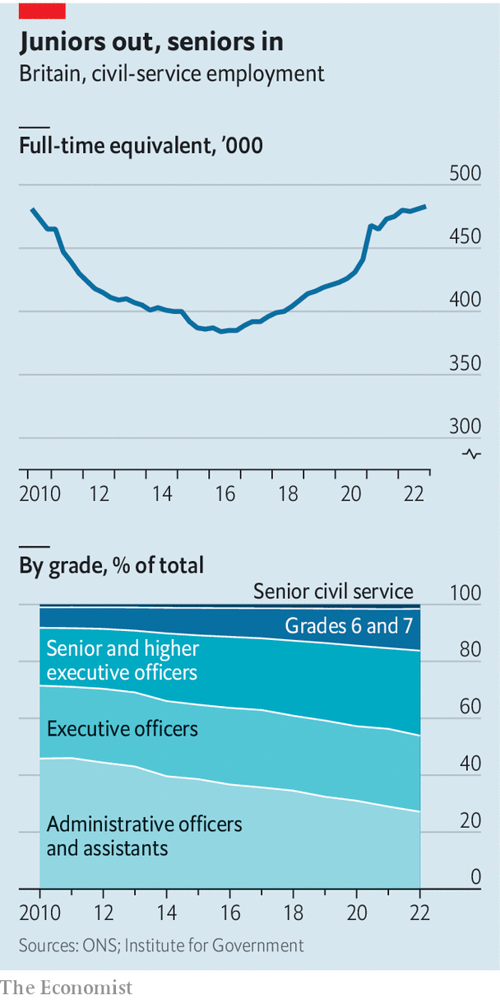

###### Rolls-Royce no more?

# The machine that runs Britain’s state needs an overhaul 

##### Ministerial hostility and increased churn compound long-standing concerns about the civil service 

 

> Mar 23rd 2023 

In 2011 the Ministry of Justice (MoJ) decided to roll out a new GPS-enabled ankle tag for criminals, in the hope of reducing reoffending. The design included 900 bespoke requirements and was split between four contractors—a high-risk structure in which the MoJ had no experience. Officials and suppliers fell out; managers came and went; hazy assumptions went unchallenged. In 2022 the programme was canned at a cost of £98m. 

The tagging fiasco, and the ministry responsible for it, provide a lens into the way Britain is governed. The MoJ is the civil service in microcosm. It has a mid-sized budget. It comprises some 6,000 staff at its HQ, a brutalist citadel near the Houses of Parliament, and 80,000 more spread across the prison service, the courts service and a panoply of smaller agencies. 

As well as grappling with a big , and a bulging prison population, it oversees 24 schemes classified as “major projects” for their scale or complexity, the second-highest of any government department. The MoJ is rather like the British army of the 1950s, says one veteran official. It keeps day-to-day order well enough and is good at mobilising in a crisis such as covid-19. But it struggles to innovate. And on big projects, calamity can strike. 

That judgment jars with the reputation of Britain’s civil service as the Rolls-Royce of public administrations. In an index based on an aggregation of earlier studies, the Blavatnik School of Government in 2019 ranked it the best out of 38 countries. Polls suggest it is more trusted than bankers, politicians or the priesthood. In the past decade it has lugged Britain through , a pandemic and the European energy crunch. Paying a tax bill or renewing a licence online is usually a slick experience; the number of digital wonks has risen by 79% since 2016. 

They are among some half a million officials, spread through two dozen central departments and scores of subsidiary agencies. The civil service is one partner in what Peter Hennessy, a constitutional historian, calls “the governing marriage”: a relationship between elected ministers and permanent officials, conducted largely in private. In exchange for job security and political neutrality, the civil service gives the government of the day candid advice and loyally enacts its policies. 

Yet the civil service is also institutionally weakened and vulnerable. A model of government first conceived in the mid-1850s is now under immense strain. “It is the greatest single beneficial reform of the 19th century, apart from the extension of the franchise,” says Lord Hennessy. “But more of it is in flux now than it has been for a very long time.” 

 


Old problems—the churn of officials and inadequate evaluation—have been compounded by new ones, such as inexperienced officials and hostility from some ministers. Together, they threaten the civil service’s authority, confidence and capability. “We have no automatic right to exist,” said Simon Case, its head, in a recent speech. Can the Rolls be fixed? 

Some complaints are very long-standing. In 1968 a report by Lord Fulton declared that Whitehall was dominated by the “philosophy of the amateur” and ill-equipped for the age of atomic energy and the jumbo jet. “The ideal administrator is still too often seen as the gifted layman who, moving frequently from job to job within the service, can take a practical view of any problem, irrespective of its subject matter, in light of his knowledge and experience of the government machine.” 

Churn remains a problem. Nearly 5% of the civil service moved to a new department within Whitehall in 2021, according to the Institute for Government (IfG), a think-tank. Add the people who left the service, and 2021 saw the highest rate of turnover in a decade. That saps expertise. Worse, says Gareth Davies, the head of the National Audit Office (NAO), a spending watchdog, too often “there’s no sense of ownership” over big projects. “People are reasonably confident they’ll be gone before any adverse consequences are obvious.” The MoJ’s tagging project had five “senior responsible owners”, the official accountable for a project, in six years.

In part, churn reflects career incentives. Mid-ranking policy officials talk of being encouraged to move every 18 months to gather experience, pay and promotion. But it also reflects a deeper malaise, argues Jonathan Slater, a former permanent secretary (the most senior department official) at the Department for Education: a culture which prizes the ability to “handle” ministers and “fix” political problems. John Kingman, a former Treasury bigwig, has claimed there is a “disdain” for deep knowledge. A pyramidal structure of older managers at the top and younger generalists at the bottom does not provide a home for well-paid, experienced experts.

The second problem is that the civil service has a surprisingly poor picture of whether its programmes work. Just 8% of major projects worth a total of £432bn ($529bn) had robust impact-evaluation plans in place, the Cabinet Office concluded in 2019. The MoJ had little evidence as to whether tagging reduced reoffending before the tagging scheme was launched or by the time it was scrapped, a NAO report concluded. “It is not yet an embedded culture that says ‘you won’t have much chance of your proposal being approved unless you’ve marshalled the available evidence in a robust way’,” says Mr Davies. Political incentives are to blame: “Nobody likes being associated with something evaluated and shown to be unsuccessful.”

These long-running problems have been exacerbated in recent years. In 2010, when David Cameron took office, headcount stood at 481,000. Austerity saw it shrink by a fifth by 2016, to 384,000, with many of the cuts falling on lower-ranking staff. Over the next six years these cuts were fully reversed, owing largely to a recruitment drive of senior officials to cope with the demands of Brexit and covid-19. 

The result of this ebb and flow has been to make the senior ranks much bigger, but also younger and worse paid, according to an analysis by the IfG. Salaries of the senior civil service fell by 23% in real terms over the period. It is likely that some civil servants have been promoted before time to manage morale and boost salaries at a time of meagre pay settlements. The influx has given the service more energy and less cynicism, says Alex Thomas of the IfG. But it also means it is a “less experienced, and probably a less authoritative and confident civil service,” he says. 

That confidence matters more than ever. The “governing marriage” works best when the partners trust each other but years of political crisis have driven them apart. Brexit sowed in the minds of many Tories the notion that the civil service was hostile to their goals. This suspicion hardened during the tenure of Boris Johnson. The polite version of this critique came from Michael Gove, a veteran minister who in Fultonesque terms said the civil service had too few mathematicians and too much flitting between jobs. The balder version came from , an aide who had long wanted to smash “the blob” and kept a “shit list” of senior officials. Half a dozen permanent secretaries resigned or were squeezed out, among them Mark Sedwill, the cabinet secretary; Mr Slater; and Sir Richard Heaton, the boss of the MoJ. 

In October 2022 Liz Truss, Mr Johnson’s short-lived successor, followed suit with calamitous effect by firing Sir Tom Scholar, the head of the Treasury, as a pre-emptive strike against “Treasury orthodoxy”. All the while Tory MPs produced a drumbeat of denigration: civil servants were variously woke, obstructive and work-shy. The years of chaos brought a rapid turnover of ministers, too: the MoJ has seen six prisons ministers since the election of 2019. 

Mr Case’s leadership has added to the unease. Critics think he was much too pliant in the face of  and accuse him of failing to defend colleagues such as Sir Tom. 

Morale has dipped as a result. Just 32% of civil servants agree that their pay is reasonable compared with pay at other organisations, according to the most recent staff survey from 2021. Thousands of civil servants, including courts and parole staff, have gone on strike. In exit interviews four in ten senior civil servants resigning from the service in 2020-21 cited how “fairly treated, respected or valued” they felt as reasons for their departure. The MoJ is emblematic. In 2021 the department had the highest rate of turnover of the highest-ranking civil servants of any department, at 28%. Dominic Raab, the current justice secretary, is subject to an official investigation into claims he bullied and demeaned staff. He denies the claims. 

What does it matter if some officials are unhappy? Because, say experienced Whitehall-watchers, the delicate compact at the heart of Britain’s system of government is being degraded. Telling a secretary of state what they don’t wish to hear is never easy. Candid advice becomes that much rarer in a civil service that is inexperienced, criticised, poorly led and short on evidence of what works. In the staff survey in 2021, just 54% of civil servants agreed that it is “safe to challenge the way things are done”. For good ministers, that lack of candour can be frustrating. For bad ones, it is a recipe for blunders—which degrades their trust in civil servants even more. Rival sources of advice, such as think-tanks and party gurus, fill the void and the civil service’s authority is eroded yet further. 

Rishi Sunak has lowered the temperature. On taking office in October, the prime minister emailed staff to thank them for their work and has made clear to officials he does not regard the civil service as “the problem”. The fast stream, a prestigious graduate programme paused by Mr Johnson, has been reopened. There is a recognition among some ministers that if they want a more professional civil service, they must professionalise themselves first. 

“It matters to Rishi. The prime minister is someone who is very keen to see us reforming the way we do government,” says Jeremy Quin, the minister for civil-service modernisation. Departments face significant real-term spending squeezes in the years to come but Mr Sunak has dropped Mr Johnson’s blunt goal of firing 91,000 civil servants. The government is focusing on redoubling reforms led by Francis Maude, a minister under Mr Cameron, in which “functions” (finance, procurement, human resources and the like) were professionalised and centralised. Whitehall’s ability to spot when major projects are stalling and to get them back on track is improving, says Mr Quin. 

Some of Mr Gove’s reforms are coming to fruition, albeit slowly. Rules that came into force in September 2022 are intended to wean Whitehall off the overuse of management consultants. A training course for ministers handling infrastructure projects is being run by the Saïd Business School in Oxford. “Capability-based pay” will be introduced for the most senior ranks from next April, in an effort to reward expertise and to slow churn. A new “evaluation task force” has been launched to improve standards; the government says proper evaluation will be in place for every major project by 2025. At the MoJ the number of analysts on electronic-tagging programmes has been increased from three to 17. Ministers hope to expand the practice of tagging by 2030 through off-the-shelf tech.

More radical ideas are in the ether, all reflecting the idea that the civil service needs more independence from ministers. A new legal duty to uphold propriety and inform Parliament about breaches of laws and ministerial codes would strengthen the hand of permanent secretaries concerned by ministers’ behaviour, argues Jill Rutter in a paper for the Bennett Institute for Public Policy. Lord Maude, who is conducting a further review of the civil service, is interested in the case for a “stewardship” agenda, which would make permanent secretaries accountable for their department’s long-term health. 

More radically, Mr Slater proposes opening the black box of officials’ advice to ministers. In Whitehall transparency is limited. Permanent secretaries can put on record their concern that schemes are unfeasible or a waste of money: in April 2022, the permanent secretary of the Home Office registered his concern that a scheme to send  wouldn’t be a deterrent to migrants. Contrast that with New Zealand, where officials’ detailed policy reports are published a month after a decision is taken by politicians. 

Mr Slater proposes going even further and publishing before a decision is taken, as tends to happen in English local government. A more open regime would be uncomfortable for an institution that is unused to scrutiny and that prizes being close to ministers. But Mr Slater argues that external scrutiny would force up the quality and candour of advice. It is hard to simply say what the minister wants when the world is listening in. (It would also have the happy side-effect of revealing when ministers have disregarded good advice.)

Whether to make use of that advice would still be ultimately the choice of ministers. Even a Rolls-Royce cannot drive itself. But it can run better. “The concentration of grey cells in Whitehall is still very, very considerable,” says Lord Hennessy. “But it’s an asset which is underused, underappreciated and in the worst case parodied. It’s a terrible waste.” ■


