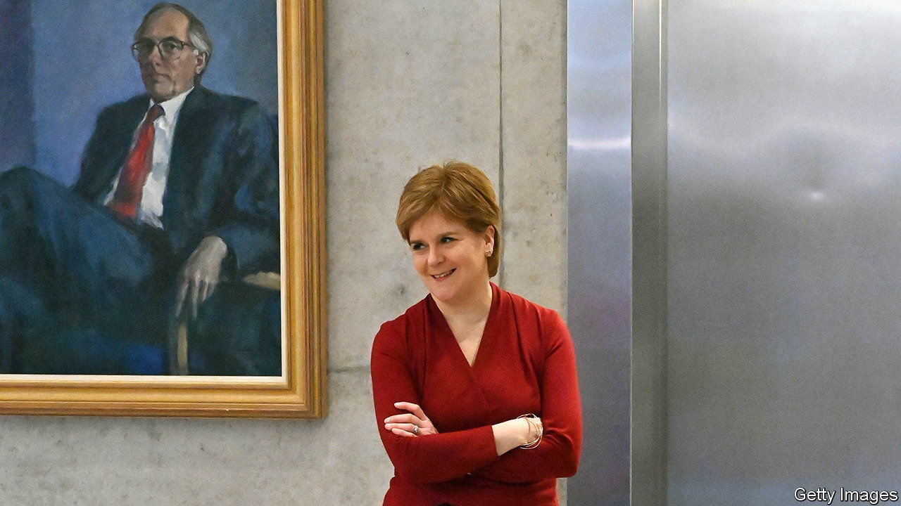

###### A party turned upside down

# The race to succeed Nicola Sturgeon has plunged the SNP into turmoil 

##### The preference-falsification theory of revolution comes to Edinburgh 

 

> Mar 23rd 2023 

Revolutions present a paradox, observes Timur Kuran, a Turkish-American political scientist. Before the event, they often appear unlikely. When a collapse does occur—as in France in 1789 or Iran in 1979—they catch the world by surprise. Yet in hindsight those same revolutions appear inevitable, as the fragility of the previous regime is laid bare. Professor Kuran explains this contradiction through what he terms “preference falsification”: the tendency of people to pretend to be content with the status quo when there is no viable opposition, only to air their grievances at the first flicker of change. 

His theory helps explain a present-day upheaval. A revolution is tearing through the Scottish National Party (SNP), which has governed Scotland since 2007. The extent of the party’s disarray is stunning. Yet in hindsight it is also wholly predictable: the list of internal disputes is long and the weaknesses of the SNP self-evident. The scale of preference falsification during the leadership of Nicola Sturgeon is now on full display; a party whose main strength seemed to be iron discipline is letting rip.

Ms Sturgeon herself set the chaos in motion. She caught her party off-guard by announcing her on February 15th, after serving eight years as first minister and seven years before that as deputy first minister. That triggered a leadership contest in which the three candidates have turned on the party’s record in office, its administrators and each other. The new leader, who will be announced on March 27th, will inherit a demoralised party and an independence cause whose support appears to be sagging. Depending on who it is, some even warn of a split in the party. 

Several camouflaged weaknesses have been exposed. Ms Sturgeon ran a highly centralised operation with Peter Murrell, her husband and long the SNP’s CEO. This is the party’s first contested leadership election since 2004; Ms Sturgeon was unopposed in 2014. Rebellions and resignations were rare. MPs and members resented this centralisation, but tolerated it as a precondition for electoral success and as a useful contrast with more chaotic opponents. 

Ms Sturgeon’s dominance has now caught up with the party. It prevented the emergence of an experienced field of successors and left the party with weak institutional capacity. It may also have led to mismanagement. Accused of lying to the press about a steep fall in party membership, Mr Murrell resigned on March 18th; the SNP’s head of media has also quit. Police are separately investigating how party funds have been used. 

The cause of independence, the SNP’s founding purpose, is another source of fragility. Ms Sturgeon left in part because she had run out of options to deliver a new referendum. In November 2022 the British Supreme Court clarified that the Scottish Parliament could not unilaterally hold a plebiscite; Scots themselves are not shifting decisively in favour of divorce. The careful control Ms Sturgeon exerted over the SNP’s independence strategy has been replaced by confusion and more radical talk from the candidates to succeed her. 

Ash Regan, campaigning on the slogan “Independence—nothing less”, has claimed Scotland could separate without a referendum; she has issued mock-ups of a new currency, decorated with unicorns and wildcats. Humza Yousaf, the SNP’s health secretary, who is regarded as a moderate, has implicitly described Westminster as a “foreign government”. Kate Forbes, the finance minister and Mr Yousaf’s main rival, has promised a referendum within three months of a win for the SNP in Scotland in a general election.

Without a clear path to independence, the SNP is discovering it agrees on little else. There are wildly different views on tax incentives and the size of the state. Mr Yousaf says he is proud of the party’s ; Ms Forbes says “more of the same” would be “an acceptance of mediocrity”. Ms Sturgeon wrapped nationalism up with progressive causes such as gender self-identification; Ms Forbes, an evangelical Christian, disagrees with same-sex marriage, abortion and bringing up children outside marriage. No preference is being falsified these days. ■


