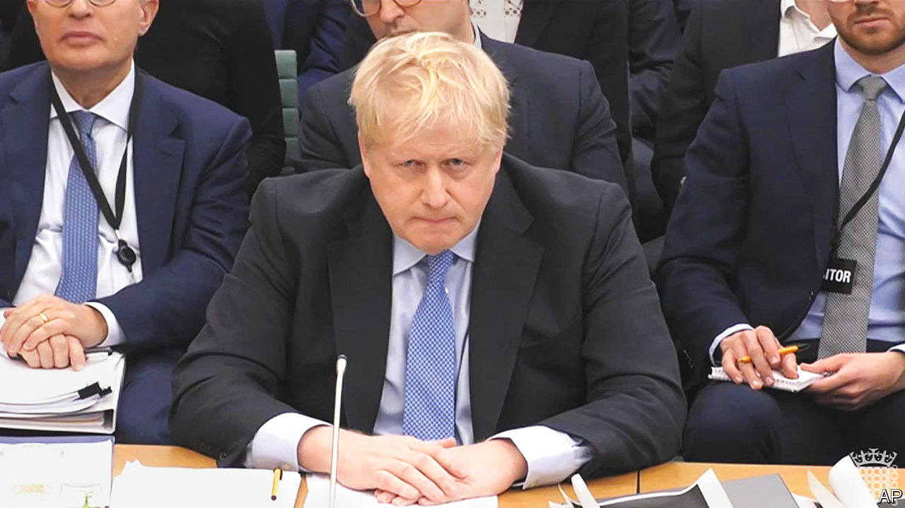

###### End of the clown show?

# “Honest” Boris Johnson looks done for 

##### The former prime minister now provides more theatre than threat 

 

> Mar 22nd 2023 

Boris Johnson is an honest man. It is possible to tell this by the sheer number of times he declares his honesty. In his written submission to the committee of MPs investigating whether he intentionally misled Parliament over , the word “honest” popped up around 20 times in one form or another. In a three-hour hearing on March 22nd he offered yet more honesty, at one point even “hand on heart.” And little speaks more of honesty than declaring your honesty 20-odd times in two days. 

Mr Johnson first came to national attention on a BBC comedy show called “Have I Got News for You”. Watch it now and those episodes feel more like a prophecy: the privileges committee, with clapping. Everything is there: the hair; the bluster; the accusations of wrongdoing. And, of course, the honesty. When asked then about an alleged crime, he replied: “Honestly, I don’t remember.” 

It didn’t matter then. He was so funny, so blond, so charismatic. As the show’s host at the time said: “Everyone’s going to love you.” And large parts of Britain did—as an MP, then as mayor of London, then all the way to Downing Street. And Mr Johnson loved the country back, so much so that he became the first Britain prime minister whose exact number of children is unknown. 

The act seems now to be drawing to a close. The committee hearing was another panel, another show. But the mood of “Have I Got Pixellated Photos For You” was less jolly. The boozy Downing Street gatherings during lockdown are known as the Partygate scandal. But the aura of the hearing was pure hangover. Mr Johnson’s mood alternated between testy (“complete nonsense”, he spat at one point) and the kind of repentant abstinence that follows overindulgence. A man who once said he was pro having cake and pro eating it emphasised that, at his 2020 birthday gathering, “the cake remained in its Tupperware box”. 

Mr Johnson did attempt a little bonhomie: he talked of “electric forcefields” and “higgledy-piggledy corridors”. But his audience was less interested in higgledy-piggledy corridors than in pages 30, 40 and 41 of the evidence bundle: might he refer to it? Above all they referred him to the photographs—an entire appendix of awkwardness, with bottles of wine and crisps and a regrettable takeaway on a silver platter. 

There were other regrettable takeaways for Mr Johnson from all this. If the committee finds against him, it may set in train a process that ends in him leaving Parliament. But whatever its verdict, he looks done for. On the day he fended off questions about alcohol and trestle tables, MPs approved the  negotiated by Rishi Sunak. His polling is down; his chances of hitting the political heights again are very slim. He might admit as much, if he were being honest with himself. 


