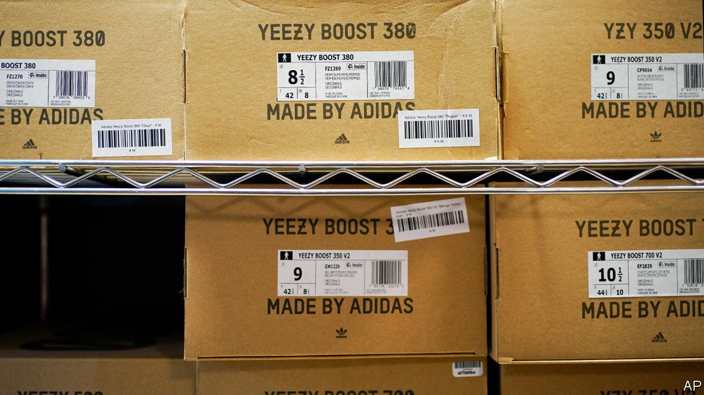
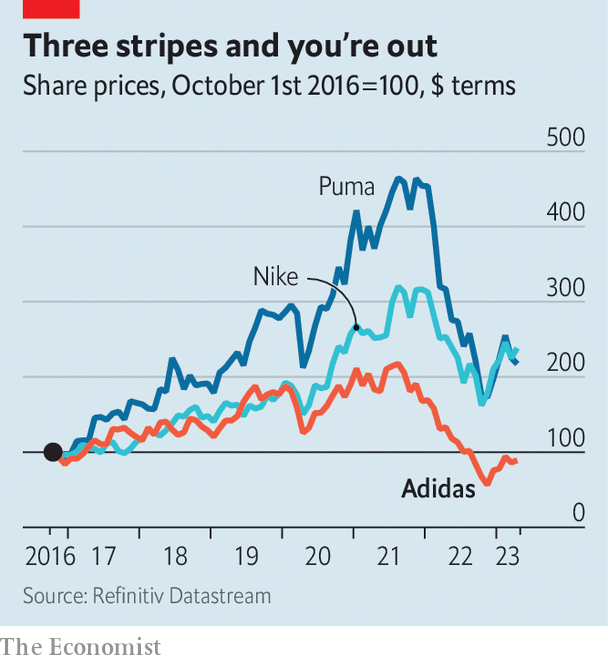

###### No Yeezy answers

# Can Adidas ever catch up with Nike? 

##### The German firm’s new boss has his work cut out 

 

> Mar 23rd 2023 

A few years ago it appeared as though Adidas might challenge Nike for the title of the world’s biggest maker of sportswear. The American giant was well ahead, to be sure. But its three-striped German rival had pep in its step. Under Kasper Rorsted, who took over as chief executive in October 2016, Adidas’s revenues shot up—by a cumulative 30% or so in the first three years of his stewardship. A lucrative deal from 2013 to make and sell trainers designed by Kanye West, an American rapper, was paying off handsomely; by 2021 Mr West’s Yeezy line contributed 12% of Adidas’s overall shoe sales. In August that year the company’s market capitalisation reached €67bn ($79bn), more than twice what it had been five years earlier. 

 


Today Adidas looks like an also-ran. Revenues were more or less flat in the final three months of 2022, year on year. The company disclosed a quarterly operating loss of €724m. Far from catching up, it is falling further behind Nike, which on March 21st reported quarterly sales of $12bn, 14% higher than the year before and twice those of Adidas, and boasts cushy 13% operating margins worthy of its Air soles. Adidas’s market value is back down to €25bn, one-seventh that of Nike. Investors today appear to have more confidence not just in the swoosh but in Puma, Adidas’s smaller domestic rival (see chart).

Some of Adidas’s cramps are the result of factors beyond its control. Inflation pushed up supply-chain costs. The company had to wind down its sizeable business in Russia after the country’s warmongering president, Vladimir Putin, sent tanks into Ukraine in February 2022, provoking an exodus of Western firms from the Russian market. And the increasingly erratic behaviour, including anti-Semitic outbursts, of Mr West (who now insists on being called Ye) led Adidas to cut ties with him in October last year. That left it with millions of unsold pairs of Yeezys, worth some €1.2bn. Unless these are somehow repurposed, the company expects to end 2023 with its first annual operating loss in 30 years, of perhaps €700m. The prospect of a recession in Europe and North America, and uncertainty over China’s economic recovery, present another drag.

Bad luck is not the whole story, however. Mr Rorsted’s focus on efficiency and cost, though in some ways welcome, came at a price. He treated Adidas’s retail partners shoddily, preferring to focus on selling directly to consumers through the company’s own shops. He also neglected investments in innovation. Mr Rorsted would have made a fine chief financial officer, says Florian Riedmüller of the Nuremberg Institute of Technology. Instead, he “is an example of what happens when you put the wrong person into the top job”.

Adidas’s board thinks it has now found the right one in Bjorn Gulden, who took over as CEO at the start of the year. The Norwegian former professional footballer had helped to turn round Puma, from which he was poached. 

Mr Gulden’s first task is to decide what to do with all the Yeezys (options include trying to sell them, possibly handing the proceeds to charity, donating them to a good cause, such as the victims of the recent earthquakes in Syria and Turkey, or just binning them). A bigger long-term challenge, says Aneesha Sherman of Bernstein, a broker, is what to do about China. Last year Adidas’s Chinese sales fell by 36%. China’s strict pandemic lockdowns and boycotts of Western brands that expressed concern about China’s treatment of its Uyghur Muslim minority both played a role; Nike’s Chinese sales, too, declined in its latest quarter, by 8%. 

But unlike Nike, China’s bestselling sportswear brand, which has deftly adapted to local tastes, in particular a growing love of basketball, Adidas has been caught flat-footed. Its Chinese sales have been overtaken by those of Anta, a fast-charging local rival. Now it risks losing the number-three position to another, Li Ning. 

Mr Gulden calls 2023 a “transition year” that will smooth the path to rebuilding a profitable business in 2024. He plans to cut the dividend, reduce discounts on unsold kit, mend relations with retailers, and invest more in products and in the Adidas brand. That is a start. But if Adidas really wants to catch up with Nike, it will need to pick up the pace—and then some. ■


