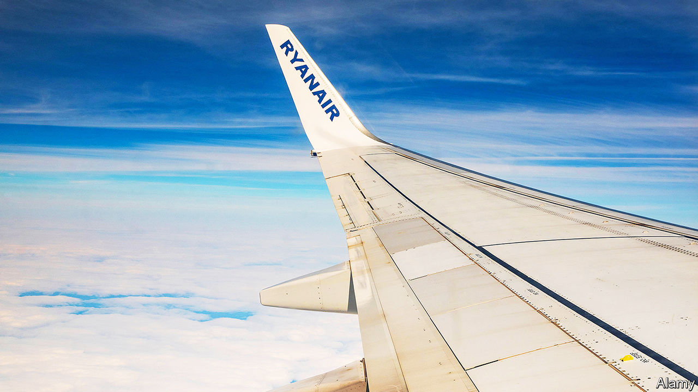

###### Caution is a headwind

# Every setback is an opportunity for Ryanair 

##### Europe’s biggest airline has once again outmanoeuvred rivals 

 

> Mar 23rd 2023 

Michael O’Leary has given up the attention-grabbing stunts and outrageous proposals that used to ensure headlines for him and his airline, Ryanair. No more badmouthing customers, suggesting standing-only tickets or fees for using the toilet on planes, and dressing up as a court jester or a leprechaun. Now that Ryanair is Europe’s biggest carrier—one in five flights on the continent comes courtesy of its 550 aircraft—the demands to appear “slightly more corporate” outweigh the need to be “running around looking like an ’eejit’”, he says, almost wistfully.

Indeed, nowadays the low-cost carrier’s achievements speak for themselves with no need for gimmicks. Between its stockmarket debut in 1997 and 2019 passenger numbers rose by an average of 19% a year. While most rivals struggled to regain lost ground, Ryanair emerged from the covid-19 pandemic stronger. Summer schedules that will see the number of daily flights increase from 2,000 to 3,000 from March 29th have already attracted strong bookings. This could boost passenger numbers to 168m in the financial year to March, easily surpassing the pre-covid figure of 149m. Ryanair pulled this off, Mr O’Leary says, “partly through luck and partly through bravery”. 

It certainly took a bit of pluck to resist the job cuts that other airline bosses executed when covid-19 grounded many of their flights. Ryanair kept on most staff on reduced wages and rotated crews on the few remaining flights to keep their licences current. It also started hiring again before anyone else. It could afford to do so thanks to a strong balance-sheet built on a business model of ultra-low-cost flying: rock-bottom fares filling planes on routes between the cheapest airports, with extra charges for everything else (except toilets). As Aviation Strategy, a consultancy, notes, the company also renegotiated an order for 135 of Boeing’s 737 MAX narrowbodies and, if the rumours are true, ordered 75 more in 2020 at the height of the covid slump at just one-third of the list price. 

Negotiations with Boeing over planes for the next phase of Ryanair’s expansion have stalled, as the aircraft-maker resists more discounts. But Mr O’Leary is confident that he can strike a deal in the next couple of years that will give him the planes to carry 300m passengers by 2035. He also reckons that after 30 years of excess capacity European aviation is in for a period of stability. Barriers to entry are already going up. One comes from the planemaking duopoly of Boeing and Airbus, whose order books are full until 2027. Another is higher interest rates and financial uncertainty, which makes it harder for newcomers to raise capital. The third is Ryanair itself, which deters rivals with fares based on the lowest costs in the industry—and with its knack for turning adversity to its advantage. “War, pestilence…something will go wrong,” concedes Mr O’Leary. But that is also “where opportunities come”. ■


