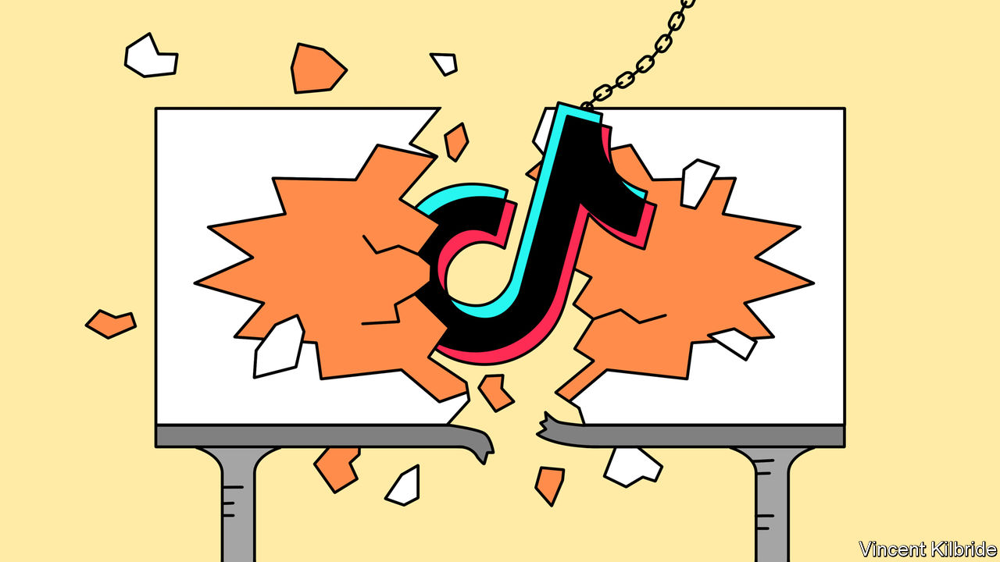
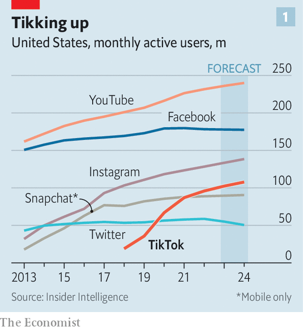
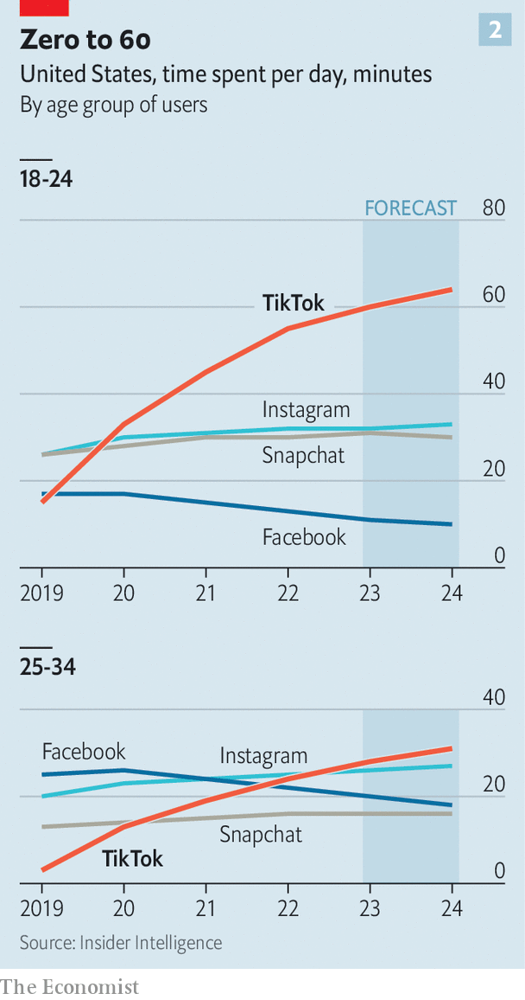
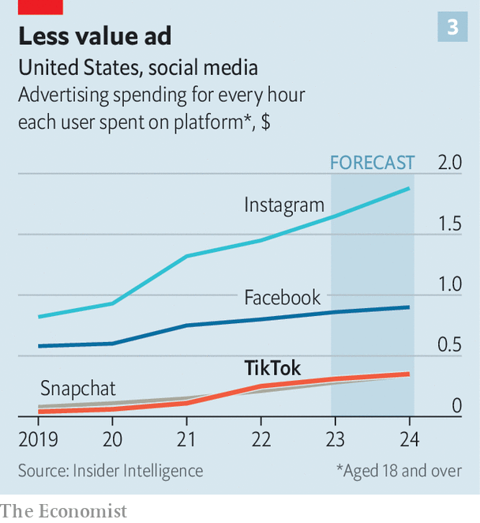

###### Social media

# How TikTok broke social media 

##### Whether or not it is banned, the app has forced its rivals to adopt a less lucrative model 

 

> Mar 21st 2023 

Is tiktok’s time up? As the social-media app’s chief executive, Shou Zi Chew, was getting ready for a grilling before Congress on March 23rd, after  went to press, TikTok’s 100m-plus users in America were fretting that their government was preparing to ban the Chinese-owned platform because of security fears. Their anguish contrasts with utter glee in Silicon Valley, where home-grown social-media firms would love to be rid of their popular rival. With every grumble from Capitol Hill, the share prices of Meta, Pinterest, Snap and others edge higher.

TikTok’s fate hangs in the balance. But what is already clear is that the app has changed social media for good—and in a way that will make life harder for incumbent social apps. In less than six years TikTok has weaned the world off old-fashioned social-networking and got it hooked on algorithmically selected short videos. Users love it. The trouble for the platforms is that the new model makes less money than the old one, and may always do so.

 


The speed of the change is astonishing. Since entering America in 2017, TikTok has picked up more users than all but a handful of social-media apps, which have been around more than twice as long (see chart 1). Among young audiences, it crushes the competition. Americans aged 18-24 spend an hour a day on TikTok, twice as long as they spend on Instagram and Snapchat, and more than five times as long as they spend on Facebook, which these days is mainly a medium for communicating with the grandparents (see chart 2).

 


TikTok’s success has prompted its rivals to reinvent themselves. Meta, which owns Facebook and Instagram, has turned both apps’ main feeds into algorithmically sorted “discovery engines” and launched Reels, a TikTok clone bolted onto Facebook and Instagram. Similar lookalike products have been created by Pinterest (Watch), Snapchat (Spotlight), YouTube (Shorts), and even Netflix (Fast Laughs). The latest TikTok-inspired makeover, announced on March 8th, was by Spotify, a music-streaming app whose homepage now features video clips that can be skipped by swiping up. (TikTok’s Chinese sister app, Douyin, is having a similar effect in its home market, where digital giants like Tencent are increasingly putting short videos at the centre of their offerings.) 

The result is that short-form video has taken over social media. Of the 64 minutes that the average American spends viewing such services each day, 40 minutes are spent watching video clips, up from 28 minutes just three years ago, estimates Bernstein, a broker. However, this transformation comes with a snag. Although users have a seemingly endless appetite for short video, the format is proving less profitable than the old news feed. 

 


TikTok monetises its American audience at a rate of just $0.31 for every hour the typical user spends on the app, a third the rate of Facebook and a fifth the rate of Instagram (see chart 3). This year it will make about $67 from each of its American users, while Instagram will make more than $200, estimates Insider Intelligence, a research firm. And it is not just a TikTok problem. Mark Zuckerberg, Meta’s chief executive, told investors last month that “Currently, the monetisation efficiency of Reels is much less than Feed, so the more that Reels grows…it takes some time away from Feed and we actually lose money.”

The most comforting explanation for the earnings gap is that TikTok, Reels and the other short-video platforms are immature. “TikTok is still a toddler in the social-media ad landscape,” says Jasmine Enberg of Insider Intelligence, who points out that the app introduced ads only in 2019. Platforms tend to keep their ad load low while getting new users on board, and advertisers take time to warm to new products. “You can’t really wave a magic wand and declare that your new ads are ‘premium’ without any performance history to back it up, so they start at the end of the line,” says Michelle Urwin of Skai, an ad-tech firm.

Meta points out that it has been here before. Instagram’s Stories feature took a while to get advertisers signed up but is now a big earner. Meta is monetising Reels more aggressively and expects it to stop losing money around the end of this year. But the firm acknowledges that it will be a long time before Reels is as profitable as the old news feed. “We know it took us several years to bring the gap close between Stories and Feed ads,” Susan Li, Meta’s chief financial officer, said on an earnings call last month. “And we expect that this will take longer for Reels.”

Some wonder if the gap will in fact ever be closed. Even mature video-apps cannot keep up with the old social networks when it comes to monetising their users’ time. YouTube, which has been around for 18 years, makes less than half as much money per user-hour as Facebook or Instagram, estimates Bernstein. In China, where short-form video took off a few years before it did in the West, short-video ads last year monetised at only about 15% the rate of ads on local e-commerce apps.

For one thing, the ad load in video is inescapably lower than on a news feed of text and images. Watch a five-minute YouTube clip and you might see three ads; scroll Instagram for five minutes and you could see dozens. Watching video also seems to put consumers in a more passive mood than scrolling a feed of friends’ updates, making them less likely to click through to buy. Booking 1,000 impressions for a video ad on Instagram Reels costs about half as much as 1,000 impressions for an ad on Instagram’s news feed, reports Tinuiti, a big marketing agency, implying that advertisers see Reels ads as less likely to generate clicks.

Auctions for video ads are less competitive than those for static ones, because many advertisers have yet to create ads in video format. Big advertisers prize video ads (and report record engagement on TikTok, where products have gone viral with the hashtag #TikTokmademebuyit). But the long tail of small businesses from which social networks have made their billions find video spots tricky to produce. Just over 40% of Meta’s 10m or so advertisers use Reels ads, the company says. Getting the remaining 60% to create video commercials may be made easier by artificial intelligence. One senior executive imagines a near future in which a small retailer can create a bespoke video ad using only voice commands. Until that moment arrives, half the long tail is lopped off.

Short-video apps are also hampered by weaker targeting. For audiences, part of the appeal of TikTok and its many imitators is that users need do no more than watch, and swipe when they get bored. The algorithm uses this to learn what kinds of videos—and therefore ads—they like. But this guesswork is no substitute for the hard personal data harvested by the previous generation of social networks, which persuaded users to fill in a lengthy profile including everything from their education to their marital status. The upshot is that many advertisers still treat short-form video as a place for loosely targeted so-called brand advertising, to raise general awareness of their product, rather than the hyper-personalised (and more valuable) direct-response ads that old-school social networks specialise in.

Here, at least, TikTok’s imitators have an advantage over TikTok itself. Using a trove of data built up over a decade and a half, when there were few rules against tracking users’ activity across the wider web, Meta already knows a lot about many of the users watching its videos and can make well-informed guesses about the rest. If a new, unknown user watches the same videos as a group who are known to be rich female graduates with children, say, it is a good bet that the new user has the same profile. TikTok says it has made big investments in its direct-response ads, including new tools for measuring their effectiveness. But it still has catching up to do. “Meta are leveraging their history,” says Mark Shmulik of Bernstein. 

Social apps will not be the only losers in this new, trickier ad environment. “All advertising is about what the next-best alternative is,” says Brian Wieser of Madison and Wall, an advertising consultancy. Most advertisers allocate a budget to spend on ads on a particular platform, he says, and “the budget is the budget”, regardless of how far it goes. If social-media advertising becomes less effective across the board, it will be bad news not just for the platforms that sell those ads, but for the advertisers that buy them. ■


