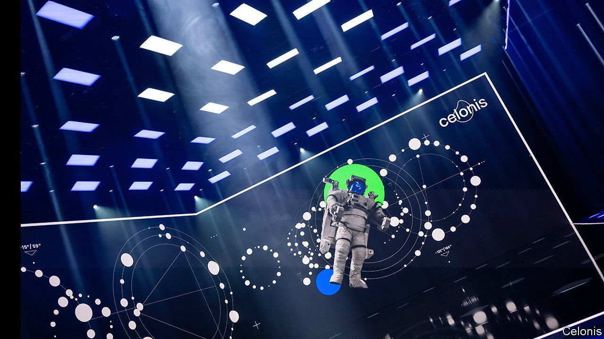

###### A digital gold mine

# The real next big thing in business automation 

##### Process mining will help automate business long before chatbots do 

 

> Mar 23rd 2023 

Running a big business is complicated—often mind-numbingly so. Seemingly straightforward processes such as taking an order and receiving the payment can take thousands of possible paths, for example if an extra credit-check is needed, delivery has to be confirmed or a follow-up invoice sent. Though often necessary, the rigmarole complicates life for companies and slows things down. The resulting inefficiencies can cost businesses eye-watering amounts—between 20% and 30% of annual revenue, according to one estimate. 

Software-makers are now finding ways to untangle the procedural spaghetti with the help of “process mining”. Its dull name notwithstanding, it is one of the fastest-growing areas of information technology (IT). It generated around $1bn in annual sales in 2022, reckons Gartner, an IT consultancy, and could treble in size in the next few years. Celonis, a German process-miner, recently raised $1bn at a valuation of $13bn, making it Germany’s biggest startup and its hottest tech success story since SAP, a business-software giant, was founded 50 years ago. 

Consultants have long tried to model and optimise business processes for corporate clients. But their abstract models rarely reflected the complex reality. To get a better view, two things needed to happen. Firms had to be able to extract “log files” from IT systems, showing in minute detail how these systems operate. And algorithms had to be developed to process these data. Based on that, “you can automatically construct a model which shows you what is really happening,” explains Wil van der Aalst, a pioneer of the field now at RWTH Aachen University in Germany. That helps companies determine if, for instance, the extra credit check leads to unnecessary shipping delays or if the confirmation of delivery was registered in a timely fashion. 

The notion of process mining isn’t new; Mr van der Aalst began writing modelling algorithms in the 1990s. But it took startups like Celonis to “industrialise these ideas”, says Bastian Nominacher, who co-founded the firm in 2011 with two fellow students in Munich. They stumbled upon process mining when they were asked to fix the dysfunctional IT system of a local broadcaster. It took them just three months to develop their first product. Instead of marketing it to business-process executives, as rivals had done before, they targeted senior management, promising big savings (which their software displays prominently on dashboards). Early customers included Siemens, a German engineering giant, where Celonis was able to hone its products. It then expanded abroad by striking a deal to piggyback on SAP’s software (while rejecting takeover offers from the bigger tech firm). Today it employs 3,000 people.

Celonis’s success (and 65% share of the small but rapidly growing market) has attracted competitors. Some 50 firms now offer a range of mining services, from checking whether a process works in practice as it should on paper, to measuring how it compares with the same process at other firms. Increasingly, process mining is being combined with artificial intelligence to predict where and when bottlenecks may occur. Celonis sells a comprehensive “execution-management system” that continuously tracks processes and tries to make them more efficient. Marc Kerremans of Gartner observes that the same tools that allow companies to optimise their processes for speed and efficiency are already being used by some firms to limit other types of waste, such as carbon emissions.

As with other much-hyped IT, more than one process-mining customer will end up disappointed, its chief executive wondering why it spent so much money for so little gain. But get it right, and the benefits can be substantial. When Siemens started working with Celonis in 2011 it counted 923,000 variants in its order-to-cash process alone. Today around 10m manual interventions, or a quarter of the total, have been eliminated. ■


