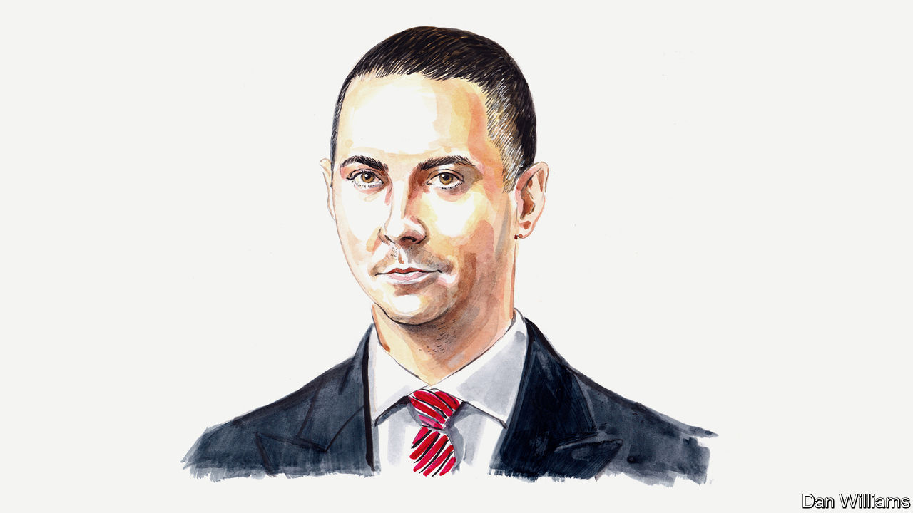

###### Russia

# Russia’s reliance on China will outlast Vladimir Putin, says Alexander Gabuev 

##### The director of the Carnegie Russia Eurasia Centre foresees a period of Russian vassalage 

 

> Mar 18th 2023 

WHEN XI JINPING arrives in Moscow on March 20th for a state visit, the Kremlin ceremonies will be focused on showing not only respect to the most important foreign guest Russia has hosted since the beginning of its war against Ukraine, but also equality between the Chinese leader and his host, President Vladimir Putin. Yet elaborate court protocols will not be able to mask the growing power asymmetry between the two countries.

Mr Putin likes to frame his assault on Ukraine as an act of rebellion against American global dominance and a leap towards full Russian sovereignty. The reality is very different. Thirteen months into the war, Russia is increasingly dependent on China as a market for its commodities, as a source of critical imports, and as its most important diplomatic partner amid its growing global isolation. In 2022 China accounted for nearly 30% of Russian exports and 40% of its imports. A growing share of that trade is settled in Chinese yuan, since the West sanctions Russia’s access to the dollar and euro. With the West quickly dismantling its reliance on Russian natural resources, this dependency is set to grow.

Indeed, Russia may soon be more dependent on China than it ever was on Europe. It launched its pivot to China in 2014, following the annexation of Crimea, in order to diversify away from Europe. Now that ties with the West are broken beyond repair, Russia has no long-term options other than China.

For now, China is content simply to monetise its growing geoeconomic leverage over Russia by securing discounts on its hydrocarbon exports and conquering its consumer market. But it is probably only a matter of time before China demands more political loyalty for its help in keeping Mr Putin’s regime afloat.

As Russia’s reliance on China reduces the Kremlin’s leverage, China could demand more political concessions. It could ask Russia to share sensitive military technologies, accept its naval presence in the Russian Arctic, or greenlight more People’s Liberation Army installations in Central Asia. China may also want a say on Russia’s ties to Asian countries that have their own troubles with Mr Xi’s regime. China could ask Russia not to service the military equipment that it has been selling to India for decades, for example. The Kremlin may not be able to refuse some of these offers.

Why, if the Kremlin was so obsessed about supposed American dominance in its relationship with the West, would it lock the country into deepening deference to China? The reason is that the war against Ukraine and, by extension, its Western allies, has emerged as the organising principle of Russian politics, economics and foreign policy. Mr Putin and his entourage have staked so much on this campaign that the war has become existential. Losing it, in the dark minds of the hard men in the Kremlin, means losing power, the country, and maybe even their own freedom and lives.

As censorship and repression become the norm in Russia, and the economy is increasingly put on a war footing, the Kremlin is reassessing every diplomatic relationship through the lens of its potential support for the war effort. China emerges as the most consequential partner, for three reasons.

First, its increased purchases of Russian commodities fill Mr Putin’s war chest. Second, China is an irreplaceable source of supplies for Mr Putin’s war machine, whether components for Russian weapons or microchips for industrial machines. Finally, although the Kremlin has been looking for ways to punish the West—above all America—for its support for Ukraine, so far the tools it has deployed, such as cyberweapons or energy blackmail, have not proved very effective. The Kremlin is therefore increasingly convinced that helping China, America’s primary global adversary, to dethrone its great rival is the best way to win revenge for the Biden administration’s help to Ukraine. This is why sharing sensitive military secrets with China, or otherwise enabling its military machine, no longer seems taboo.

What sweetens the pill of subservience to China is not only  about the upcoming demise of American hegemony, but China’s remarkable ability to massage the Russian ego and give Mr Putin public face, including through Mr Xi’s state visit. Another comforting reality is that China could not care less about repression and corruption inside Russia, so long as Chinese interests are served.

Russia’s new attitude towards China is in stark contrast to even a year ago. Before February 24th many voices in the Russian power system cautioned against a blind rush into China’s embrace, advocating a more balanced foreign policy. These voices are now silent, subordinated to Mr Putin’s tunnel vision of Russian national interests: destroying Ukraine and taking revenge on the West. The tragedy for Russia is that even after Mr Putin’s exit from the political scene, the new setup of a giant Eurasian dictatorship subservient to Chinese overlords will probably survive.

One day the war in Ukraine will end, with an unsatisfying result for all sides. After all, Russia has nuclear weapons, and there is nothing indicating that it will not use them if Mr Putin believes losing the war would mean his demise. However desirable, therefore, a return to Ukraine’s internationally recognised 1991 borders seems unlikely, just like the idea that Mr Putin and other Russian war criminals will voluntarily fly to The Hague to face trial.

Several years from now, the West will have eliminated its economic dependency on anything Russian. Russia’s economy will adjust—with enormous Chinese help—to a new model: poorer and technologically backward, but sustainable. China will consume the bulk of Russian exports and provide its only modern technology; the Russian financial system will be fully yuanised. The sanctioned leaders of the Russian security services and the military will become the country’s new elite: mostly veterans of the Ukrainian campaign, with no experience of travelling to the West since 2014, and many with children in top Chinese universities.

To restore ties with the West and crawl out from under this Chinese dominance, Russia will have to meet Ukraine’s demands of accountability for war criminals, reparations and the return of all annexed territories, with the promise of a partial lifting of sanctions as an elusive reward. That will be a tall order even in the unlikely scenario of a democratic government in post-Putin Russia, and next to impossible to the team that will probably run the Kremlin after Mr Putin finally leaves. Vassalage to China will look more familiar, predictable and beneficial. ■


