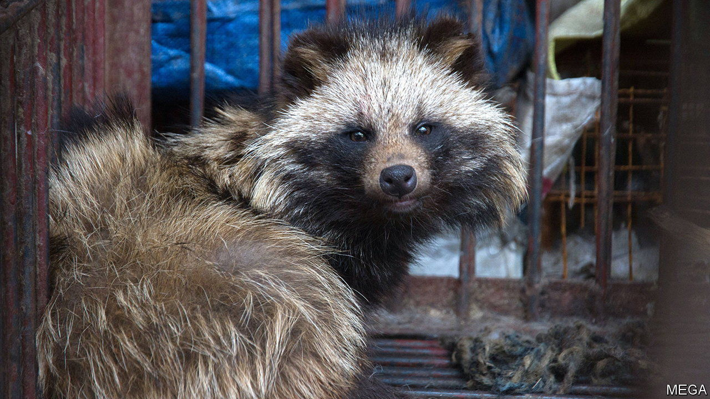

###### The origins of covid-19

# China has not done enough to halt the wildlife trade 

##### That is true whether or not covid-19 made the jump from wild animals 

 

> Mar 23rd 2023 

ON MARCH 20th a team of scientists from around the world provided the latest twist in the debate over the origins of covid-19. A working paper they published online confirms, using genetic evidence, that animals such as dogs, weasels, foxes and hedgehogs were present at the seafood market in Wuhan whose customers and stallholders were among the first people in China to fall ill. In some ways that is unsurprising—yet for a long time China’s government denied that such wildlife markets even existed. It was not until 2021 that a paper by Chinese scientists reported they had seen animals for sale there.

The latest research draws on data collected in early 2020, when the Chinese Centres for Disease Control swabbed surfaces in the market after it was shut down. Notably, the research finds that the animals kept there included raccoon dogs—which would have had the potential to transmit the virus to humans. The theory, then, is that animals transported to the market from outside the city might have triggered the pandemic. For China, this line of thought is probably preferable to an opposing theory that covid could have leaked from a nearby virology lab. Yet a market origin would hardly clear the Communist Party of blame.

Markets such as the one in Wuhan were greatly shrunk in the aftermath of a previous plague—the deadly SARS outbreak of 2003 which was tied to wildlife trading of just this sort. Back then, scientists inside and outside China warned of the need to keep humans away from wild animals. “Operation Green Sword” seized 30,000 exotic animals from markets and restaurants in Guangdong, the southern province that had been at the centre of that disaster. A national campaign, “Operation Spring Thunder”, subsequently turned up some 900,000 more.

Yet individuals and companies who benefited from the wildlife trade resisted the curbs fiercely. Within months restrictions had been relaxed; business soon bounced back. By 2010 Zhong Nanshan, a doctor who became a hero during the SARS crisis, was warning a session of China’s rubber-stamp parliament that the wildlife trade’s resurgence was increasing the risk of a new disaster. In 2017 annual revenue in China from exotic creatures reached 520bn yuan ($76bn), according to Peter Li at the University of Houston-Downtown in America. That money is made not only from selling animals for their meat but also for fur, for traditional medicine and to be put on display.

Since 2020 the government has once again stepped up efforts to solve the problem. That year Xi Jinping, China’s president, said that eating wildlife “without limits” was a “bad habit” that had to be junked. China has imposed a fresh ban on consuming exotic animals. But Mr Li, noting that trading creatures for other reasons is still allowed, wonders how long even that prohibition will last. He says the wildlife industry retains powerful influence within the government.

The argument that a leaky laboratory may have been responsible for unleashing covid on the world has benefited traders of exotic animals. They see a chance to avoid blame for a pandemic that has killed millions. But evidence in favour of either of these theories leaves China’s government with a lot to answer for. ■


