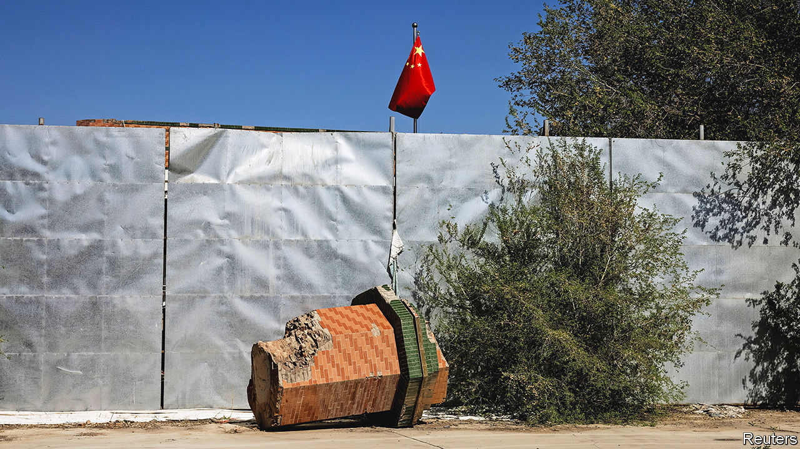
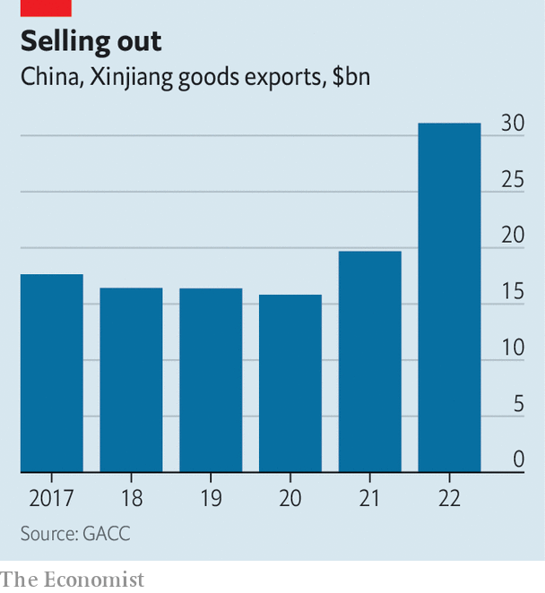

###### Nothing bad to see here

# China wants the world to forget about its crimes in Xinjiang 

##### Yet the Uyghurs continue to be persecuted 

 

> Mar 23rd 2023 

When fire spread through an apartment building in Urumqi last year, killing at least ten people, the public was horrified. Hundreds of people took to the streets in cities across China. At great risk, they voiced displeasure with covid-19 restrictions that may have stopped people escaping the blaze. But today the families of the victims are reluctant to tell their stories. Most are Uyghurs, a predominantly Muslim ethnic group native to the western region of Xinjiang, of which Urumqi is the capital. They have long been persecuted by the government, which has threatened more such treatment if they speak out. 

China’s attempts to silence the Uyghurs coincide with a diplomatic push in Europe, where it is hoping officials will forget about its grave human-rights abuses in Xinjiang. Since 2017 China has locked up more than a million Uyghurs and other ethnic minorities in “re-education” camps. Rights groups have documented campaigns of forced sterilisation, cultural assimilation and the destruction of mosques (a broken minaret is pictured). Lately, though, the appearance of state oppression has changed. China is trying to convince the world that Xinjiang is just like any other region in the country.

That is hard when Uyghurs talk of continuing abuse. But China has been working hard to keep them quiet. Those living abroad are sometimes threatened with deportation back to China if they speak up. Another tactic is to control contact between relatives. Kewser Wayit, a Uyghur in Boston, says he was unable to reach family in Xinjiang after he began speaking about his father’s detention in 2019. Last year a Chinese policeman agreed to connect him with his parents, as long as Mr Wayit stopped discussing the matter publicly. But he broke his silence after his sister was detained in China for posting photos of protests ignited by the fire in Urumqi. 

Uyghurs inside China still risk being locked up, just not in the re-education camps. In recent years the government has closed many of them and loosened some security measures in Xinjiang’s big cities. But the number of inmates in the formal prison system has grown. Between 2017 and 2021 more than 500,000 people were prosecuted in the region (which has a population of 26m, of which around 11m are Uyghurs). That was a huge increase over the previous five years. Many of them received punishments without being tried, says Human Rights Watch, a global monitor. On average they seem to have been getting longer sentences. 

All this is in keeping with China’s long-term plan for Xinjiang. In 2018 the region’s Communist Party secretary, Chen Quanguo, outlined goals that included “stabilisation”, “consolidation” and “normalisation”. Today his successor, Ma Xingrui, appears focused on the last of those. The local government talks of attracting 200m tourists in 2023. It has dispatched Uyghur influencers to promote the region. In January a delegation of religious leaders from 14 Islamic countries toured Xinjiang and praised its “major achievements” in counter-terrorism and deradicalisation, according to China’s foreign ministry.

European leaders are more difficult to impress. In 2021 the European Union imposed sanctions on several Chinese officials over the persecution of Uyghurs. China struck back, placing sanctions on a range of European politicians, diplomats and scholars. The European Parliament then refused to ratify an agreement on bilateral investment that had been reached between China and the EU in 2020. But now Fu Cong, China’s ambassador to the EU, wants to “let bygones be bygones”. He is calling for revival of the investment agreement and the simultaneous lifting of sanctions. “We don’t want to go back to the history of who was right and who was wrong in imposing sanctions, because that would be a futile debate,” Mr Fu said earlier this year. “We need to look ahead.”

China appeared to be making progress in February, when it was announced that Erkin Tuniyaz, the governor of Xinjiang, would meet officials in London and Brussels. But that trip was called off after activists and politicians called for Mr Tuniyaz to be detained on his arrival in London. Around the same time a long-delayed dialogue on human rights between China and the EU resumed. European officials say these meetings give them a chance to confront their Chinese counterparts. Activists say they impose no real costs on China, while giving leaders on both sides cover to strengthen business ties.

 


The activists have a point. Exports from Xinjiang to the EU increased by a third in 2022 compared with the year before. Xinjiang’s total exports have nearly doubled in the past two years (see chart), with much going to neighbouring Kazakhstan and Kyrgyzstan. That has come even as trade with America has fallen off a cliff because of the Uyghur Forced Labour Prevention Act, which bans imports from Xinjiang unless there is clear evidence that they were produced without forced labour. 

However, it is not just people in countries such as Kazakhstan and Kyrgyzstan who are moving on. In a commercial district of Istanbul, a Uyghur businessman says he has been cut off from his family in China and that his son was detained for several years. Still, he refuses to criticise the Chinese government. Xi Jinping needs to secure China’s borders, he says. And he needs to maintain good relations with his Chinese partners. He is reluctant to discuss the future of his homeland. “I don’t think about these big questions,” he says. “I focus only on raising my children. Maybe one day we can go home.” ■


