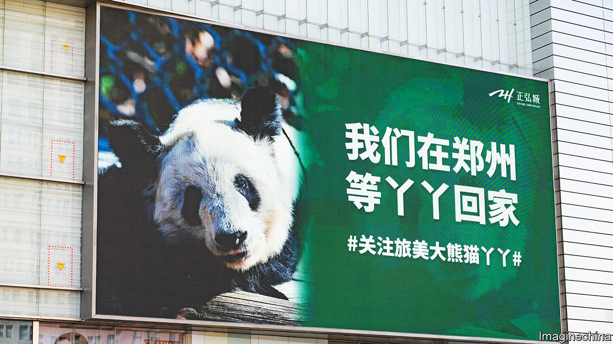

###### Bring our bears home

# Chinese nationalists are up in arms over the treatment of pandas 

##### One has died at a zoo in America. Another is losing clumps of fur 

 

> Mar 23rd 2023 

Le Le means “happy happy”, but the giant panda known by that name appeared to be in a sad state. Last year animal advocates accused the Memphis Zoo in America of neglecting the bear and his female companion, Ya Ya. In February Le Le died, apparently of heart disease. Now Ya Ya (meaning “cute girl”) is looking less adorable. She has been losing clumps of hair, raising concerns about her health. 

It is not just animal lovers who are distressed. The bears are on loan from China, part of the country’s “panda diplomacy”. Chinese nationalists allege mistreatment fuelled by anti-Chinese sentiment in America. “When even giant pandas are affected, it shows China-US relations are really bad,” said the , a nationalist tabloid. 

An online campaign has been launched in China to bring Ya Ya back home. Giant photos of the sick-looking bear have been placed on billboards (see picture). Chinese living abroad visit her and post updates on her condition. Others are checking up on pandas hosted by other zoos in America and elsewhere. Russia has been praised for its first-class treatment of two pandas at Moscow Zoo.

Chinese officials often fan nationalist anger. In this case they have called for calm. Diplomats stationed in America visited the Memphis Zoo and “confirmed that the giant pandas have been cared for”, according to official reports. Ya Ya, 22, is old and suffering from a skin condition, explained the Chinese Association of Zoological Gardens, which arranges panda loans.

Panda diplomacy is a boon for China. Zoos pay up to $1m a year to rent a bear (extra if a rare cub is born). The animals highlight China’s fairly successful conservation efforts—the species was reclassified as “vulnerable”, up from “endangered”, in 2016. And, say critics, the pandas make an authoritarian state seem cuddly. Around 20 countries are currently hosting the bears.

Ya Ya is expected to return to China in April, when her loan agreement expires. But the affair has left some in China questioning the practice of panda diplomacy. “It should be reduced,” says a visitor to the Beijing Zoo who has been raising awareness by carrying a tote bag with Ya Ya’s picture on it. Pandas come from China, she says, but they do not belong to it.


