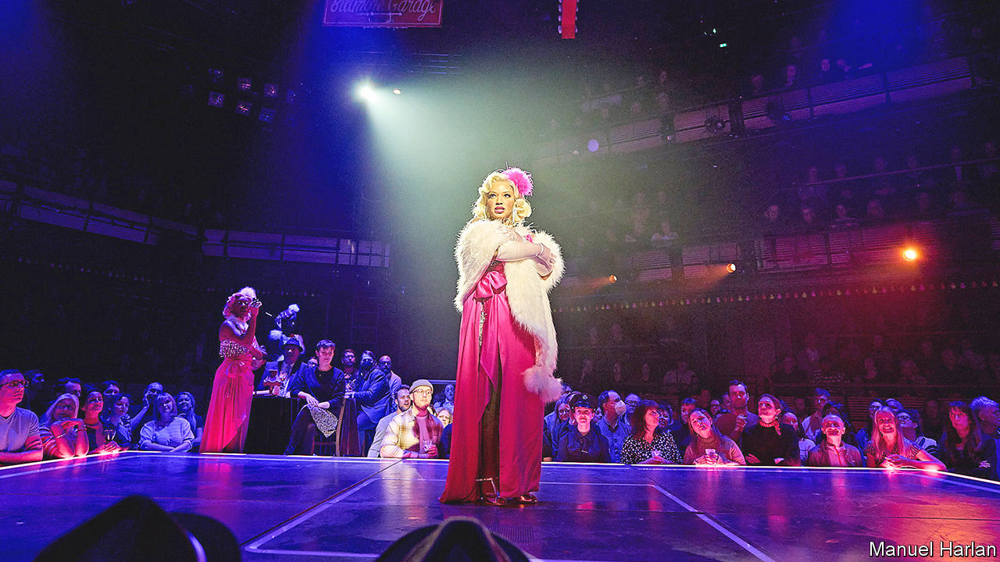

###### Back Story

# A bold “Guys & Dolls” holds lessons for the future of theatre 

##### As Sky Masterson would say: it isn’t wrong to gamble, only to lose 

 

> Mar 23rd 2023 

Like shooting craps, theatre is risky business. Actors can miss cues or forget lines, dancers and jokes may fall flat. Punters risk forking out royally for tickets only to hate the play. Producers are subject to the vagaries of the economy and (if they rely on it) statutory funding, not to mention the lightning strike of a pandemic. If the show bombs, they risk losing their shirts.

That fate will not befall the new “Guys &amp; Dolls” at  in London. Set in a charmed, harmless New York underworld, Frank Loesser’s musical of 1950, adapted from Damon Runyon’s stories, features two pairs of wires-crossed lovers. Sky Masterson is a hustler who bets he can take a mission leader, Sarah Brown, on a date to Havana. For 14 years, meanwhile, two-bit craps promoter Nathan Detroit has been engaged to Miss Adelaide, a fixture at the Hot Box—a night spot where, in this version, some of the choreography is downright filthy.

The performances are uniformly strong, especially Marisha Wallace’s knockout Adelaide. The salient feature of this revival, however, is its immersive staging. About a third of the audience stands, doubling as bystanders to the high jinks that unfold in their midst (an approach that , the director, used for “A Midsummer Night’s Dream” and “Julius Caesar”, which enlisted punters as the Roman mob). Stage platforms rise and fall from the floor in assorted configurations, lampposts and manholes artfully indicating new locales. Ushers dressed as cops keep order.

Configuring the theatre this way, says Mr Hytner, means that the people “paying the least are closest to the action”. The intimacy and exuberance rub off on the folk in the posh seats, too. “Sheer bliss,” cooed the . “Sure to be a smash hit,” said the . If this show were a gate, it’d be swinging.

The same cannot be said for the gates of theatre in general. Audiences in Britain are still down on pre-pandemic levels, as are those on Broadway. Although it spurred innovations in streaming, the coronavirus  and careers. In Britain it has been followed by a squeeze on state funding for some high-profile playhouses (but not the Bridge, which doesn’t take any).

Beyond the pandemic loom the spectres of Netflix and changing tastes, and a fear that the  generation will be disinclined to sit through “King Lear”, or even “Guys &amp; Dolls”. Impresarios differ over the right fix: whether to trim costs or invest in razzmatazz, put on cutting-edge work or classics (staples such as “Chicago” and “The Lion King” are doing best on Broadway, says Charlotte St Martin of the Broadway League, a trade association). Star names sell, if you can get them.

In a way, “Guys &amp; Dolls” is a much safer bet than most of Nathan Detroit’s. As the musicals of Rodgers and Hammerstein did after the second world war, it supplies neon-lit flamboyance after pinched grey years, and a sequence of earworm songs that you didn’t realise you knew. In an artistic sense, though, the moral of this triumphant tale of chancers lies in its boldness and risks.

If theatre is a tightrope walk, Mr Hytner raises the rope, not only because of the pinpoint choreography in cramped spaces. The immersive method adds another risk: that the spectators won’t play ball. They are called on to take leaflets from Bible-bashers and share drinks with gamblers. Each night one finds himself at a table in the Hot Box and is clasped to Adelaide’s cleavage (ushers forewarn him, Mr Hytner confides).

The real trick, in other words, is not what happens on the shifting stage but in the crowd. “In the theatre”, wrote the great director Peter Brook, “the audience completes the steps of creation.” This is an age-old insight. It can be traced through Antonin Artaud’s interwar “theatre of cruelty”—which aimed to unsettle viewers with sound and light—to Shakespeare’s collusive jokes about mad Englishmen, all the way back to the origins of Greek drama in religious rites. The magic happens when a group of strangers, typically sitting in the dark, conspire in turning spectacle into art. 

But in a digital age, that principle is more urgent than ever. Just as high-street retailers are surviving by selling what websites cannot, from oven-fresh bread to tattoos, theatre will prosper if it “doubles down on its liveness”, as Mr Hytner puts it, offering people “an experience that they can’t have looking at a screen”. At the end of this “Guys &amp; Dolls”, the cast dances with a jubilant audience. As Sky Masterson almost says: it isn’t wrong to gamble, only to lose.


