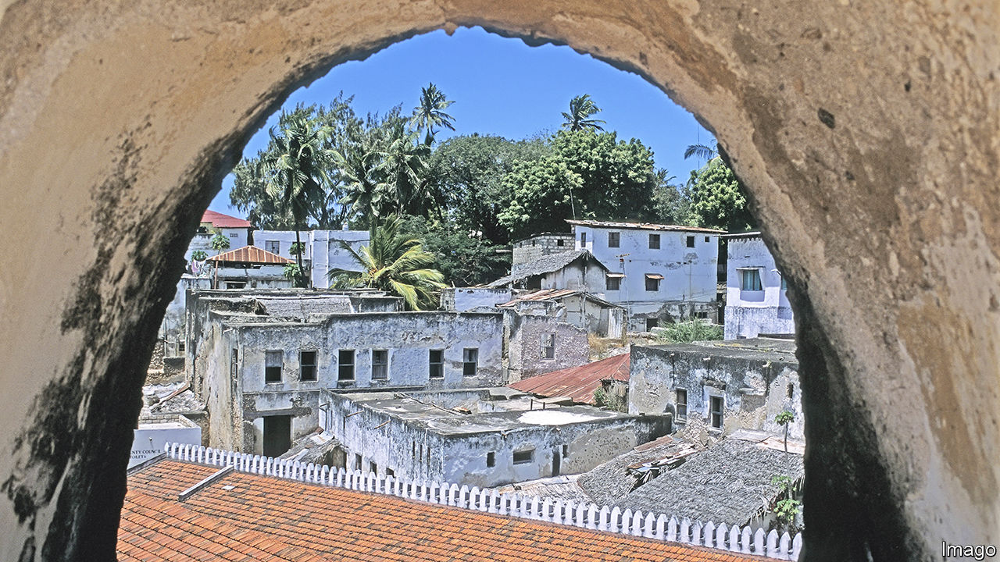
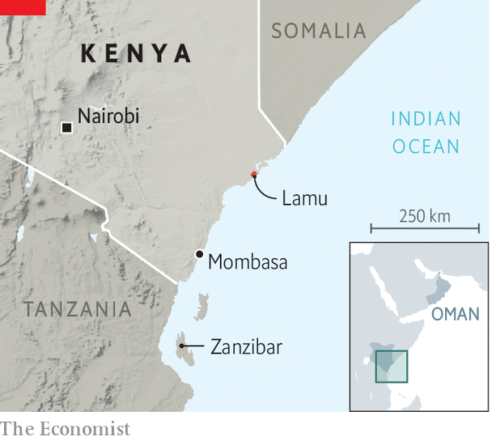

###### The parable of Lamu

# A museum on a Kenyan island glosses over slavery 

##### Sometimes, history is told not by the winners, but by the funders 

 

> Mar 22nd 2023 

Back in the 1950s, a young British officer known as the district commissioner was ensconced in a charming seafront mansion from which he lorded it over the locals of  off the north-eastern coast of what was then the . “The place was magical,” he wrote in an essay published half a century later. “Enchanted, I fell under its spell.”

The locals were Muslims, proud of a heritage known as Swahili that is a hybrid of Arab and mainland African culture from inland, lending its name to the local language and people. The pace of life was steady, to put it mildly. “Most of them regarded all forms of change with the gravest suspicion,” wrote that former administrator, Peter Lloyd. “The town itself reflected their attitude, being the epitome of changelessness. As just one example, my palatial residence had been completed in 1892, yet everybody still called it ‘the new house’.”

And what a house! Despite the absence of both electricity and piped water and the presence of a multitude of bats, it was a place of delights. So vast that I occupied only a small part of the building…Whole families were established elsewhere in it, claiming to be descendants of slaves of its original owner, with squatters’ rights. In return they performed odd jobs, like bringing up water from the cistern. I even discovered, after living there for several months, that someone had started a shop in the back premises.

After Kenya won its independence in 1963, the house fell into disrepair. But in 1970 Jim Allen, an Anglo-Kenyan scholar with an engagingly grumpy air and an almost obsessive love of Lamu, persuaded the government to convert it into the Lamu Museum. Allen became the founding director, filling the dusty and dilapidated rooms with an array of paraphernalia from up and down the coast. 

Following Allen’s departure in 1974 and death 16 years later, the museum’s fortunes ebbed and flowed, lacking funds and dynamic leadership. The building at last looked truly old. The antique cannon by the front door still pointed out across the channel, where dhows with traditional triangular sails go gently by. But few people, locals or tourists, bothered to pass through the handsomely carved wooden portal.

 


In the past few years, however, it has undergone a revival, thanks to funds from the sultanate of Oman, whose still-reigning al-Busaidi dynasty once ruled much of the east African coast. Last month the museum was reopened with much fanfare by Kenya’s minister of tourism, wildlife, culture and heritage. The renovation shows how, nowadays, history is sometimes told not by the winners, but by the funders.

The museum is now spick and span. There is no sign of bats or any other random detritus from the days of Lloyd or even those of Allen, though heavily laden donkeys still trot past (cars remain banned on the island). But the locals are taken aback. For the emphasis of the heritage narrated inside, captioned in Swahili, English and Arabic, is almost entirely Omani. There are models of a newly constructed town and recently restored buildings—all of them in Oman. Whole rooms and galleries, replete with videos, are dedicated not to Lamu but to Oman.

The old museum’s fanciest and most valuable artefact, a side-blown horn known as a —carved with intricate beauty out of an immense elephant tusk—has been dispatched to Nairobi, Kenya’s distant capital, reportedly for security reasons. An elderly museum guide, disconsolately showing your correspondent around, muttered, “Oman! Oman! Oman! Why no Lamu?” Mohammed Mwenje, the museum’s director, says his team are still working on the part of the exhibition that will be devoted to the island. Most of the relevant items, he maintains, “have not yet returned from storage”.

The entrance hall, meanwhile, is graced with two grand portraits, side by side, of the recently elected president of Kenya, who hails from 700km (435 miles) away, and the sultan of Oman. Allen, the museum’s founder, widely credited with putting Lamu on the cultural map when it was a hidden backwater, is unmentioned. 

More controversially, so is the topic of slavery, which the Omani elite practised well into the 20th century. From around 1700 until the British arrived in the late 19th century, the sultanate of Oman ruled a coastal strip that stretched down to include Zanzibar (which is now part of Tanzania). Zanzibar became an entrepot for dates, cloves, carpets, mangrove poles and—not least—slaves. At one time slaves were reckoned to make up at least half of its population.

In 1907 Zanzibar’s sultan, a scion of the Omani al-Busaidi dynasty, was forced by his British overlords to outlaw the practice up and down the coast. Nevertheless, “perhaps half of [Lamu’s] slave population, including whole families, remained under a system of de facto, if not de jure, slavery,” according to the  () in 1983. In his nostalgic essay, Lloyd relates how in the 1950s some visiting Omani luminaries made a suggestion. The British were then detaining many hundreds of rebellious , mostly ethnic Kikuyus from far inland, in prison camps along the coast. Why not, said those bigwigs, send them off to Oman—as slaves?

 “In form and under Islamic law,” recounts the , “the institution of slavery continued in some measure, and among some families, until Kenya achieved independence.” The result was one of Africa’s bloodiest revolutions, when the Omani family’s Zanzibari branch—which still reigns in Oman today—was finally overthrown in 1964. Even after that, says the , de facto slavery endured on Lamu into the 1980s, “by collusion among the old Afro-Arab families (including relatives of the sultan)”. It may have lasted even longer. 

The old house has been beautifully restored, yet its antiseptic makeover has scraped away some of its mystery and romance. The sanitisation of the past has dulled its impact. The underlying lesson is that, if you bankroll a museum and its telling of history, you can stamp your own memory on them. Not all the people of Lamu are pleased. ■


