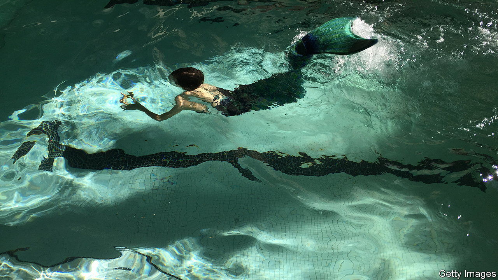

###### A teenager’s tail

# The narrator of “Chlorine” longs to escape her human body 

##### Jade Song’s debut novel is a coming-of-age story with a touch of mystery and myth 

 

> Mar 23rd 2023 

. By Jade Song. 

The mermaids of folklore tend to be tragic figures, pining for legs and the love of human princes. But for Ren Yu, the teenage narrator of “Chlorine”, such tales misunderstand the otherworldly powers of these wondrous fish. Ren should know, since she insists she is a mermaid herself.

“Mermaids are not born. We are made,” she announces at the start of Jade Song’s fresh and propulsive debut. Ren notes that her own metamorphosis, her own “transcendence” of the indignities of her “short and pitiful life as a human girl”, took place just before an important  competition when she was 17. This novel, Ren explains, is her “tale of becoming”.

Reading Ren’s account of her life in Pittsburgh, it is easy to understand why she might yearn to splash away from it all. She is a straight-A student, a star swimmer and an immigrant misfit who understands that she must repay her Chinese parents’ sacrifices by gaining admission to . Her swimming coach is lecherous, her teachers are condescending and her emotionally aloof mother shows her love through cut-up fruit and high expectations. Her father is back in China, having buckled under the weight of learning English: “What is it called when immigrants reverse, when they wake up from the nightmare masked as a dream?”

Ms Song is good on the growing pains of . The “horrors” of female puberty, in all its literal bloodiness, are vivid here. Ren finds that a “so-called period” is actually more of an exclamation mark: “Was womanhood always so violent, raw?” The author conveys the confusion that can attend the dawning of desire, when young women may be more eager to please than to seek pleasure. A moment of sexual possibility turns dark partly because Ren is too cowed to : “I never said yes, but I never said no, and the indefinite limbo of maybe is where regret and doubt and confusion reside.” Is it any wonder Ren plots an escape from her human body?

The men in this novel can seem so horrible as to be made of straw. But this is a small flaw in a book that enlivens its coming-of-age yarn with a touch of mystery and a twist of myth. “Outwardly, I studied,” says Ren. “Inwardly, I sought the weightlessness of water, to be as liberated as the aquatic beings in my imagination.” ■


