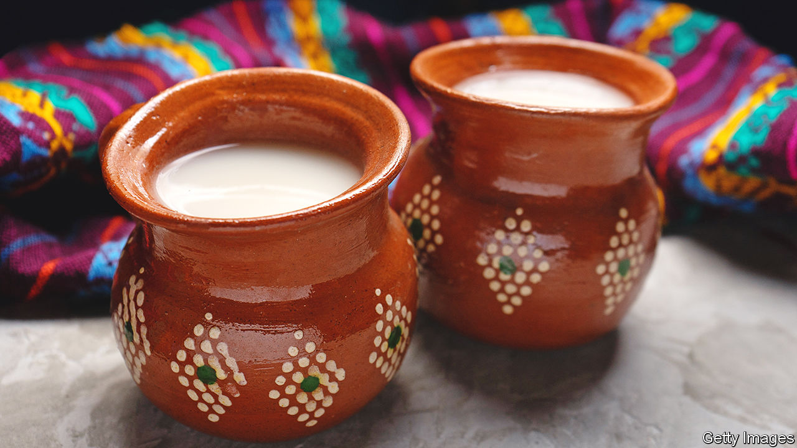

###### World in a dish

# When in Mexico City, try pulque, a local tipple 

##### The fermented drink demonstrates the allure of booze made by hand 

 

> Mar 23rd 2023 

IT IS FRIDAY morning, and the Mercado de Xochimilco, in southern  City, is bustling. Over the road is a squat building which, from the outside, looks dead, its shutters drawn and doors closed. Pushing them open reveals a utilitarian space: linoleum floors, formica-topped tables, sturdy wooden chairs. Above a counter are posters on which are handwritten  (celery),  (peanut),  (a soft orange fruit) and  (oats). These are flavours of , a drink made for millennia that offers both an alcoholic kick and an insight into the ancient culture of booze.

Like tequila and ,  is made from agave sap, but unlike those spirits, it is fermented rather than distilled. -makers carve out the heart of a mature maguey plant (ie, one around 12 years old) and collect the sap, known as, orhoney water”, for its ultra-sweet taste. The heart of a maguey (a kind of agave) will produce as much as six litres per day for up to six months. The  is largely wild or spontaneous, relying on naturally present microbes, though makers will often “backslop”—add some fully fermented  from a previous batch—to help the process along.

The resulting drink is about as alcoholic as lager, with a viscous texture that may challenge first-timers. The plain version has a pleasant, round, sourish taste reminiscent of a mild kombucha, or the watery yogurt drinks of Iran and Turkey. The flavoured kinds, especially the vibrant, herbal  and the crisp, biscuit-like , are also well worth trying.

Unlike pasteurised beers, is rich in vitamins, minerals and beneficial bacteria. According to local lore it enhances male virility. A (Mexico City native) at the  that day said his grandfather credited  with giving him more than a dozen children (the  himself attributed this fertility to a lack of television). Until quite recently, many  did not admit women, but thankfully that has changed. Because it requires fresh sap, and the maguey’s growing range is limited,  remains a proudly local product, made only in Mexico City and nearby states.

In the early 20th century the city boasted around 1,500 . That was before big brewers and distillers began a long campaign of demonisation, in which the drink was portrayed as primitive and unhygienic. A false rumour held that excrement aided its fermentation. By the early 21st century, just a dozen or so remained.

It is still much less popular than beer, but food writers and enthusiasts say is enjoying a resurgence. It may be that younger Mexicans are taking a renewed interest in their country’s rich . Visitors, too, should seek it out, and not only on the principle that when abroad you should sample what you cannot find at home.  connects drinkers to a wilder, more intimate human past, when alcohol—enjoyed the world over for its ability to induce conviviality, relaxation and reflection—came not from a factory or corner shop, but from skilled artisans who fermented local crops into joy. ■


