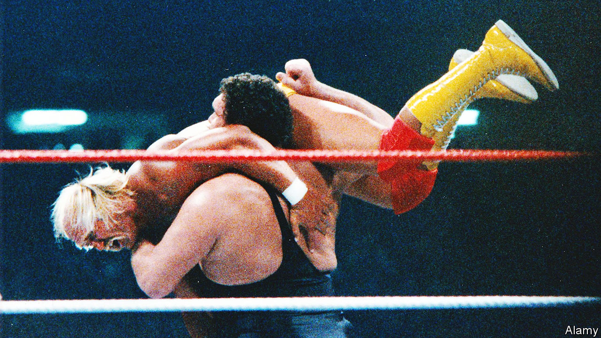

###### Fake it to make it

# “Ringmaster” is a colourful biography of a wrestling impresario 

##### But Abraham Riesman overstates the spectacle’s place in modern America 

 

> Mar 23rd 2023 

. By Abraham Riesman. 

PART-WAY through “Hannah and Her Sisters”, Woody Allen’s film of 1986, a dyspeptic artist played by Max von Sydow has been flicking through the television channels and grumbles: “Can you imagine the level of a mind that watches wrestling?” Apparently the character labours under a common snooty misconception. He seems to grasp that professional wrestling is fake—meaning the outcomes of the matches are predetermined—but assumes its fans do not. 

In reality, as Abraham Riesman explains in “Ringmaster”, his thorough but overwritten biography of Vince McMahon—the majority owner of World Wrestling Entertainment (WWE) and the man who turned wrestling into an entertainment behemoth—many devoted fans are “smarts” rather than “marks”. They know they are watching a scripted event more akin to a soap opera than a traditional sport. But they love it anyway, either despite its phoniness or, more likely, because of it. They are seeing athletic entertainers acting out storylines at once simple, driven by lust or grievance, and tortuous, with as many twists as an endless airplane novel. They maintain “the pose of belief so as not to be rude to their heroes”. 

Those fans number in the tens of millions and are spread all over the world. Last year WWE, the publicly traded company that Mr McMahon built, had revenues of $1.3bn. Wrestlers of the past, such as Hulk Hogan and Andre the Giant (pictured), sometimes dabbled in acting; more recent ones, such as John Cena and Dwayne “The Rock” Johnson, used their starts in wrestling to become genuine film stars. Donald Trump’s career, meanwhile, has been  for more than three decades—ever since, in the late 1980s, one of his casinos in Atlantic City was billed as the host of WrestleManias 4 and 5, jamborees that were actually held at other local venues.

Mr Trump’s spectre haunts this book, which really tells two stories, one more tenuous than the other. The first and better tale is about Mr McMahon himself, and his rise from rural and small-town poverty in North Carolina. Like some other successful businessmen—indeed, like Mr Trump—he passes himself off as self-made. In fact his father and grandfather, respectively Vince McMahon senior and Jess McMahon, were wrestling promoters in the sport’s early ramshackle days, when it comprised a set of regional fiefdoms that did not compete with each other. But whereas Vince senior was, according to a relative, “the most loving man you’d ever want to know”, and held in great esteem and affection by the wrestlers in his stable, his son is said to be cold and ruthless.

He is also shrewd and ambitious, and was able to see that wrestling’s fragmented structure was inefficient. An earlier generation of promoters feared television would kill the market for in-person wrestling; Mr McMahon embraced tv and celebrity. WrestleManias—annual pay-per-view events running since 1985—featured not just famous wrestlers such as Hulk Hogan and Mr T, but also appearances by , Geraldine Ferraro,  and  (the first two in recorded clips). Under Mr McMahon, wrestling became, much like American football, better and somehow more authentically experienced on television than live.

“We have lived for a quarter of a century in the world Mr McMahon made,” begins the book’s final chapter. “Not just wrestling fans—all of us.” Those sentences encapsulate its more tenuous story, which is that  and Mr McMahon’s ruthlessness somehow define contemporary America, rather than simply being an aspect of it. Doubtless this thesis will find favour on both America’s Trumpian right and the far left, albeit for opposite reasons: the Trumpsters wholeheartedly embracing McMahonism, the left-wingers believing it reveals America’s fundamental cynicism and moral bankruptcy.

But readers who do not already agree with the author are unlikely to be persuaded. Cut-throat businessmen and dishonest politicians predate Messrs McMahon and Trump. They do not thrive only in America. Most Americans do not watch wrestling, just as most did not vote for Mr Trump. And if people find either the 45th president or wrestling distasteful, they can vote for someone else—or change the channel. ■


