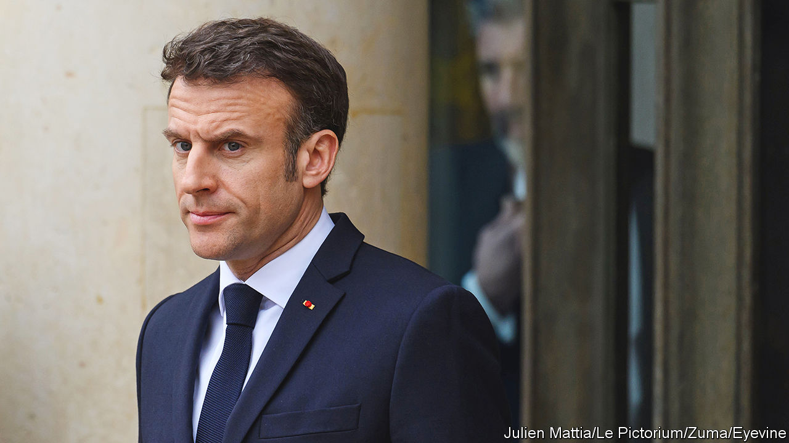

###### A win that feels like a loss

# Emmanuel Macron’s government survives, but more trouble lies ahead 

##### Protests against his pension reform may spread 

 

> Mar 20th 2023 

BY A WAFER-THIN margin of just nine votes, the French government survived a  on March 20th, opening the way for its controversial pension reform to be written into law. The result in the National Assembly was far narrower than many had expected, and reflects a level of  that is unlikely to dissipate. The immediate political crisis for President Emmanuel Macron may be over, but popular unrest could yet spread.

Opposition parties needed 287 votes to dislodge Mr Macron’s minority centrist government. This would have annulled his legislation raising France’s minimum pension age from 62 years to 64. But a motion of no-confidence proposed by a cross-party alliance got just 278 votes. A second effort to topple the government, tabled by Marine Le Pen’s nationalist-populist National Rally, failed by a far wider margin. 

This ought to mean that Elisabeth Borne, the prime minister, and her team can turn the page and move on. The pension reform still has to secure approval from the constitutional council, the country’s highest court. But it has now gone through parliament. Mr Macron judged last week that he would not get the votes to pass the reform in the lower house with a regular vote, so he used a constitutional provision known as article 49.3 to push it through without one. It was clear that this could lead to a no-confidence motion. Mr Macron won the bet.

Politically, however, this decision will leave a bitter aftertaste. The pension reform itself is unpopular. During six weeks of parliamentary debate, protest marches and strikes (by railway workers, rubbish collectors and others), two-thirds of the French have remained stubbornly against raising the retirement age. No argument deployed by the government—the threat of future funding deficits, the need to preserve the system even as people live ever longer—has dented this hostility.

The president’s decision to resort to article 49.3 has enraged people further. Fully 78% told a poll that they were against the use of this tool. The opposition sees it as an anti-democratic abuse of power. Ahead of the vote Charles de Courson, who led the cross-party motion of no-confidence, called the use of article 49.3 a “denial of democracy”. Protesters have gathered in Paris and other cities after dark, some setting fire to bins of stinking, uncollected rubbish. In several towns, riot police have been sent in. 

Mr Macron’s dilemma is that although his pension reform is deeply unpopular, it is right for France. The country spends 14% of GDP on public pensions, nearly double the average for the OECD, a club of mostly rich countries. In 2004 there were 13m pensioners in France. Thanks to longer life expectancy and retiring baby-boomers, by 2030 this figure will rise to 20m. Re-elected in April 2022, Mr Macron could have left a brewing problem to a successor; instead he decided it was worth spending precious political capital to solve it. “Do you think it gives me any pleasure to carry out this reform? No,” Mr Macron said in a televised interview on March 22nd, declaring it “not a luxury, nor a pleasure” but “a necessity”. 

Moreover, his use of article 49.3 is unusual, but not unique. Designed to strengthen the hand of government, the article was written into the constitution of the Fifth Republic by Charles de Gaulle as a response to the instability of the Fourth. De Gaulle himself used it in 1960 to launch France’s nuclear-deterrence programme. Since then it has been used 100 times, by governments on the left and the right, Ms Borne’s included. 

Mr Macron’s proposal to raise the retirement age was also part of his manifesto during his re-election campaign, and he and his government tried to forge a consensus. Ms Borne spent months consulting unions and opposition leaders and redrafting the legislation with new concessions, especially to the centre-right Republicans. Parliament devoted 175 hours to debating the issue, in part to deal with some 13,000 amendments tabled by NUPES, a left-wing alliance led by Jean-Luc Mélenchon, in a bid to hold up any debate. When the legislation went to the Senate, which is controlled by the Republicans, it was approved—even though 19 Republicans in the lower house then voted against the government.

The outcome, however, is likely to feel like an empty victory for Mr Macron. It is unfortunate, to say the least, that the reform was not approved through normal parliamentary procedure. “We can’t just say that the crisis is now over and continue as before as if nothing has happened,” says Gilles Le Gendre, a deputy from his party. 

The episode will also exacerbate Mr Macron’s reputation for having an imperious governing style. As it is, the president’s popularity rating has fallen to just 28% from a high of 41% after his re-election, according to Ifop, a pollster. This is its lowest point since early 2019, during the  (yellow jackets) rebellion. A comparable popular uprising, on top of ongoing political disorder, cannot be ruled out. Ahead of a national strike on March 23rd, Laurent Berger, a union leader, described the aftermath of the vote as “the worst social crisis for ten years.”

Mr Macron has few good options. In the combative TV interview on March 22nd, the president ruled out either an immediate change of prime minister or fresh elections. He knows full well that with the public mood as it is, such a vote would do nothing to shore up his party in parliament. It would be more likely to benefit the extremes. A formal alliance with the Republicans looks unworkable at this point. For now, Mr Macron has won himself some breathing space to try to reboot his minority government, if little else. ■

