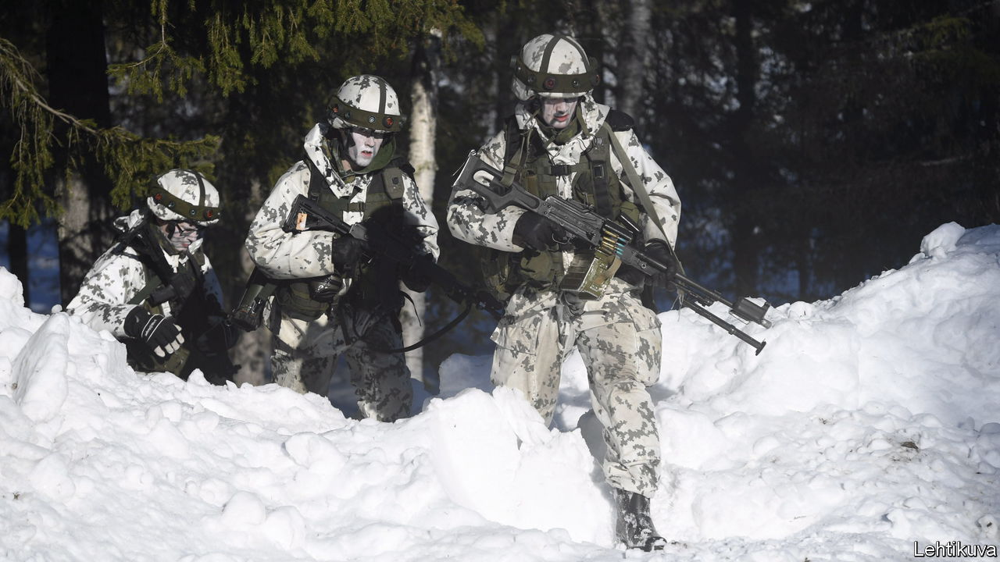
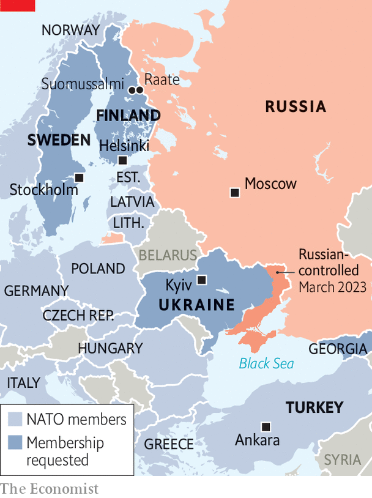

###### Land of cold wars

# Finland has Turkey’s approval and can at last join NATO 

##### Returning to the days of a hostile Russian border 

 

> Mar 22nd 2023 

IN WINTER THE snow outside Suomussalmi, a town 600km (370 miles) north of Helsinki, lies a metre deep. Step off the road and you sink to your thighs, as the Soviet army’s 44th Rifle Division found when it invaded Finland during the Winter War of 1939-40. Once its 14,000 men, 530 trucks and 44 tanks had passed the border village of Raate, the Finns blew up its lead and rear vehicles. For weeks, while the trapped column froze and starved, Finnish ski troops in white camouflage glided through the woods slicing it to bits. The division’s commander struggled back to Soviet lines, where commissars had him shot.

Most Soviet soldiers were Russian, but those on the Raate road were Ukrainian. Some 82 years later, Ukrainians fighting for their own country would trap and smash a Russian army on a motorway north of Kyiv using much the same tactics the Finns had. Finland reacted with a shock of recognition. It abandoned its policy of military neutrality, first forced on it by the Soviets, and . Its neutral neighbour Sweden did the same.

 


Since then both countries’ applications have been . The Turks’ main problem is with Sweden, which it accuses of harbouring various enemies. In January Turkey suggested it might admit Finland alone, an idea the Finns at first resisted out of solidarity. Yet they have gradually come to accept the notion. On March 17th Sauli Niinisto, Finland’s president, visited Ankara. There Recep Tayyip Erdogan, his Turkish counterpart, announced he would start the process of ratification.

Mr Erdogan has left Sweden hanging, demanding the deportation of more than 100 people he calls “terrorists”, mainly Kurdish émigrés. The Turkish president faces an election on May 14th, and bashing the Swedes is useful campaign fodder—the more so since a far-right Danish politician burnt  in front of Turkey’s embassy in Stockholm in January. Letting in Finland curries favour with America, which has been delaying selling Turkey F-16 fighter jets. Mr Erdogan also needs goodwill from NATO members, which he hopes will help Turkey rebuild after an earthquake in February.

For Finland, joining NATO makes some things simpler. Under neutrality Finnish leaders “had to be mini-Kissingers”, pragmatically balancing their Western orientation and the eastern threat, says Ilkka Haavisto of EVA, a think-tank in Helsinki. Now deepening their Western alignment is itself pragmatic. NATO’s guarantee of mutual defence will help Finland protect its 1,300km-long border with Russia. 

Many of the Russian forces based in the region have been sent to Ukraine, says General Sami Nurmi of the Finnish army, but he expects them to rebuild over three to five years. The war has also made it much harder for Russian propagandists to influence public opinion. Where once they could exploit the Finns’ traditional neutrality, “that changed almost overnight” after the war started, says Jessikka Aro, author of a book on Russian internet trolls. 

There are some political wrinkles. Finland will hold a general election on April 2nd. Sanna Marin, the prime minister, is popular, but her Social Democratic party trails the centre-right National Coalition in the polls. Applying to NATO together with Sweden “made it easier for my party”, says Antti Rinne, a former Social Democratic prime minister. Going it alone has raised hackles, though mostly in Sweden, where some of its people feel abandoned.

The biggest change is the return to the days of a hostile eastern border. In Suomussalmi, relations had recently been friendly. Finns crossed into Russia to buy cheap petrol; Russians bought holiday houses and took summer jobs picking berries on farms. Now that is over. Most Finns do not dislike Russians as individuals: the Raate road has monuments to the Ukrainian and Russian soldiers who died there. The Russian state is another matter. 

“Everybody in Suomussalmi has a Plan B for if Russia comes,” says Jenni Mikkonen, who manages a local pub and grew up playing in the trenches left by the war. Ville Hiltunen, one of her patrons, roams the woods with a metal detector digging up war relics, a popular pastime in the area. In a compartment behind his garage he keeps a miniature museum of vintage gear: Soviet helmets; a Finnish submachine-gun. An old metal plate bears words scratched in Russian: “No food. Dying.” “People here know what it is to live near Russia,” says Mr Hiltunen. “It’s nothing new.” ■

