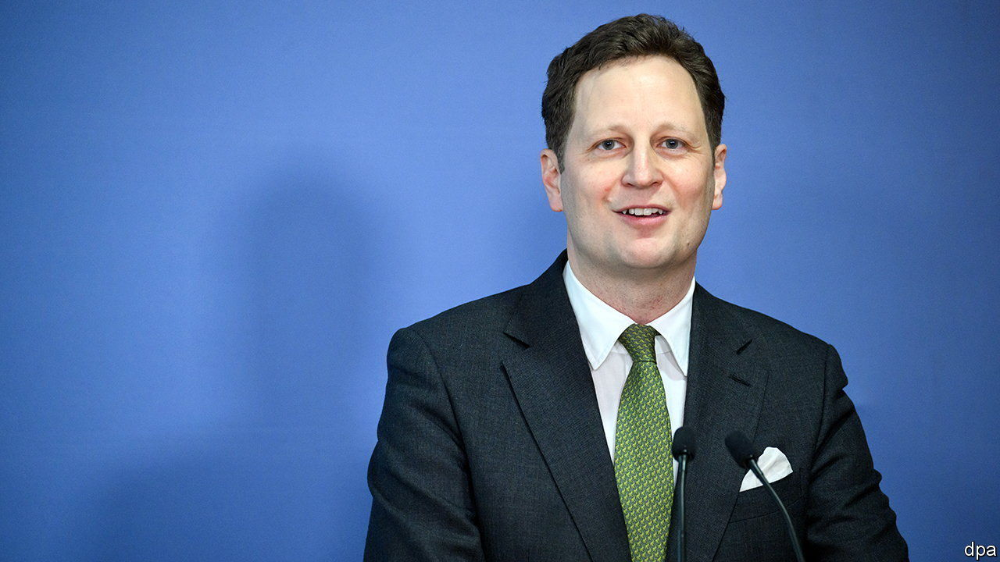

###### Hohenzollern rehab

# The Kaiser’s family accepts it will not get all its stuff back 

##### The House of Prussia drops two post-Soviet restitution claims 

 

> Mar 23rd 2023 

It seemed odd for Prince Georg Friedrich of Prussia to stage an event at a press centre used by the government, since Prussia has no government: indeed, it has not existed since 1947. The event on March 9th was billed as a presentation of historical research on the Hohenzollerns, the family that ruled the kingdom and later all of Germany. Improbably, it made headlines. The prince, a great-great-grandson of Kaiser Wilhelm II, announced he was dropping two claims for restitution of property seized by the Soviets after the second world war.

Georg Friedrich clearly hoped to rehabilitate the House of Prussia’s image after years of negative press. But even conservative-leaning publications failed to applaud him. The  called it “a [public-relations] debacle—and what else is monarchy other than public relations?” The 46-year-old prince had launched the claims in 2014, citing a law that entitles descendants of victims of Soviet expropriation to get back mobile property (furniture, paintings and so forth) as well as compensation—unless their ancestors actively supported the Nazi regime. 

There lies the rub. The eldest son of the last Kaiser, also named Wilhelm, supported the Nazis, hoping they would restore him to the throne eliminated after the first world war. He called on the public to vote for them in 1932, and during the war he sent Hitler congratulatory telegrams after victorious battles. Historians dispute whether Wilhelm’s support mattered; Hitler hardly needed the backing of a would-be monarch. But it was probably enough to disqualify Hohenzollern restitution claims. The family could yet find out: it may not have dropped quite all of them.■

