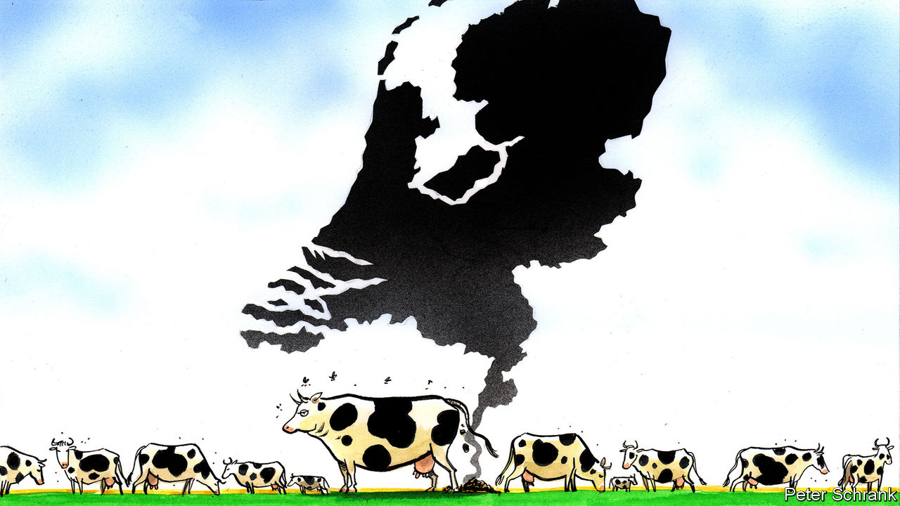

###### Charlemagne

# The cucumber Saudis: how the Dutch got too good at farming 

##### A small, fertiliser-rich country sniffs the limits of its old model 

 

> Mar 23rd 2023 

Visitors to dairy farms are always well advised to watch their step. Those inspecting the three dozen milking cows kept by Minke van Wingerden and her team have more to fear than landing in manure: the entire farm is set up on a floating platform, docked a 20-minute cycle ride away from Rotterdam’s central railway station. One wrong step and you will wind up spluttering in the Nieuwe Maas river—as a couple of the cows have discovered (firemen fished them out of the harbour). Forget vistas of the placid Frisian countryside: these animals spend their days overlooking tankers and trucks unloading wares at Europe’s biggest port. Throughout the day -scooping robots scour the milking area, keeping it clean. On two lower floors of the barge, the cows’ output is variously turned either into cheese or fertiliser.

Ms Van Wingerden’s Floating Farm is the apotheosis of centuries of Dutch thinking about how to grow lots of food in a crowded corner of northern Europe. Since the age of Rembrandt and Vermeer, land has been reclaimed from the sea and windmills erected to drain the plains. Town-size greenhouses are built to grow tulips or vegetables. A food shortage during the second world war convinced the Dutch they needed to grow as much as their fields could manage. Calvinist industriousness turned the Netherlands into an unlikely agrarian powerhouse: with more than €100bn ($108bn) of annual farming sales overseas, it is the world’s biggest exporter of agricultural products after America, a country more than 250 times its size. Some of that is re-exported imported food. But the Dutch make twice as much cheese per head as France.

Two questions have long dogged Dutch farming. The first is whether quantity made up for quality: having tasted the tomatoes, cucumbers and chilies grown in its hyper-efficient greenhouses, one may be forgiven for not being able to tell them apart. The second is whether its approach made any sense. The Netherlands is the most densely inhabited country in the EU bar tiny Malta; officials joke it is a city-state in the making. Efficient as its farmers may be, the sector is a footnote to the modern Dutch economy, employing just 2.5% of workers. Countries usually pick between having lots of farms or lots of people. The Dutch approach was to have their Gouda and eat it. That has landed both farmers and politicians in a heap of natural fertiliser.

Limits to the Dutch model of turbo-farming have been suspected for decades. Already in the 1980s, authorities realised that importing lots more animal feed would result in lots more animal excrement. Yet the limits of the land kept being tested: each acre of Dutch farm supports four times as many animals, by weight, as others in Europe. The result of all those digestive tracts has been a surfeit of excreted nitrogen, a key nutrient for plants but one that in excessive quantities can destabilise ecosystems. Cars and industry emit nitrogen compounds too. All this has contributed to damaging the soil and polluting waterways. Flora that thrive on excess nitrogen have been killing off plants that would otherwise manage to compete for resources. That in turn has knock-on effects, not all of which scientists understand.

Ernst van den Ende of Wageningen University, a food-research hub, says there is not much wrong with individual Dutch farms, which are often models of sustainability. The problem is that there are too many of them, pumping out too much nitrogen. For more than a decade there have been efforts (mostly ineffectual) to cut back such emissions to meet EU rules that protect nature reserves. But in 2019 things came to a head. A decree from the highest Dutch court gave wishy-washy laws unexpected bite. Every activity that led to nitrogen being produced—including the construction of buildings, roads and other infrastructure—would henceforth require cuts in nitrogen elsewhere. The country has a housing shortage, but new building has been throttled by the rule. Daytime speed limits on motorways were cut from 130kph to 100kph in the hope that lower emissions might let other bits of the economy keep going. Schiphol airport, one of the world’s busiest, resorted to buying farms to shut them down so planes could take off. 

The crisis has been all-encompassing. A bastion of free-market liberalism in Europe has morphed into something akin to a planned economy, with a “Minister for Nature and Nitrogen Policy” as lead commissar. In the end, it became clear a piecemeal approach would not cut it. Last year a sweeping plan to halve nitrogen emissions by 2030 was unveiled. The government said it would pay €24bn to buy out as many as 3,000 big emitters, meaning mostly farms. Livestock numbers would be cut by nearly a third. The era of ever-increasing agricultural exports was over.

Sacred cows, this way please

Strangely, even in a country bursting at the seams, picking people over cows turns out to be politically fraught. The prospect of buy-outs or expropriations fuelled farmer protests across the country. (Think burning hay-bales and nitrogen-rich animal matter dumped on motorways.) Last week the revolt hit the ballot box. A newish party representing farmers triumphed in local elections on March 15th, topping the polls that elect the nationwide senate as well as regional governments. The farmers’ party got 1.5m votes, 19% of the total, in a country that employs just 244,000 people in agriculture. City-dwellers backed it out of a nostalgic attachment to farmers and resentment against nagging authorities. Whether the government can force through its nitrogen cuts is up in the air.

Other countries are heading for nitrogen crises too; neighbouring Belgium, also pretty crowded, already has one. But the wider parallel is with carbon emissions, which Europe plans to cut to “net zero” by 2050. That will demand adaptations well beyond what the Dutch have experienced with nitrogen. The Netherlands, a generally well-run place, has made a hash of adapting its economy to ecological constraints it knew about for decades. That does not bode well for everyone else. ■


