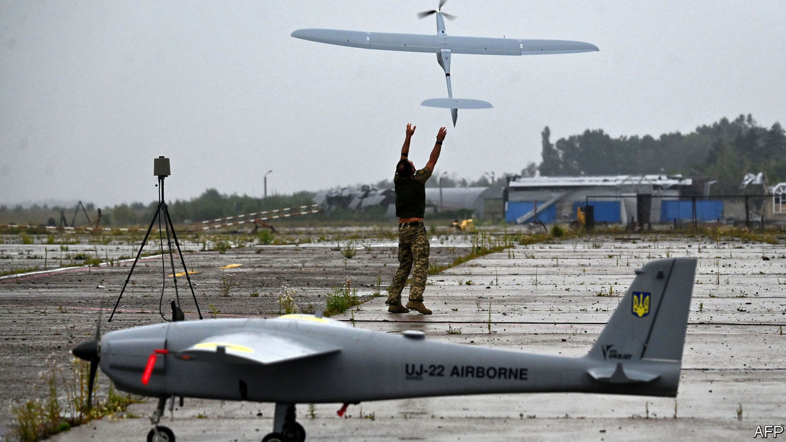
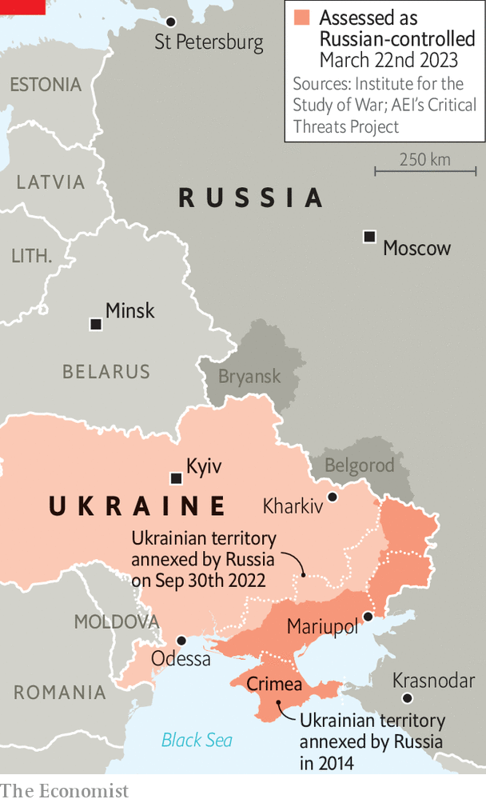

###### Remote-control war

# Ukraine is betting on drones to strike deep into Russia 

##### With the West dithering about long-range munitions, drones offer an alternative 

 

> Mar 20th 2023 


On February 28th the skies above Russia buzzed with the sound of hostile drones. St Petersburg, the country’s second city, imposed a 200km no-fly zone around its airports. In Krasnodar in the south, an oil depot went up in flames. Drones reached Belgorod and Bryansk regions, which share a border with Ukraine. One even came close to Moscow—downed after reportedly clipping trees less than 100km from the capital. The incursion was not the first time that Ukrainian unmanned aerial vehicles (UAVs) had found a way past Russian defences, but it was the first concerted attack of its kind. It had many Ukrainians wondering if they had found a key to overturning Russia’s long-range strike advantage—even in the absence of long-range Western munitions like ATACMS missiles, which may never come.

 


Drones have been flying above war zones for more than a century. The Israelis flew reconnaissance craft in the 1970s; an American precision-strike drone was deployed for the first time in the early 2000s. But current usage is evolving fast. Ukraine is deploying drones in at least five different ways: as small, commercially available reconnaissance vehicles that can feed video footage back over a short range; as small-scale improvised loitering munitions, often designed to disturb more than destroy; as more sophisticated reconnaissance or electronic-warfare drones; as larger loitering munitions designed to destroy heavy armour; and finally as strike drones, whether airborne or naval, able to deliver bombs and missiles over distances of hundreds or even thousands of kilometres. 

If the hardware for the former categories comes in many different forms and is mostly produced abroad, strike drones are produced in much smaller quantities and are almost exclusively Ukrainian. It is here that military inventors are hoping to make their breakthrough. 

Mykhailo Fedorov, the 32-year-old deputy prime minister responsible for both Ukraine’s drone programme and its digital transformation, says the turning-point may be coming faster than people think. A number of changes are about to make a big impact, he says. The army has completed a big restructuring, establishing 60 new attack-drone squadrons, at least one in every brigade, with separate staff and commanders. This is the first reform of its kind anywhere in the world. Ukraine’s military doctrine has been updated to include (classified) guidelines on drone use. The defence ministry has created a new board to co-ordinate the work of drone producers. There has been a drive to deregulate: removing import and certification barriers. And this month is marked by the launch of a new military “cluster” venture designed to link Ukrainian military tech with international companies and capital. 

A defence-industry insider, speaking on condition of anonymity, confirms that the army is due to gain “significant and high-tech capacity” in the coming weeks and months. That said, it will still struggle against the Russians, he cautions. Their own Iranian-designed drones have tormented Ukrainian cities since the start of winter. The war is also testing drone technologies as never before: over a large, contested airspace and against sophisticated electronic-warfare systems.

Only a few military systems can perform well. “The Russians are very, very good at what they do,” the industry source says. “They are performing black magic in electromagnetic defence. They can jam frequencies, spoof GPS, send a drone to the wrong altitude so that it simply drops out of the sky.” The threat from ground-based air defences means that Ukrainian reconnaissance drones struggle to see more than 15km behind Russian lines, says one expert with recent experience of observing drone operations. 

At an early stage the Ukrainians appeared to pin hopes for controlling drones behind Russian lines on Elon Musk’s Starlink satellites, which work at frequencies and in numbers that Russian systems struggle to jam. A naval-drone attack on Russia’s Black Sea fleet in October reportedly made good use of this gap. But Mr Musk, apparently worried about the escalatory effect of such moves, has stepped in where Russian technology proved unable to. Starlink now uses geofencing to block the use of its terminals—not only above Russian-occupied territory inside Ukraine, but also, according to a Ukrainian military intelligence source, over water and when the receiver is moving at speeds above 100km per hour. “You put it on a boat at sea and it will simply stop working,” he says. So Ukraine’s drone developers now use a range of other, more expensive communication systems, with multiple systems often on the same vehicle. The success of the attack on February 28th in getting so close to Moscow suggests that Ukraine may be getting close to a solution that works. 

But though Ukraine may have proved the concept, it is another thing to scale it up. Ukraine’s strike-drone programme still appears some way from achieving the production volumes it needs to rival Russia’s long-range strike capacity, says Seth Frantzman, the author of “Drone Wars”, which traces the use of UAVs in combat. One problem is access to air-launched munitions, with America reluctant to provide weapons that could reach deep inside Russia. Improvised devices and ingenuity can only go so far, though the Ukrainians are certainly trying.

Another major bottleneck is engine production, especially the petrol engines (as opposed to electric motors) needed to power strike drones over large distances. Only a limited number of manufacturers in the world can produce them and Ukraine is competing to buy from the same markets as its enemy. “We really sense the presence of the other party here,” says Mr Fedorov, the deputy prime minister 

A drone manufacturer working out of a heavily guarded factory in the suburbs of one Ukrainian city says that Russia’s authoritarian nature has given it a head start in strike capability, and that Ukraine is obliged to play catch-up. “Sanctions mean they will start to run out of parts faster than we do,” he said. “But we shouldn’t kid ourselves. They activated their production lines far faster than we did.”

Russia appears to have placed heavy bets on a conventional war of attrition in the east of Ukraine. But even as their troops inch forward, Russian generals do appear concerned by the potential expansion of war deep into their rear. In recent weeks, new air-defence systems have appeared in Moscow (covering every target in Russia is impossible.) Ukrainian drone-production facilities have also become a target of Russian missile strikes. Dmytro Shymkiv, the co-owner of AeroDrone, a promising long-distance drone manufacturer, says his company has kept production secret and mobile as a result. The rapidly evolving technologies of the drone-makers are why many in Ukraine are betting on a breakthrough. “Necessity has always been the mother of invention,” says the military-intelligence source. ■

