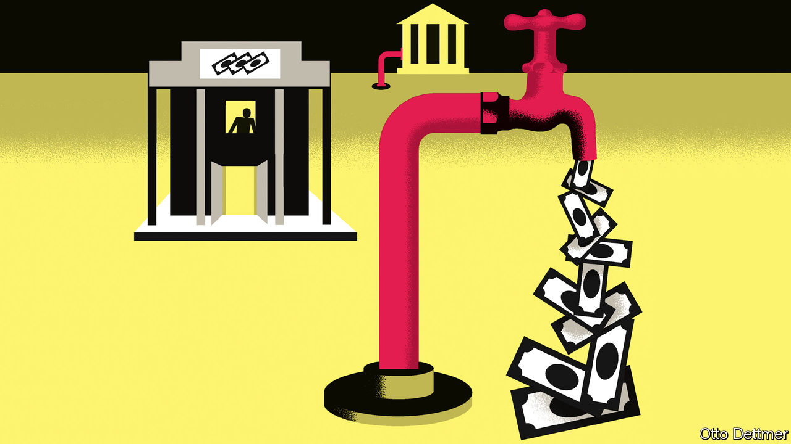

###### Free exchange

# America’s banks are missing hundreds of billions of dollars 

##### How the Federal Reserve drained the financial system of deposits 

 

> Mar 21st 2023 

It is easy to understand how money gets destroyed in a traditional bank run. Picture the men in top hats yelling at clerks in “Mary Poppins”. The crowds want their cash and bank tellers are trying to provide it. But when customers flee, staff cannot satisfy all comers before the institution topples. The remaining debts (which, for banks, include deposits) are wiped out.

This is not what happens in the digital age. The depositors fleeing  (svb) did not ask for notes and coins. They wanted their balances wired elsewhere. Nor were deposits written off when the bank went under. Instead, regulators promised to make svb’s clients whole. Although the failure of the  was bad news for shareholders, it should not have reduced the aggregate amount of deposits in the banking system.

The odd thing is that deposits in American banks are nevertheless falling. Over the past year those in commercial banks have sunk by half a trillion dollars, a drop of nearly 3%. This makes the financial system more fragile, since banks must shrink to repay their deposits. Where is the money going?

The answer starts with money-market funds, low-risk investment vehicles that buy short-term government and corporate debt. These saw inflows of $121bn last week as svb failed. However money does not actually enter such vehicles, for they are unable to take deposits. Instead, cash that leaves a bank for a money-market fund is credited to the fund’s bank account, from which it is used to purchase the commercial paper or short-term debt in which the fund invests. When the fund uses money in this way, it flows to the bank account of whichever institution sells the asset. Inflows to money-market funds should thus shuffle deposits around the banking system, rather than force them out of it.

And that is what used to happen. Yet there is one obscure way in which money-market funds may suck deposits from the banking system: the Federal Reserve’s reverse-repo facility, which was introduced in 2013. The scheme was a seemingly innocuous change to the financial system’s plumbing that may, a decade later, be having a profoundly destabilising impact on banks. 


In a usual repo transaction a bank borrows from competitors or the central bank and deposits collateral in exchange. A reverse repo does the opposite. A shadow bank, such as a money-market fund, instructs its custodian bank to deposit reserves at the Fed in return for securities. The scheme was meant to aid the Fed’s exit from ultra-low rates by putting a floor on the cost of borrowing in the interbank market. After all, why would a bank or shadow bank ever lend to its peers at a lower rate than is available from the Fed? 

But use of the facility has jumped in recent years, owing to vast quantitative easing (qe) during covid-19 and regulatory tweaks which left banks . qe creates deposits: when the Fed buys a bond from an investment fund, a bank must intermediate the transaction. The fund’s bank account swells; so does the bank’s reserve account at the Fed. From the start of qe in 2020 to its end two years later, deposits in commercial banks rose by $4.5trn, roughly equal to the growth in the Fed’s own balance-sheet. 

For a while banks could cope with the inflows because the Fed decided at the start of covid to ease a regulation known as the “supplementary leverage ratio” (slr). This stopped the growth in commercial banks’ balance-sheets from forcing them to raise more capital, allowing them to safely use the inflow of deposits to increase holdings of Treasury bonds and cash. Banks duly took the opportunity, buying $1.5trn of Treasury and agency bonds. Then in March 2021 the Fed let the exemption from the slr lapse. As a result, banks found themselves swimming in unwanted cash. They shrank by cutting their borrowing from money-market funds, which instead chose to park their cash at the Fed. By 2022 the funds had $1.7trn deposited overnight in the Fed’s reverse-repo facility, compared with a few billion a year earlier. 

After the fall of svb, America’s small and midsized banks fear deposit outflows. The problem is that monetary tightening has made them still more likely. Gara Afonso and colleagues at the Federal Reserve Bank of New York find that use of money-market funds rises along with rates, since returns adjust faster than those from bank deposits. Indeed, the Fed has raised the rate on overnight-reverse-repo transactions from 0.05% in February 2022 to 4.8%, making it much more alluring than the going bank-deposit rate of 0.4%. The amount money-market funds parked at the Fed through the reverse-repo facility—and thus outside the banking system—jumped by half a trillion dollars in the same period. 

A licence to print money

For those lacking a banking licence, leaving money in the repo facility is a better bet than leaving it in a bank. Not only is the yield considerably higher, but there is simply no reason to worry about the Fed going bust. Money-market funds could in effect become “narrow banks”: institutions that back consumer deposits with central-bank reserves, rather than higher-return but riskier assets. A narrow bank cannot make loans to firms or write mortgages. Nor can it go bust. 

The Fed has long been sceptical of such institutions, fretting that they would undermine banks. In 2019 officials denied tnb usa, a startup aiming to create a narrow bank, a licence. A similar concern has been raised about opening the Fed’s balance-sheet to money-market funds. When the reverse-repo facility was set up, Bill Dudley, then the president of the New York Fed, worried it could lead to the “disintermediation of the financial system”. During a financial crisis it could exacerbate instability with funds running out of riskier assets and onto the Fed’s balance-sheet. 

There is no sign yet of a dramatic rush. For now, the banking system is dealing with a slow bleed. But deposits are growing scarcer as the system is squeezed—and America’s small and midsized banks could pay the price. ■


