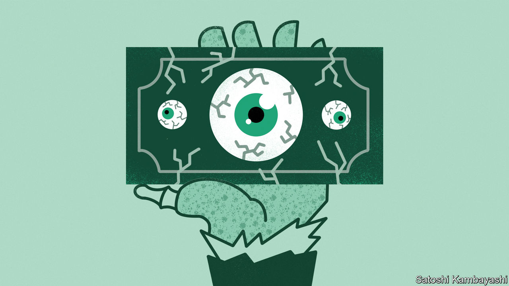

###### Don’t unleash the zombies

# How much longer will America’s regional banks hold up? 

##### Despite the danger, policymakers must not intervene prematurely 

 

> Mar 23rd 2023 

What kind of story is unfolding in the banking system? At first glance it would appear to be a tragic drama. In the past fortnight, four banks have met their end: two crypto lenders, the dominant bank in Silicon Valley and most recently a global systemically important bank. There have been 11th-hour interventions to protect customers, the creation of emergency-lending facilities and a marriage between two giant rival firms. 

But look again and perhaps it is a science-fiction tale. Thomas Philippon, a professor of finance at New York University (nyu), is experiencing the vertigo of time travel. “It really feels like we are back in the 1980s,” he said at a recent talk. In that decade, high inflation prompted extreme monetary tightening, which was meted out with enthusiasm by Paul Volcker, chairman of the Federal Reserve. This undermined the health of “savings and loans” banks (s&amp;ls), consumer-savings institutions also known as “thrifts”, which mostly lent long-term fixed-rate mortgages. They faced a cap on the rate they could pay on deposits, which led to flight. And they held fixed-rate assets. When interest rates rose, these mortgages lost a considerable amount of value—essentially wiping out the thrift industry’s net worth. 

The dynamic will sound familiar to anyone who has paid attention to Silicon Valley Bank (svb), where a rate shock slashed the value of its fixed-rate assets, prompting deposit flight and the institution’s collapse. The question now is whether what happened over the past fortnight was a brutal crunch or the start of a long, drawn-out process, as in the 1980s. The answer depends on the extent to which svb’s problems are found elsewhere. 

Start with the value of financial institutions’ assets. Banks regularly publish data on the losses they face on fixed-rate assets, such as bond portfolios. If these assets had to be liquidated tomorrow the industry would lose nearly a third of its capital base. Worryingly, one in ten institutions looks more poorly capitalised than svb. 

However, that is a big “if”. Such paper losses remain hypothetical so long as depositors stick around. A recent paper by Itamar Drechsler of the University of Pennsylvania and co-authors points out that bank deposits, which tend to be stable and interest-rate insensitive, are a natural hedge for the sort of long-term, fixed-rate lending that banks favour. The paper argues “banks closely match the interest-rate sensitivities of their interest income and expense”, which produces remarkably stable net-interest margins. This explains why bank share prices do not collapse every time rates rise, instead falling just as much as the broader market does.

The clearest evidence of flight is from two California-based banks. First Republic has reportedly lost $70bn in deposits—around 40% of its total as of the end of 2022—since svb failed. Lots of the lender’s clients are wealthy individuals, who appear to be quickest to pull deposits. On March 17th First Republic arranged for 11 major banks to park $30bn-worth of deposits with it. It is now reported to be seeking additional support from financial institutions and possibly the government, too. On March 21st PacWest, another Californian lender, reported it had lost a fifth of its deposits since the start of 2023. 

Banks suffering from deposit flight, such as First Republic and PacWest, can turn to other financial institutions for liquidity—or they can turn to the Fed’s newly expanded lending facilities. Official data indicate that American banks borrowed $300bn from various Fed programmes in the week to March 15th. There are some indications that most of the borrowing that was not done by already failed banks—namely, svb and Signature—was done by west-coast banks, including First Republic and PacWest. Indeed, some $233bn of the total was lent by the San Francisco Fed, which covers banks west of Colorado. On March 21st PacWest revealed that it had so far borrowed a total of $16bn from various Fed facilities to shore up its liquidity. There was at most around $2bn-worth of borrowing from any of the Fed banks that support other regions of the country, indicating that banks in other states have yet to face debilitating deposit flight. 

Policymakers must now wait to see if more banks come forward. It will be an uncomfortable pause. Regional and community banks play an important role in the American economy, and do about half the country’s commercial lending. Smaller banks are particularly dominant in commercial property. They hold nearly 80% of commercial mortgages provided by banks. The temptation, which American officials have been vague about, is to ensure smaller banks do not lose their deposits by guaranteeing the lot of them. 

Aaaaarrggggghhhhh

This could create a grim scenario: a zombie-horror flick. At least that is the argument made by Viral Acharya, also of nyu. Banks with flighty deposit bases and losses on their assets are exposed to real losses. The worst-possible outcome, reckons Mr Acharya, is that “you leave the banks undercapitalised but you say that all depositors of weak banks are safe”. 

This kind of intervention, he says, is common historically and “whenever this has been done—it happened in Japan, happened in Europe, routinely happens in China and India—you get zombie banks”. These have no capital, are backstopped by governments and “tend to do a tonne of bad lending”. He points to the Bank of Cyprus, which was undercapitalised in 2012: “They bet the entire house on Greek debt even when Greece was actually blowing up. Why did they do that? Well, they had stable deposits, no one was folding them up, they had no equity left—and then soon after you had a spectacular bank failure.” 

The thrift crisis in America in the 1980s was ultimately so costly because the initial response—when the thrifts faced losses of around $25bn—was one of forbearance. Many insolvent thrifts were allowed to stay open as part of an attempt to allow them to grow out of their losses. But their problems only worsened. They, too, came to be known as “zombies”. Just like the Bank of Cyprus, these zombies went for broke by investing in riskier and riskier projects, hoping that they would pay off in higher returns. By the time the returns did materialise, the zombies were insolvent. The eventual bail-out cost taxpayers $125bn, five times what it would have done if regulators had bitten the bullet earlier. Allowing that kind of zombie flick to play out again would be a real tragedy. ■


